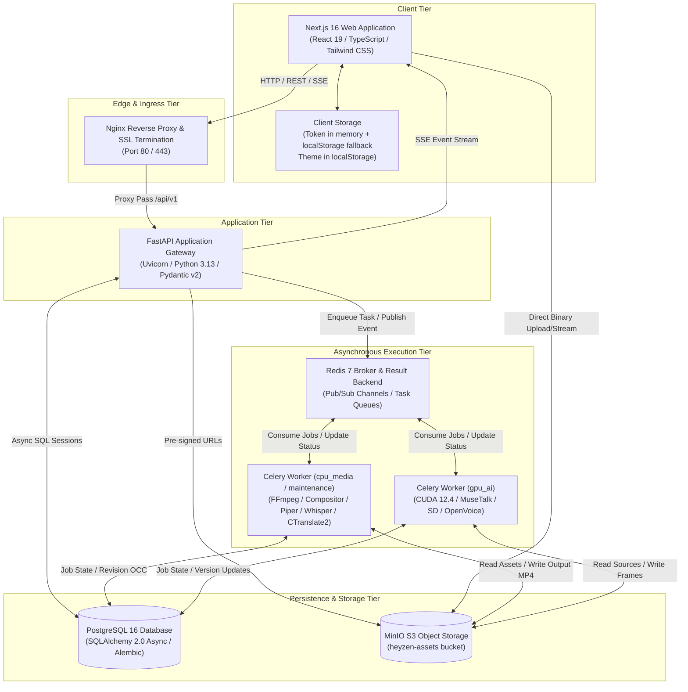
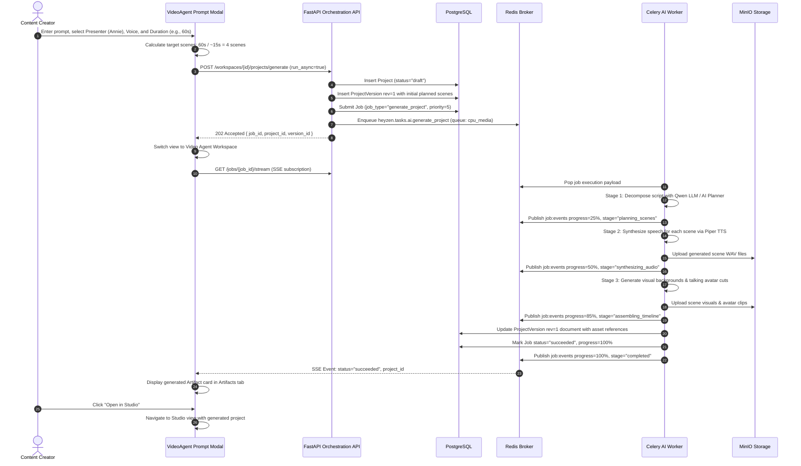
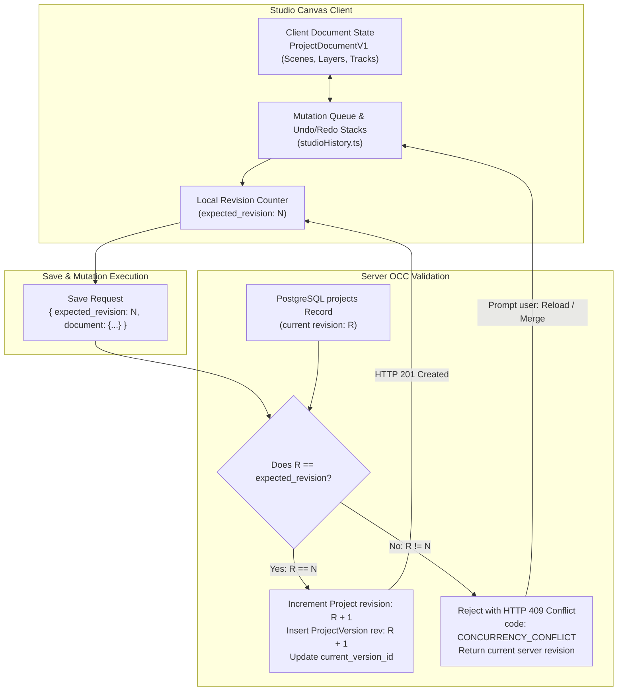
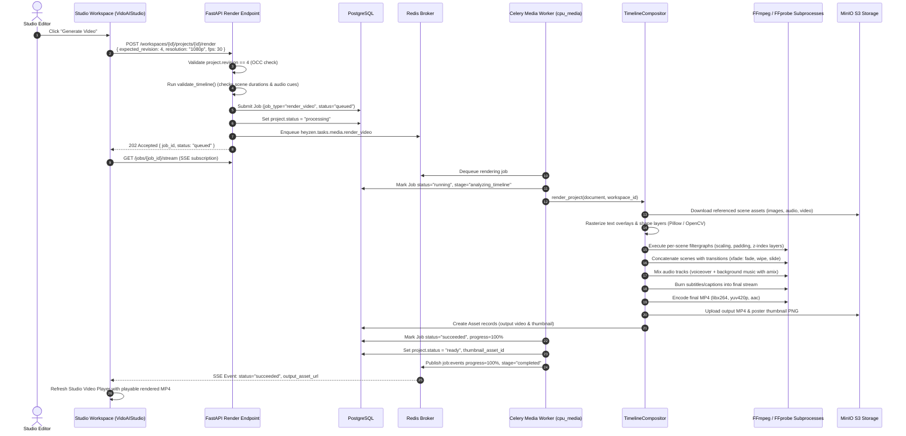
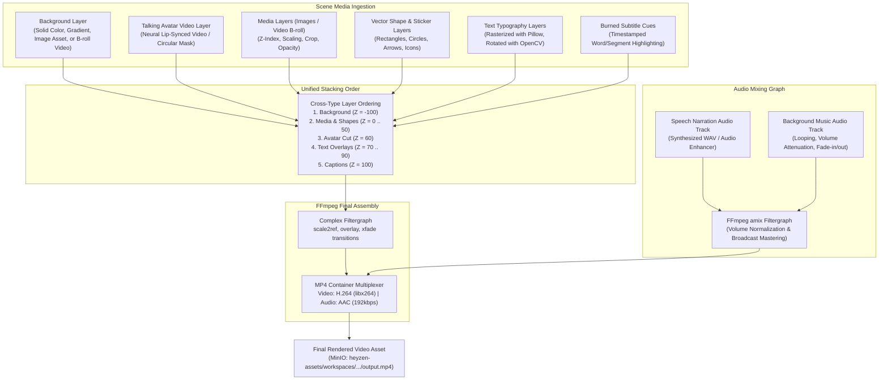
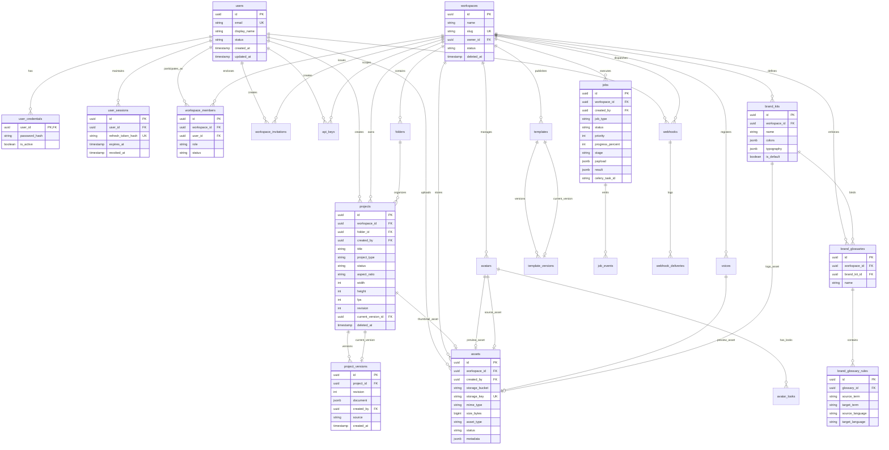

# HeyZen System Architecture & Technical Specifications

This document defines the architectural blueprints, data structures, state machines, and concurrency control models of the **HeyZen Autonomous AI Video Creation & Studio Platform**.

---

## 1. System Overview Architecture

HeyZen is structured as a decoupled multi-tier architecture uniting an interactive Next.js 16 frontend, an asynchronous FastAPI application gateway, Celery task workers, PostgreSQL 16 database, Redis 7 message broker/cache, and MinIO object storage.



---

## 2. Authentication & Session Architecture

Authentication employs dual tokens: a short-lived access JWT in client memory and a persistent refresh token stored in an `HttpOnly`, `SameSite=Lax` cookie. To prevent token hijacking, refresh tokens are cryptographically hashed using SHA-256 before insertion into the `user_sessions` table.

```mermaid
sequenceDiagram
    autonumber
    actor User as User / Browser
    participant AuthCtx as React AuthContext
    participant API as FastAPI /api/v1/auth
    participant DB as PostgreSQL
    participant Session as user_sessions Table

    Note over User, Session: User Registration or Login
    User->>AuthCtx: Enter Email & Password
    AuthCtx->>API: POST /api/v1/auth/login
    API->>DB: Query user by lower(email)
    DB-->>API: Return User & UserCredential record
    API->>API: Verify password via Argon2id
    API->>API: Mint JWT Access Token (15 min exp)
    API->>API: Generate random Refresh Secret & compute SHA-256
    API->>Session: Insert session record (user_id, token_hash, expires_at)
    API-->>AuthCtx: Set-Cookie: hz_refresh_token=<secret>; HttpOnly; SameSite=Lax
    API-->>AuthCtx: 200 OK { tokens: { access_token }, user, workspace }
    AuthCtx->>AuthCtx: Store access_token in memory & localStorage
    AuthCtx-->>User: Redirect to "/" (Home Dashboard)

    Note over User, Session: Token Rotation & Session Restoration
    User->>AuthCtx: Page Reload (F5)
    AuthCtx->>API: GET /api/v1/auth/me (Bearer Token)
    alt Access Token Valid
        API-->>AuthCtx: 200 OK (User Profile & Workspaces)
    else Access Token Expired (401)
        AuthCtx->>API: POST /api/v1/auth/refresh (Cookie: hz_refresh_token)
        API->>API: Hash cookie secret via SHA-256
        API->>Session: Lookup active, unrevoked session by hash
        API->>Session: Mark current session revoked (Rotation)
        API->>API: Mint new Access Token & new Refresh Secret
        API->>Session: Insert new session record
        API-->>AuthCtx: Set-Cookie: hz_refresh_token=<new_secret>
        API-->>AuthCtx: 200 OK { tokens: { access_token } }
        AuthCtx->>API: Re-try GET /api/v1/auth/me
        API-->>AuthCtx: 200 OK (Restored)
    end
```

---

## 3. Video Agent End-to-End Workflow

The Video Agent decomposes high-level user prompts into structured, multi-scene video blueprints. It scales scenes dynamically based on requested duration without hardcoding fixed scene counts.



---

## 4. Interactive Studio Document & OCC Concurrency Model

HeyZen Studio implements **Optimistic Concurrency Control (OCC)** to ensure multiple collaborative sessions, autosave workers, and background render pipelines never silently overwrite project edits.



---

## 5. Studio Video Rendering Pipeline

The video rendering pipeline validates timeline integrity, freezes an exact revision snapshot, and compiles multi-track media into broadcast-quality H.264 MP4 videos.



---

## 6. Media Pipeline & Layer Compositing Model

The HeyZen compositor renders scenes according to strict layer ordering and mathematical coordinate mapping:



---

## 7. Multi-Language Project Translation Pipeline

Video translation supports local file ingestion, URL intake (YouTube / Google Drive), and existing ProjectVersion documents. Translations enforce workspace **Brand Glossaries** so corporate terminology is never altered by neural machine translation.

```mermaid
flowchart LR
    SourceProject["Source Project / Video Asset"] --> AudioExtraction["FFmpeg Audio Extractor<br/>(16kHz Mono PCM)"]
    AudioExtraction --> WhisperASR["faster-whisper ASR<br/>(Word-level Timestamp Transcription)"]
    WhisperASR --> SourceCues["Structured Subtitle Cues<br/>[{start, end, text}]"]
    
    SourceCues --> Glossaries["Brand Glossaries<br/>(Case-sensitive Term Rules)"]
    Glossaries --> CTranslate2["CTranslate2 NMT Engine<br/>(Preserves protected terms)"]
    CTranslate2 --> TargetCues["Target Language Script & Cues"]
    
    TargetCues --> PiperTTS["Piper Neural TTS<br/>(Target Language Voice Model)"]
    PiperTTS --> TargetAudio["Localized Audio Track"]
    
    TargetAudio --> LipSync{"Lip-Sync Enabled?"}
    LipSync -->|Yes + GPU| MuseTalk["MuseTalk / Wav2Lip<br/>(Lip-synced Video Cut)"]
    LipSync -->|No / CPU Fallback| AudioReplaced["Timeline Audio Swap"]
    
    MuseTalk --> ForkVersion["Create Localized Project Fork<br/>or ProjectVersion Snapshot"]
    AudioReplaced --> ForkVersion
```



---

## 8. Database Entity Relationship (ER) Diagram

The PostgreSQL 16 relational database enforces multi-tenant boundary integrity, cascade rules, UUID primary keys, and timestamp tracking across all models:


