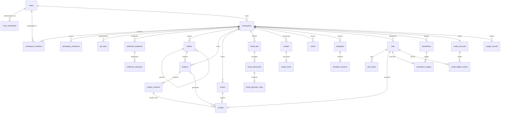
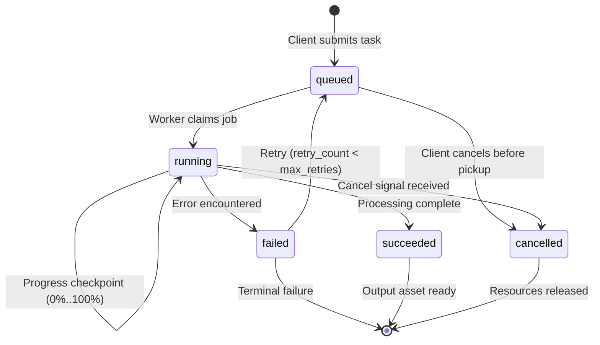
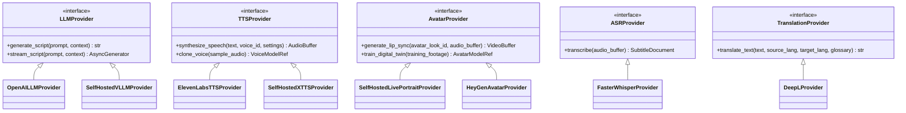

# HeyZen — Backend & Database Architecture Design Document
**Document Version:** 1.0.0  
**Status:** Approved Architecture Design  
**Target Platform:** HeyZen AI Video Studio  
**Primary Authors:** DeepMind Agentic Systems Architecture Team  
**Workspace Root:** `d:\HeyGen\video-ai-tools`  
**Classification:** Technical Specification — Core Architecture  

---

## Executive Summary

This document specifies the complete production-grade backend, database, worker, and AI architecture for **HeyZen** — an enterprise-ready AI video creation and editing platform.

The architecture is designed to support high-throughput video generation, real-time studio editing, multi-tenant workspace collaboration, multi-track timeline composition, voice cloning, digital avatar synthesis, translation with lip-sync, credit ledger accounting, and external API/webhook integrations. 

### Core Architectural Principles
1. **Frontend Isolation:** The existing Next.js frontend application is canonical and locked. The backend is designed around its domain models, UI state conventions, and API expectations.
2. **Provider Independence:** No vendor lock-in. All AI subsystems (LLMs, TTS, ASR, translation, avatar rendering, lip-sync) are encapsulated behind abstract interfaces supporting cloud APIs, private hosted models, and local open-source inference pipelines.
3. **Decoupled API & GPU Compute:** The FastAPI API gateway is stateless and lightweight (CPU-only). Heavy audio/video processing (FFmpeg) and neural network inference (CUDA/PyTorch) run asynchronously on decoupled worker nodes coordinated via Celery, Redis, and MinIO/S3 object storage.
4. **Hybrid Storage Engine:** Tabular relational integrity (PostgreSQL 16) for workspaces, billing, permissions, assets, and audit logs combined with high-flexibility document storage (`JSONB`) for non-rigid canvas/timeline scene graphs.
5. **Zero Large-Binary Ingress via API:** Large media files (videos, high-res images, audio recordings) never transit through the FastAPI web server. All uploads and downloads use direct pre-signed URLs against S3-compatible storage (MinIO).
6. **Strict Double-Entry Usage Accounting:** Platform credits are tracked via an immutable transactional ledger with hold/capture semantics rather than an unsafe mutable balance integer.

---

# Table of Contents
1. [Architecture Overview](#1-architecture-overview)
2. [Module Structure](#2-module-structure)
3. [Entity Relationship Design & Multi-Tenancy](#3-entity-relationship-design--multi-tenancy)
4. [Table-by-Table Database Specification](#4-table-by-table-database-specification)
5. [Relationship Diagram](#5-relationship-diagram)
6. [Project JSON Strategy](#6-project-json-strategy)
7. [Versioning Strategy](#7-versioning-strategy)
8. [Job State Machine & Distributed Processing](#8-job-state-machine--distributed-processing)
9. [Storage Architecture](#9-storage-architecture)
10. [AI Provider Abstraction](#10-ai-provider-abstraction)
11. [Authentication & Authorization Design](#11-authentication--authorization-design)
12. [Credit & Usage Accounting Design](#12-credit--usage-accounting-design)
13. [API Module Map & Endpoint Inventory](#13-api-module-map--endpoint-inventory)
14. [Security Design](#14-security-design)
15. [Database Index Strategy](#15-database-index-strategy)
16. [Delete & Retention Strategy](#16-delete--retention-strategy)
17. [Concurrency & Idempotency Strategy](#17-concurrency--idempotency-strategy)
18. [Future GPU-Worker Deployment Model](#18-future-gpu-worker-deployment-model)
19. [Migration Strategy](#19-migration-strategy)
20. [Phase-by-Phase Implementation Order](#20-phase-by-phase-implementation-order)

---

# 1. Architecture Overview

```text
 ┌──────────────────────────────────────────────────────────────────┐
 │                     Locked Next.js Frontend                      │
 │                     (Port 3000 / Turbopack)                      │
 └───────────────┬──────────────────────────────────▲───────────────┘
                 │                                  │
          HTTPS  │ REST                             │ SSE / WebSocket
         Direct  │ (JSON / Pre-signed URLs)         │ (Job & Render Events)
                 ▼                                  │
 ┌──────────────────────────────────────────────────┴───────────────┐
 │                       FastAPI API Gateway                        │
 │           Stateless • Async • Python 3.12 • Pydantic v2          │
 └──┬────────────┬─────────────────────────────┬────────────────┬───┘
    │            │                             │                │
    ▼            ▼                             ▼                ▼
┌────────┐  ┌─────────┐                ┌──────────────┐  ┌─────────────┐
│ Postgre│  │  Redis  │                │ Celery Broker│  │    MinIO    │
│  SQL   │  │ Cache / │                │ & Task State │  │ S3 Storage  │
│  v16   │  │ Pub/Sub │                │   (Redis)    │  │ (Direct I/O)│
└────────┘  └─────────┘                └───────┬──────┘  └──────▲──────┘
                                               │                │
                        ┌──────────────────────┴───────┐        │ Pre-signed
                        │                              │        │ Fetch/Write
                        ▼                              ▼        │
             ┌─────────────────────┐        ┌───────────────────┴─┐
             │   Media Workers     │        │     AI Workers      │
             │     (CPU/RAM)       │        │     (NVIDIA GPU)    │
             │   FFmpeg, Audio,    │        │  vLLM, XTTS, Whisper│
             │  Transcode, Render  │        │  LivePortrait, Video│
             └─────────────────────┘        └─────────────────────┘
```

### Component Responsibilities
* **Next.js Frontend (Port 3000):** React 19 single-page application with canvas timeline, avatar selector, script generator, and workspace navigation. Remains completely locked during this phase.
* **FastAPI API Gateway (Port 8000):** Asynchronous REST API managing authentication, tenant scoping, CRUD on metadata, pre-signed S3 URL generation, job submission, and SSE event streaming. Never runs media rendering or neural network inference locally.
* **PostgreSQL 16:** Primary transactional relational store. Houses tenant boundaries, user profiles, asset metadata, job history, audit trails, and immutable project version snapshots in `JSONB`.
* **Redis 7:** Multi-role in-memory engine:
  1. Celery task broker and distributed locking (`Redlock`).
  2. Short-lived session / token blacklist cache.
  3. Pub/Sub broker for routing real-time job progress to FastAPI SSE listeners.
  4. Distributed rate-limiting counters.
* **MinIO Object Storage (Port 9000 / 9001):** S3-compliant distributed binary storage. Holds raw user uploads, intermediate audio stems, generated avatar video clips, exported 4K MP4 renders, and brand assets.
* **Media Workers (Celery CPU):** Scalable pool of workers executing FFmpeg transcode jobs, audio track normalization, waveform generation, subtitle burning, and video stitching.
* **AI Workers (Celery GPU):** High-memory GPU-backed workers running containerized PyTorch/CUDA workloads: text-to-speech (TTS), audio-driven avatar lip-sync, speech-to-text (ASR), and generative image/video models.

---

# 2. Module Structure

To ensure clean separation of concerns and prevent circular dependency spaghetti as the codebase grows, HeyZen adopts a **Domain-Driven Modular Monolith** architecture.

```text
backend/
├── app/
│   ├── main.py                  # FastAPI application entrypoint & middleware configuration
│   ├── config.py                # Pydantic v2 BaseSettings (environment variables)
│   ├── constants.py             # Global constants and enum definitions
│   │
│   ├── core/                    # Shared cross-cutting foundational services
│   │   ├── auth/                # JWT parsing, password hashing (Argon2id), API key hashing
│   │   ├── database.py          # SQLAlchemy 2.0 async engine and session factory
│   │   ├── dependencies.py      # Common FastAPI dependency injections (DB session, current user)
│   │   ├── exceptions.py        # Centralized HTTP & domain error definitions
│   │   ├── logging.py           # Structlog JSON logging configuration with request correlation IDs
│   │   ├── redis.py             # Async Redis connection pool and lock utilities
│   │   ├── security.py          # Security utilities, rate limiting, and CORS headers
│   │   └── storage/             # Abstract StorageProvider base and S3/MinIO client
│   │
│   ├── modules/                 # Domain-specific feature modules (Self-contained)
│   │   ├── users/               # User accounts, profiles, credentials
│   │   ├── workspaces/          # Workspaces, members, invitations, RBAC permissions
│   │   ├── folders/             # Hierarchical folder tree navigation
│   │   ├── projects/            # Video projects, version snapshots, project JSON documents
│   │   ├── assets/              # S3 asset catalog, upload presigning, MIME validation
│   │   ├── avatars/             # Digital avatars, photo avatars, avatar looks & poses
│   │   ├── voices/              # TTS voice catalog, voice cloning models, audio samples
│   │   ├── templates/           # Reusable scene templates, variable placeholders
│   │   ├── brands/              # Brand kits, logos, color palettes, fonts, pronunciation glossaries
│   │   ├── jobs/                # Asynchronous job dispatching, state machine, SSE progress streaming
│   │   ├── renders/             # Video composition, export configurations, render history
│   │   ├── translations/        # Video translation pipeline, multi-language audio & subtitles
│   │   ├── api_keys/            # Developer API keys, scoped token validation
│   │   ├── webhooks/            # Webhook endpoints, signature generation, delivery retries
│   │   ├── credits/             # Double-entry ledger, usage metering, plan limits
│   │   └── agent/               # Video Agent conversational copilot & script generation
│   │
│   └── workers/                 # Celery task definitions (invoked asynchronously)
│       ├── celery_app.py        # Celery broker and worker initialization
│       ├── media_tasks.py       # FFmpeg assembly, transcode, waveform tasks
│       ├── ai_tasks.py          # Remote/local inference dispatch (TTS, LipSync, LLM)
│       └── scheduled_tasks.py   # Cron tasks (retention pruning, webhook retries)
│
├── alembic/                     # Database migration management
│   ├── env.py
│   ├── script.py.mako
│   └── versions/
├── pyproject.toml               # Poetry/pip-tools package manifest (Defined for future use)
└── Dockerfile                   # Multi-stage production container build
```

### Module Internal Architecture
Each sub-module inside `backend/app/modules/<name>/` conforms to a uniform internal structure:
* `models.py`: SQLAlchemy 2.0 ORM entity definitions mapped to database tables.
* `schemas.py`: Pydantic v2 schemas for request validation, query parameters, and JSON responses.
* `service.py`: Encapsulated domain business logic, invariant enforcement, and external provider calls.
* `router.py`: FastAPI API routes handling HTTP requests, parameter binding, and status codes.
* `repository.py` (optional): Query abstraction when complex database queries or aggregations are required.

---

# 3. Entity Relationship Design & Multi-Tenancy

### Tenancy Boundary Philosophy
In HeyZen, the **Workspace** is the strict multi-tenancy boundary:
1. Every collaborative resource (`Project`, `Folder`, `Asset`, `BrandKit`, `Template`, `ApiKey`, `WebhookEndpoint`, `CreditAccount`, `Job`) **MUST** possess a non-null `workspace_id` foreign key.
2. A single `User` can belong to multiple workspaces with completely different permissions.
3. Every incoming API request resolves an active `workspace_id` from the HTTP Header `X-Workspace-ID` or a route parameter (`/workspaces/{workspace_id}/...`), which is cryptographically validated against the caller's membership record.
4. Server-side queries strictly enforce workspace filtering (`WHERE workspace_id = :active_workspace_id`). No client-side scoping is trusted.

### Role-Based Access Control (RBAC) Matrix

| Permission | Owner | Admin | Creator | Viewer |
| :--- | :---: | :---: | :---: | :---: |
| `workspace:delete` | ✅ | ❌ | ❌ | ❌ |
| `workspace:billing` | ✅ | ❌ | ❌ | ❌ |
| `member:manage` | ✅ | ✅ | ❌ | ❌ |
| `api_key:manage` | ✅ | ✅ | ❌ | ❌ |
| `webhook:manage` | ✅ | ✅ | ❌ | ❌ |
| `brand:manage` | ✅ | ✅ | ❌ | ❌ |
| `project:create` | ✅ | ✅ | ✅ | ❌ |
| `project:edit` | ✅ | ✅ | ✅ | ❌ |
| `project:delete` | ✅ | ✅ | ✅ (Own) | ❌ |
| `render:export` | ✅ | ✅ | ✅ | ❌ |
| `asset:upload` | ✅ | ✅ | ✅ | ❌ |
| `project:view` | ✅ | ✅ | ✅ | ✅ |
| `asset:view` | ✅ | ✅ | ✅ | ✅ |

---

# 4. Table-by-Table Database Specification

All primary keys use `UUIDv7` (or PostgreSQL 16 `gen_random_uuid()` with timestamp prefix) for high-performance sequential B-tree indexing. All timestamps are `TIMESTAMPTZ` storing UTC time.

### 4.1 Users & Authentication

#### `users`
Represents the global human actor across all workspaces.
* `id` (`UUID`, PK, default `gen_random_uuid()`): Unique user ID.
* `email` (`VARCHAR(255)`, UNIQUE, NOT NULL): Canonical login email (case-insensitive indexed).
* `display_name` (`VARCHAR(128)`, NOT NULL): User's preferred name.
* `avatar_url` (`VARCHAR(1024)`, NULLABLE): Public URL to profile avatar.
* `status` (`VARCHAR(32)`, NOT NULL, default `'active'`): Status enum (`'active'`, `'suspended'`, `'pending_verification'`).
* `is_superuser` (`BOOLEAN`, NOT NULL, default `FALSE`): System administration flag.
* `created_at` (`TIMESTAMPTZ`, NOT NULL, default `clock_timestamp()`): Creation timestamp.
* `updated_at` (`TIMESTAMPTZ`, NOT NULL, default `clock_timestamp()`): Last modification timestamp.
* `last_login_at` (`TIMESTAMPTZ`, NULLABLE): Last successful authentication timestamp.

#### `user_credentials`
Isolated table separating security secrets from general user metadata.
* `user_id` (`UUID`, PK, FK -> `users.id` ON DELETE CASCADE): User reference.
* `password_hash` (`VARCHAR(255)`, NOT NULL): Argon2id password hash string.
* `password_updated_at` (`TIMESTAMPTZ`, NOT NULL, default `clock_timestamp()`): Timestamp of last password change.
* `failed_login_attempts` (`INTEGER`, NOT NULL, default `0`): Lockout counter.
* `locked_until` (`TIMESTAMPTZ`, NULLABLE): Temporary lockout expiration.
* `mfa_secret` (`VARCHAR(255)`, NULLABLE): Encrypted TOTP authenticator secret.
* `mfa_enabled` (`BOOLEAN`, NOT NULL, default `FALSE`): Two-factor status flag.

### 4.2 Workspaces & Membership

#### `workspaces`
Primary tenant organization entity.
* `id` (`UUID`, PK, default `gen_random_uuid()`): Workspace ID.
* `name` (`VARCHAR(128)`, NOT NULL): Human-readable workspace name.
* `slug` (`VARCHAR(128)`, UNIQUE, NOT NULL): URL-safe organization slug.
* `logo_url` (`VARCHAR(1024)`, NULLABLE): Workspace logo.
* `owner_id` (`UUID`, NOT NULL, FK -> `users.id` ON DELETE RESTRICT): Workspace creator/owner.
* `created_at` (`TIMESTAMPTZ`, NOT NULL, default `clock_timestamp()`).
* `updated_at` (`TIMESTAMPTZ`, NOT NULL, default `clock_timestamp()`).
* `deleted_at` (`TIMESTAMPTZ`, NULLABLE): Soft-deletion timestamp.

#### `workspace_members`
Association table defining workspace membership and assigned roles.
* `id` (`UUID`, PK, default `gen_random_uuid()`).
* `workspace_id` (`UUID`, NOT NULL, FK -> `workspaces.id` ON DELETE CASCADE).
* `user_id` (`UUID`, NOT NULL, FK -> `users.id` ON DELETE CASCADE).
* `role` (`VARCHAR(32)`, NOT NULL, default `'creator'`): Role enum (`'owner'`, `'admin'`, `'creator'`, `'viewer'`).
* `created_at` (`TIMESTAMPTZ`, NOT NULL, default `clock_timestamp()`).
* `updated_at` (`TIMESTAMPTZ`, NOT NULL, default `clock_timestamp()`).
* *Constraints:* `UNIQUE(workspace_id, user_id)`.

#### `workspace_invitations`
Pending team member invitations.
* `id` (`UUID`, PK, default `gen_random_uuid()`).
* `workspace_id` (`UUID`, NOT NULL, FK -> `workspaces.id` ON DELETE CASCADE).
* `email` (`VARCHAR(255)`, NOT NULL): Invited email address.
* `role` (`VARCHAR(32)`, NOT NULL, default `'creator'`): Assigned role upon acceptance.
* `token_hash` (`VARCHAR(255)`, UNIQUE, NOT NULL): SHA-256 hash of the invitation token.
* `inviter_id` (`UUID`, NOT NULL, FK -> `users.id` ON DELETE CASCADE).
* `status` (`VARCHAR(32)`, NOT NULL, default `'pending'`): Status (`'pending'`, `'accepted'`, `'revoked'`, `'expired'`).
* `expires_at` (`TIMESTAMPTZ`, NOT NULL): Expiration timestamp (typically 7 days).
* `created_at` (`TIMESTAMPTZ`, NOT NULL, default `clock_timestamp()`).

### 4.3 Folders & Project Hierarchy

#### `folders`
Hierarchical tree structure for project organization.
* `id` (`UUID`, PK, default `gen_random_uuid()`).
* `workspace_id` (`UUID`, NOT NULL, FK -> `workspaces.id` ON DELETE CASCADE).
* `parent_id` (`UUID`, NULLABLE, FK -> `folders.id` ON DELETE CASCADE): Parent folder (self-referencing).
* `name` (`VARCHAR(128)`, NOT NULL): Folder name.
* `color` (`VARCHAR(32)`, NULLABLE): Hex color for UI folder tagging.
* `created_by` (`UUID`, NOT NULL, FK -> `users.id` ON DELETE SET NULL).
* `created_at` (`TIMESTAMPTZ`, NOT NULL, default `clock_timestamp()`).
* `updated_at` (`TIMESTAMPTZ`, NOT NULL, default `clock_timestamp()`).
* `deleted_at` (`TIMESTAMPTZ`, NULLABLE): Soft-deletion flag.
* *Constraints:* `UNIQUE(workspace_id, parent_id, name)` where `deleted_at IS NULL`.

#### `projects`
Core video project entity representing the editable video work.
* `id` (`UUID`, PK, default `gen_random_uuid()`).
* `workspace_id` (`UUID`, NOT NULL, FK -> `workspaces.id` ON DELETE CASCADE).
* `folder_id` (`UUID`, NULLABLE, FK -> `folders.id` ON DELETE SET NULL).
* `creator_id` (`UUID`, NOT NULL, FK -> `users.id` ON DELETE RESTRICT).
* `title` (`VARCHAR(255)`, NOT NULL, default `'Untitled Video'`): Project title.
* `project_type` (`VARCHAR(32)`, NOT NULL, default `'studio'`): (`'studio'`, `'agent'`, `'template'`, `'translation'`).
* `aspect_ratio` (`VARCHAR(16)`, NOT NULL, default `'16:9'`): Canvas ratio (`'16:9'`, `'9:16'`, `'1:1'`).
* `duration_seconds` (`NUMERIC(10, 3)`, NOT NULL, default `0.000`): Computed project runtime.
* `thumbnail_url` (`VARCHAR(1024)`, NULLABLE): Cover image URL.
* `status` (`VARCHAR(32)`, NOT NULL, default `'draft'`): (`'draft'`, `'rendering'`, `'ready'`, `'failed'`).
* `current_version_number` (`INTEGER`, NOT NULL, default `1`): Monotonically increasing revision counter.
* `created_at` (`TIMESTAMPTZ`, NOT NULL, default `clock_timestamp()`).
* `updated_at` (`TIMESTAMPTZ`, NOT NULL, default `clock_timestamp()`).
* `deleted_at` (`TIMESTAMPTZ`, NULLABLE): Soft-deletion timestamp.

#### `project_versions`
Immutable version snapshots enabling autosave, undo, rollback, and OCC concurrency.
* `id` (`UUID`, PK, default `gen_random_uuid()`).
* `project_id` (`UUID`, NOT NULL, FK -> `projects.id` ON DELETE CASCADE).
* `version_number` (`INTEGER`, NOT NULL): Sequential revision number (1, 2, 3...).
* `created_by` (`UUID`, NOT NULL, FK -> `users.id` ON DELETE SET NULL).
* `label` (`VARCHAR(128)`, NULLABLE): Optional name (e.g. "Draft 2 - Final Edit", "Pre-render snapshot").
* `is_autosave` (`BOOLEAN`, NOT NULL, default `FALSE`): Distinguishes background autosaves from manual saves.
* `document` (`JSONB`, NOT NULL): Complete canonical HeyZen Project JSON schema.
* `change_summary` (`VARCHAR(512)`, NULLABLE): Summary of edits (e.g., "Updated scene 2 script").
* `created_at` (`TIMESTAMPTZ`, NOT NULL, default `clock_timestamp()`).
* *Constraints:* `UNIQUE(project_id, version_number)`.

### 4.4 Assets & Storage Catalog

#### `assets`
Metadata catalog for all binary files stored in MinIO/S3.
* `id` (`UUID`, PK, default `gen_random_uuid()`).
* `workspace_id` (`UUID`, NOT NULL, FK -> `workspaces.id` ON DELETE CASCADE).
* `owner_id` (`UUID`, NOT NULL, FK -> `users.id` ON DELETE RESTRICT).
* `asset_type` (`VARCHAR(32)`, NOT NULL): (`'video'`, `'image'`, `'audio'`, `'music'`, `'font'`, `'subtitle'`, `'avatar_media'`, `'generated_media'`, `'thumbnail'`, `'document'`).
* `file_name` (`VARCHAR(255)`, NOT NULL): Original uploaded filename.
* `mime_type` (`VARCHAR(128)`, NOT NULL): Verified MIME type (e.g. `video/mp4`, `image/png`).
* `byte_size` (`BIGINT`, NOT NULL): File size in bytes.
* `storage_bucket` (`VARCHAR(64)`, NOT NULL): S3 bucket name (e.g. `heyzen-assets`).
* `storage_key` (`VARCHAR(1024)`, UNIQUE, NOT NULL): Object key path in S3.
* `checksum_sha256` (`VARCHAR(64)`, NOT NULL): Cryptographic hash for deduplication and integrity.
* `media_metadata` (`JSONB`, NOT NULL, default `'{}'::jsonb`): Extracted technical metadata (width, height, fps, sample_rate, duration).
* `status` (`VARCHAR(32)`, NOT NULL, default `'pending_upload'`): (`'pending_upload'`, `'ready'`, `'processing'`, `'failed'`).
* `created_at` (`TIMESTAMPTZ`, NOT NULL, default `clock_timestamp()`).
* `deleted_at` (`TIMESTAMPTZ`, NULLABLE): Soft-delete flag for garbage collection.

### 4.5 Digital Avatars & Poses

#### `avatars`
Avatar definitions supporting platform presets, digital twins, and photo avatars.
* `id` (`UUID`, PK, default `gen_random_uuid()`).
* `workspace_id` (`UUID`, NULLABLE, FK -> `workspaces.id` ON DELETE CASCADE): NULL for system public avatars.
* `name` (`VARCHAR(128)`, NOT NULL): Avatar display name (e.g., "Evelyn in Office", "Marcus Casual").
* `avatar_type` (`VARCHAR(32)`, NOT NULL): (`'public'`, `'custom'`, `'photo'`, `'digital_twin'`).
* `gender` (`VARCHAR(16)`, NULLABLE): (`'male'`, `'female'`, `'neutral'`).
* `preview_image_url` (`VARCHAR(1024)`, NOT NULL): Card thumbnail URL.
* `preview_video_url` (`VARCHAR(1024)`, NULLABLE): 5-second video preview URL.
* `is_public` (`BOOLEAN`, NOT NULL, default `FALSE`): System-wide accessibility flag.
* `training_status` (`VARCHAR(32)`, NOT NULL, default `'ready'`): (`'pending'`, `'training'`, `'ready'`, `'failed'`).
* `model_provider` (`VARCHAR(64)`, NOT NULL, default `'internal'`): Abstract provider identifier.
* `provider_metadata` (`JSONB`, NOT NULL, default `'{}'::jsonb`): Provider-specific neural weights / model IDs.
* `created_at` (`TIMESTAMPTZ`, NOT NULL, default `clock_timestamp()`).
* `updated_at` (`TIMESTAMPTZ`, NOT NULL, default `clock_timestamp()`).

#### `avatar_looks`
Configurable outfits, backgrounds, and poses for an avatar.
* `id` (`UUID`, PK, default `gen_random_uuid()`).
* `avatar_id` (`UUID`, NOT NULL, FK -> `avatars.id` ON DELETE CASCADE).
* `name` (`VARCHAR(128)`, NOT NULL): Look title (e.g., "Desk Close-up", "Standing Podium").
* `pose_type` (`VARCHAR(32)`, NOT NULL, default `'half_body'`): (`'half_body'`, `'close_up'`, `'full_body'`, `'circular'`).
* `thumbnail_url` (`VARCHAR(1024)`, NOT NULL).
* `source_asset_id` (`UUID`, NULLABLE, FK -> `assets.id` ON DELETE SET NULL): High-res master source video/image.
* `is_default` (`BOOLEAN`, NOT NULL, default `FALSE`).
* `created_at` (`TIMESTAMPTZ`, NOT NULL, default `clock_timestamp()`).

### 4.6 Voices & Audio Synthesis

#### `voices`
Synthesized TTS voice catalog and custom voice cloning records.
* `id` (`UUID`, PK, default `gen_random_uuid()`).
* `workspace_id` (`UUID`, NULLABLE, FK -> `workspaces.id` ON DELETE CASCADE): NULL for public library voices.
* `name` (`VARCHAR(128)`, NOT NULL): Voice name (e.g., "Natural Marcus", "Serena Friendly").
* `voice_type` (`VARCHAR(32)`, NOT NULL): (`'preset'`, `'cloned'`, `'custom'`).
* `language` (`VARCHAR(16)`, NOT NULL, default `'en'`): Primary ISO language code (e.g. `'en'`, `'es'`, `'fr'`).
* `locale` (`VARCHAR(16)`, NOT NULL, default `'en-US'`): Specific regional dialect code.
* `gender` (`VARCHAR(16)`, NOT NULL): (`'male'`, `'female'`, `'neutral'`).
* `preview_audio_url` (`VARCHAR(1024)`, NULLABLE): 10-second sample audio.
* `provider` (`VARCHAR(64)`, NOT NULL, default `'internal'`): Abstraction tag (`'elevenlabs'`, `'internal_xtts'`, `'openai'`).
* `external_voice_id` (`VARCHAR(255)`, NULLABLE): Upstream voice ID.
* `training_status` (`VARCHAR(32)`, NOT NULL, default `'ready'`): (`'pending'`, `'processing'`, `'ready'`, `'failed'`).
* `settings_schema` (`JSONB`, NOT NULL, default `'{"stability": 0.75, "speed": 1.0, "pitch": 0.0}'::jsonb`).
* `created_at` (`TIMESTAMPTZ`, NOT NULL, default `clock_timestamp()`).

### 4.7 Reusable Video Templates

#### `templates`
Curated industry layouts and scene workflows.
* `id` (`UUID`, PK, default `gen_random_uuid()`).
* `workspace_id` (`UUID`, NULLABLE, FK -> `workspaces.id` ON DELETE CASCADE): NULL for global community templates.
* `title` (`VARCHAR(128)`, NOT NULL): Template title.
* `category` (`VARCHAR(64)`, NOT NULL): (`'marketing'`, `'sales'`, `'onboarding'`, `'education'`, `'social'`).
* `aspect_ratio` (`VARCHAR(16)`, NOT NULL, default `'16:9'`).
* `thumbnail_url` (`VARCHAR(1024)`, NOT NULL).
* `preview_video_url` (`VARCHAR(1024)`, NULLABLE).
* `is_public` (`BOOLEAN`, NOT NULL, default `FALSE`).
* `created_at` (`TIMESTAMPTZ`, NOT NULL, default `clock_timestamp()`).

#### `template_versions`
Versioned layout document defining template scenes and placeholders.
* `id` (`UUID`, PK, default `gen_random_uuid()`).
* `template_id` (`UUID`, NOT NULL, FK -> `templates.id` ON DELETE CASCADE).
* `version_number` (`INTEGER`, NOT NULL, default `1`).
* `document` (`JSONB`, NOT NULL): Canonical scene graph with placeholder tokens (`{{user_name}}`, `{{company}}`).
* `placeholders` (`JSONB`, NOT NULL, default `'[]'::jsonb`): Array of dynamic variable field definitions.
* `created_at` (`TIMESTAMPTZ`, NOT NULL, default `clock_timestamp()`).
* *Constraints:* `UNIQUE(template_id, version_number)`.

### 4.8 Brand Systems & Glossaries

#### `brand_kits`
Workspace visual guidelines and asset collections.
* `id` (`UUID`, PK, default `gen_random_uuid()`).
* `workspace_id` (`UUID`, NOT NULL, FK -> `workspaces.id` ON DELETE CASCADE).
* `name` (`VARCHAR(128)`, NOT NULL, default `'Default Brand Kit'`).
* `primary_color` (`VARCHAR(32)`, NOT NULL, default `'#6366F1'`).
* `secondary_color` (`VARCHAR(32)`, NOT NULL, default `'#1E1B4B'`).
* `accent_color` (`VARCHAR(32)`, NOT NULL, default `'#10B981'`).
* `background_color` (`VARCHAR(32)`, NOT NULL, default `'#0F172A'`).
* `font_family_primary` (`VARCHAR(128)`, NOT NULL, default `'Inter'`).
* `font_family_heading` (`VARCHAR(128)`, NOT NULL, default `'Cabinet Grotesk'`).
* `logo_asset_id` (`UUID`, NULLABLE, FK -> `assets.id` ON DELETE SET NULL).
* `is_default` (`BOOLEAN`, NOT NULL, default `TRUE`).
* `created_at` (`TIMESTAMPTZ`, NOT NULL, default `clock_timestamp()`).
* `updated_at` (`TIMESTAMPTZ`, NOT NULL, default `clock_timestamp()`).

#### `brand_glossaries`
Workspace pronunciation dictionary and translation rules.
* `id` (`UUID`, PK, default `gen_random_uuid()`).
* `brand_kit_id` (`UUID`, NOT NULL, FK -> `brand_kits.id` ON DELETE CASCADE).
* `name` (`VARCHAR(128)`, NOT NULL, default `'Pronunciation & Terms'`).
* `created_at` (`TIMESTAMPTZ`, NOT NULL, default `clock_timestamp()`).

#### `brand_glossary_rules`
Individual word-level pronunciation and translation constraints.
* `id` (`UUID`, PK, default `gen_random_uuid()`).
* `glossary_id` (`UUID`, NOT NULL, FK -> `brand_glossaries.id` ON DELETE CASCADE).
* `term` (`VARCHAR(128)`, NOT NULL): Exact word or phrase (e.g., "HeyZen", "PostgreSQL").
* `replacement_phonetic` (`VARCHAR(128)`, NULLABLE): Phonetic respelling for TTS (e.g., "Hay-Zen").
* `action_type` (`VARCHAR(32)`, NOT NULL, default `'phonetic_override'`): (`'phonetic_override'`, `'do_not_translate'`, `'force_translate'`).
* `target_language` (`VARCHAR(16)`, NULLABLE): Language code for translation rules.
* `translated_term` (`VARCHAR(128)`, NULLABLE): Enforced target translation.
* `created_at` (`TIMESTAMPTZ`, NOT NULL, default `clock_timestamp()`).

### 4.9 Asynchronous Job Engine

#### `jobs`
Durable source of truth for all background asynchronous operations.
* `id` (`UUID`, PK, default `gen_random_uuid()`).
* `workspace_id` (`UUID`, NOT NULL, FK -> `workspaces.id` ON DELETE CASCADE).
* `user_id` (`UUID`, NOT NULL, FK -> `users.id` ON DELETE RESTRICT).
* `job_type` (`VARCHAR(48)`, NOT NULL): (`'render_video'`, `'tts_synthesis'`, `'lip_sync'`, `'translate_project'`, `'avatar_train'`, `'voice_clone'`, `'asset_process'`, `'script_generate'`).
* `status` (`VARCHAR(32)`, NOT NULL, default `'queued'`): State machine (`'queued'`, `'running'`, `'succeeded'`, `'failed'`, `'cancelled'`).
* `progress_percent` (`INTEGER`, NOT NULL, default `0`): 0 to 100 percentage.
* `stage` (`VARCHAR(64)`, NULLABLE): Human-readable current stage (e.g. `"synthesizing_audio"`, `"generating_lip_sync"`, `"stitching_scenes"`).
* `priority` (`INTEGER`, NOT NULL, default `10`): Priority score (0 = lowest, 50 = urgent).
* `retry_count` (`INTEGER`, NOT NULL, default `0`): Number of execution retries.
* `max_retries` (`INTEGER`, NOT NULL, default `3`): Maximum allowed attempts.
* `idempotency_key` (`VARCHAR(128)`, NULLABLE): Client token to prevent duplicate runs.
* `celery_task_id` (`VARCHAR(128)`, NULLABLE): Linked Celery runtime task ID.
* `payload` (`JSONB`, NOT NULL): Input parameters and entity references.
* `result` (`JSONB`, NULLABLE): Final output metadata and asset IDs.
* `error_details` (`JSONB`, NULLABLE): Structured failure code, traceback, and user message.
* `created_at` (`TIMESTAMPTZ`, NOT NULL, default `clock_timestamp()`).
* `started_at` (`TIMESTAMPTZ`, NULLABLE): Timestamp execution began on worker.
* `completed_at` (`TIMESTAMPTZ`, NULLABLE): Timestamp job terminated.
* *Constraints:* `UNIQUE(workspace_id, idempotency_key)`.

#### `job_events`
Audit trail of discrete progress checkpoints and state transitions for a job.
* `id` (`BIGSERIAL`, PK): Sequential event ID.
* `job_id` (`UUID`, NOT NULL, FK -> `jobs.id` ON DELETE CASCADE).
* `event_type` (`VARCHAR(48)`, NOT NULL): (`'status_change'`, `'progress_update'`, `'stage_start'`, `'warning'`, `'error'`).
* `from_status` (`VARCHAR(32)`, NULLABLE).
* `to_status` (`VARCHAR(32)`, NULLABLE).
* `progress_percent` (`INTEGER`, NULLABLE).
* `message` (`VARCHAR(512)`, NOT NULL): Diagnostic log message.
* `event_data` (`JSONB`, NOT NULL, default `'{}'::jsonb`).
* `created_at` (`TIMESTAMPTZ`, NOT NULL, default `clock_timestamp()`).

### 4.10 Video Renders

#### `renders`
Generated video media files produced from frozen project versions.
* `id` (`UUID`, PK, default `gen_random_uuid()`).
* `workspace_id` (`UUID`, NOT NULL, FK -> `workspaces.id` ON DELETE CASCADE).
* `project_id` (`UUID`, NOT NULL, FK -> `projects.id` ON DELETE CASCADE).
* `project_version_id` (`UUID`, NOT NULL, FK -> `project_versions.id` ON DELETE RESTRICT): Exact version rendered.
* `job_id` (`UUID`, UNIQUE, NOT NULL, FK -> `jobs.id` ON DELETE RESTRICT): Processing job.
* `output_asset_id` (`UUID`, NULLABLE, FK -> `assets.id` ON DELETE SET NULL): Rendered MP4 asset.
* `resolution` (`VARCHAR(16)`, NOT NULL, default `'1080p'`): (`'720p'`, `'1080p'`, `'4k'`).
* `aspect_ratio` (`VARCHAR(16)`, NOT NULL, default `'16:9'`).
* `fps` (`INTEGER`, NOT NULL, default `30`).
* `format` (`VARCHAR(16)`, NOT NULL, default `'mp4'`).
* `duration_seconds` (`NUMERIC(10, 3)`, NULLABLE): Actual final video duration.
* `status` (`VARCHAR(32)`, NOT NULL, default `'rendering'`): (`'rendering'`, `'ready'`, `'failed'`).
* `error_message` (`VARCHAR(512)`, NULLABLE).
* `created_at` (`TIMESTAMPTZ`, NOT NULL, default `clock_timestamp()`).
* `completed_at` (`TIMESTAMPTZ`, NULLABLE).

### 4.11 Video Translations

#### `translations`
Multi-language translation workflows applied to projects or videos.
* `id` (`UUID`, PK, default `gen_random_uuid()`).
* `workspace_id` (`UUID`, NOT NULL, FK -> `workspaces.id` ON DELETE CASCADE).
* `source_project_id` (`UUID`, NULLABLE, FK -> `projects.id` ON DELETE SET NULL).
* `source_asset_id` (`UUID`, NULLABLE, FK -> `assets.id` ON DELETE SET NULL).
* `source_language` (`VARCHAR(16)`, NOT NULL, default `'en'`).
* `title` (`VARCHAR(255)`, NOT NULL).
* `status` (`VARCHAR(32)`, NOT NULL, default `'draft'`): (`'draft'`, `'processing'`, `'ready'`, `'failed'`).
* `created_at` (`TIMESTAMPTZ`, NOT NULL, default `clock_timestamp()`).

#### `translation_targets`
Specific localized target language pipeline output.
* `id` (`UUID`, PK, default `gen_random_uuid()`).
* `translation_id` (`UUID`, NOT NULL, FK -> `translations.id` ON DELETE CASCADE).
* `target_language` (`VARCHAR(16)`, NOT NULL): ISO language code (e.g. `'es'`, `'de'`, `'ja'`).
* `job_id` (`UUID`, NULLABLE, FK -> `jobs.id` ON DELETE SET NULL).
* `enable_lip_sync` (`BOOLEAN`, NOT NULL, default `TRUE`).
* `enable_subtitles` (`BOOLEAN`, NOT NULL, default `TRUE`).
* `assigned_voice_id` (`UUID`, NULLABLE, FK -> `voices.id` ON DELETE SET NULL).
* `translated_script` (`JSONB`, NULLABLE): Structured translated scenes and timing.
* `output_asset_id` (`UUID`, NULLABLE, FK -> `assets.id` ON DELETE SET NULL): Rendered localized MP4.
* `status` (`VARCHAR(32)`, NOT NULL, default `'pending'`): (`'pending'`, `'processing'`, `'ready'`, `'failed'`).
* `created_at` (`TIMESTAMPTZ`, NOT NULL, default `clock_timestamp()`).
* *Constraints:* `UNIQUE(translation_id, target_language)`.

### 4.12 Developer API Keys & Webhooks

#### `api_keys`
Workspace-scoped API keys for programmatic automation.
* `id` (`UUID`, PK, default `gen_random_uuid()`).
* `workspace_id` (`UUID`, NOT NULL, FK -> `workspaces.id` ON DELETE CASCADE).
* `name` (`VARCHAR(128)`, NOT NULL): Developer key identifier (e.g. "Zapier Integration").
* `key_prefix` (`VARCHAR(16)`, NOT NULL): Plaintext key prefix (e.g. `hz_live_7a8b`).
* `key_hash` (`VARCHAR(255)`, UNIQUE, NOT NULL): SHA-256 hash of the full secret key.
* `scopes` (`JSONB`, NOT NULL, default `'["*"]'::jsonb`): Permitted permission scopes.
* `last_used_at` (`TIMESTAMPTZ`, NULLABLE).
* `expires_at` (`TIMESTAMPTZ`, NULLABLE).
* `revoked_at` (`TIMESTAMPTZ`, NULLABLE): Immediate revocation timestamp.
* `created_at` (`TIMESTAMPTZ`, NOT NULL, default `clock_timestamp()`).

#### `webhook_endpoints`
Customer endpoints listening for platform events.
* `id` (`UUID`, PK, default `gen_random_uuid()`).
* `workspace_id` (`UUID`, NOT NULL, FK -> `workspaces.id` ON DELETE CASCADE).
* `url` (`VARCHAR(1024)`, NOT NULL): HTTPS receiver URL.
* `secret` (`VARCHAR(255)`, NOT NULL): HMAC signing secret for signature verification.
* `event_types` (`JSONB`, NOT NULL): Subscribed event list (`['render.completed', 'job.failed']`).
* `is_active` (`BOOLEAN`, NOT NULL, default `TRUE`).
* `created_at` (`TIMESTAMPTZ`, NOT NULL, default `clock_timestamp()`).

#### `webhook_deliveries`
Audit log and retry tracker for individual webhook dispatch attempts.
* `id` (`UUID`, PK, default `gen_random_uuid()`).
* `endpoint_id` (`UUID`, NOT NULL, FK -> `webhook_endpoints.id` ON DELETE CASCADE).
* `event_type` (`VARCHAR(64)`, NOT NULL).
* `payload` (`JSONB`, NOT NULL).
* `response_status_code` (`INTEGER`, NULLABLE).
* `response_body` (`TEXT`, NULLABLE).
* `attempt_count` (`INTEGER`, NOT NULL, default `1`).
* `status` (`VARCHAR(32)`, NOT NULL, default `'delivered'`): (`'delivered'`, `'failed'`, `'retrying'`).
* `delivered_at` (`TIMESTAMPTZ`, NULLABLE).
* `created_at` (`TIMESTAMPTZ`, NOT NULL, default `clock_timestamp()`).

### 4.13 Credit Ledger & Usage Accounting

#### `credit_accounts`
Workspace account balance cache and tier configuration.
* `id` (`UUID`, PK, default `gen_random_uuid()`).
* `workspace_id` (`UUID`, UNIQUE, NOT NULL, FK -> `workspaces.id` ON DELETE CASCADE).
* `balance` (`NUMERIC(14, 4)`, NOT NULL, default `0.0000`): Computed current available credits.
* `held_credits` (`NUMERIC(14, 4)`, NOT NULL, default `0.0000`): Credits reserved for active in-flight jobs.
* `plan_tier` (`VARCHAR(32)`, NOT NULL, default `'free'`): (`'free'`, `'creator'`, `'pro'`, `'enterprise'`).
* `billing_cycle_start` (`TIMESTAMPTZ`, NOT NULL, default `clock_timestamp()`).
* `billing_cycle_end` (`TIMESTAMPTZ`, NOT NULL).
* `created_at` (`TIMESTAMPTZ`, NOT NULL, default `clock_timestamp()`).
* `updated_at` (`TIMESTAMPTZ`, NOT NULL, default `clock_timestamp()`).

#### `credit_ledger_entries`
Immutable double-entry journal recording every credit change.
* `id` (`UUID`, PK, default `gen_random_uuid()`).
* `account_id` (`UUID`, NOT NULL, FK -> `credit_accounts.id` ON DELETE CASCADE).
* `job_id` (`UUID`, NULLABLE, FK -> `jobs.id` ON DELETE SET NULL).
* `entry_type` (`VARCHAR(32)`, NOT NULL): (`'grant'`, `'hold'`, `'capture'`, `'release'`, `'refund'`, `'adjustment'`).
* `amount` (`NUMERIC(14, 4)`, NOT NULL): Signed value (positive for grants/refunds, negative for debits).
* `balance_after` (`NUMERIC(14, 4)`, NOT NULL): Running balance snapshot for reconciliation.
* `description` (`VARCHAR(255)`, NOT NULL): Human-readable entry explanation.
* `metadata` (`JSONB`, NOT NULL, default `'{}'::jsonb`).
* `created_at` (`TIMESTAMPTZ`, NOT NULL, default `clock_timestamp()`).

#### `usage_records`
Raw unbilled hardware and API metering records.
* `id` (`UUID`, PK, default `gen_random_uuid()`).
* `workspace_id` (`UUID`, NOT NULL, FK -> `workspaces.id` ON DELETE CASCADE).
* `user_id` (`UUID`, NOT NULL, FK -> `users.id` ON DELETE RESTRICT).
* `job_id` (`UUID`, NULLABLE, FK -> `jobs.id` ON DELETE SET NULL).
* `metric_type` (`VARCHAR(48)`, NOT NULL): (`'render_seconds'`, `'tts_characters'`, `'avatar_seconds'`, `'llm_tokens'`).
* `quantity` (`NUMERIC(12, 4)`, NOT NULL): Consumed raw metric count.
* `unit_cost_credits` (`NUMERIC(10, 4)`, NOT NULL): Credit conversion multiplier.
* `total_credits_deducted` (`NUMERIC(12, 4)`, NOT NULL): Calculated credits billed.
* `created_at` (`TIMESTAMPTZ`, NOT NULL, default `clock_timestamp()`).

---

# 5. Relationship Diagram

The following Mermaid diagram maps the complete entity model and structural linkages across all system domains:



---

# 6. Project JSON Strategy

### Canonical Project Schema (`https://schema.heyzen.ai/v1/project.json`)
The structured JSON document stored in `project_versions.document` is the authoritative definition of the video composition. It fully matches the expectations of the existing frontend studio editor:

```json
{
  "$schema": "https://schema.heyzen.ai/v1/project.json",
  "version": 1,
  "metadata": {
    "title": "Corporate Welcome 2026",
    "aspectRatio": "16:9",
    "width": 1920,
    "height": 1080,
    "fps": 30,
    "totalDuration": 18.500
  },
  "brandKitId": "018e1540-7e12-7000-84a1-b40b1275d8aa",
  "audioTracks": [
    {
      "id": "track-bgm-1",
      "assetId": "018e1540-8b33-7000-91bc-d18471131101",
      "name": "Inspiring Ambient Background",
      "volume": 0.25,
      "fadeInDuration": 1.0,
      "fadeOutDuration": 2.0,
      "loop": true
    }
  ],
  "scenes": [
    {
      "id": "scene-001",
      "sequence": 1,
      "duration": 8.500,
      "transition": {
        "type": "fade",
        "duration": 0.500
      },
      "background": {
        "type": "color",
        "value": "#0F172A",
        "assetId": null
      },
      "avatar": {
        "avatarId": "018e1540-9a22-7000-a291-a18204910294",
        "lookId": "018e1540-9a44-7000-b302-bb1829012384",
        "position": {
          "x": 0.50,
          "y": 0.65,
          "scale": 1.10,
          "rotation": 0
        },
        "viewMode": "circle",
        "circleBorder": {
          "color": "#6366F1",
          "width": 8
        }
      },
      "speech": {
        "voiceId": "018e1540-a111-7000-88ef-230981240182",
        "script": "Welcome to HeyZen. Today we explore our brand-new autonomous video creation engine.",
        "audioAssetId": "018e1540-a555-7000-9831-778102938102",
        "speed": 1.0,
        "pitch": 0.0
      },
      "layers": [
        {
          "id": "layer-txt-1",
          "type": "text",
          "name": "Header Title",
          "startTime": 0.5,
          "endTime": 8.0,
          "transform": { "x": 0.50, "y": 0.15, "width": 0.80, "height": 0.12, "rotation": 0 },
          "content": {
            "text": "NEXT-GENERATION AI VIDEO",
            "fontFamily": "Cabinet Grotesk",
            "fontSize": 64,
            "fontWeight": "800",
            "color": "#FFFFFF",
            "textAlign": "center"
          },
          "animation": { "entrance": "fade_in_up", "exit": "fade_out" }
        },
        {
          "id": "layer-img-brand-logo",
          "type": "image",
          "name": "Corner Watermark",
          "assetId": "018e1540-b111-7000-8812-a18294018239",
          "startTime": 0.0,
          "endTime": 8.5,
          "transform": { "x": 0.90, "y": 0.08, "width": 0.12, "height": 0.06, "rotation": 0 },
          "opacity": 0.85
        }
      ]
    }
  ]
}
```

### Architectural Evaluation: PostgreSQL JSONB vs Normalized Scene/Layer Tables

| Evaluation Criterion | PostgreSQL JSONB in `project_versions` (Chosen) | Fully Normalized Relational Tables |
| :--- | :--- | :--- |
| **Schema Evolution Flexibility** | **Superior:** Canvas properties (rotation, shadow, layer animations, filters) evolve freely without database migrations. | **Poor:** Every new UI styling property requires an `ALTER TABLE` migration and ORM model updates. |
| **Read/Load Performance** | **Single Query:** Fetches complete project snapshot with 1 indexed query (`SELECT document FROM project_versions`). | **Complex Joins:** Requires 6-way joins across `projects`, `scenes`, `layers`, `transitions`, `animations`. |
| **Save/Snapshot Latency** | **Atomic:** Single row insert into `project_versions`. Millisecond latency. | **Heavy Overhead:** Multi-statement transactions with dozens of row deletions, inserts, and re-orderings. |
| **Integrity Constraints** | Validated via Pydantic v2 schemas at the FastAPI API boundary. | Enforced directly via database foreign key constraints. |
| **Queryability of Key Fields** | Hybrid design: Title, duration, aspect ratio, status are replicated to relational columns in `projects`. | Direct relational `SELECT` on layer attributes. |

**Final Architectural Decision:** A **Hybrid Model** is selected. The `projects` table maintains normalized relational columns for querying, sorting, filtering, and authorization (`title`, `workspace_id`, `folder_id`, `aspect_ratio`, `duration_seconds`, `status`, `creator_id`). The detailed composition scene graph (scenes, layers, keyframes, transitions, speech scripts) is stored as an immutable `JSONB` document inside `project_versions`. This provides high querying speed for dashboards alongside complete editor flexibility.

---

# 7. Versioning Strategy

### Monotonic Revisions & Optimistic Concurrency Control (OCC)
To prevent lost updates caused by simultaneous edits in multiple browser tabs or concurrent team members, HeyZen uses strict **Optimistic Concurrency Control (OCC)**:

```text
 Client Tab A (Opens rev 4)                 API Server                  Client Tab B (Opens rev 4)
             │                                   │                                   │
             │                                   │──────── Edits & Saves rev 4 ─────▶│
             │                                   │◀────── 200 OK (New rev 5) ────────│
             │                                   │
             ├────── Attempts Save rev 4 ───────▶│
             │                                   │
             │   Database evaluates CAS check:   │
             │   UPDATE projects SET version = 5 │
             │   WHERE id = P AND version = 4    │
             │   -> 0 rows affected!             │
             │                                   │
             │◀── 409 Conflict (Current rev 5) ──│
             │                                   │
```

#### The OCC Protocol:
1. When opening a project, the client receives `version_number: 4`.
2. When saving, the client sends a `PUT /projects/{id}/save` payload containing `expected_version: 4` alongside the new JSON document.
3. The API executes an atomic conditional update:
   ```sql
   UPDATE projects 
   SET current_version_number = current_version_number + 1, updated_at = clock_timestamp()
   WHERE id = :project_id AND current_version_number = :expected_version
   RETURNING current_version_number;
   ```
4. If the row count returned is `0`, another client has updated the project in the interim. The API immediately aborts and returns an `HTTP 409 Conflict` with the latest version snapshot, allowing the frontend to present a non-destructive merge or "Save as Copy" dialog.

### Autosave vs Manual Milestone Versions
* **Autosave Snapshots:** Generated automatically every 30 seconds during active editing with `is_autosave = TRUE`. Retained on a rolling 30-day window and automatically pruned by a scheduled Celery cron task.
* **Manual Milestones:** Explicit user saves or render trigger snapshots have `is_autosave = FALSE` and optional descriptive labels (e.g. "Approved by Marketing"). These are retained permanently.
* **Version Rollback:** Restoring an earlier version (e.g. rev 2) does not delete subsequent history; it creates a new revision `rev 6` whose document is an exact copy of `rev 2`, preserving the audit trail.

---

# 8. Job State Machine & Distributed Processing

Every long-running asynchronous operation (rendering, TTS generation, lip-sync, translation, avatar training) is governed by a deterministic state machine managed in PostgreSQL and orchestrated through Celery.



### State Machine Specifications
1. **`queued`**: Job record created in PostgreSQL within an atomic transaction alongside credit reservations (`HOLD`). Task ID pushed to the relevant Celery/Redis queue.
2. **`running`**: Worker claims the task from Redis, writes `started_at = clock_timestamp()`, and updates status to `running`. The worker publishes progress events to Redis Pub/Sub (`progress_percent: 45`, `stage: "generating_lip_sync"`).
3. **`succeeded`**: Execution finished successfully. The worker registers the resulting media in `assets`, transitions the job to `succeeded`, records `completed_at`, captures held credits, and notifies the client via SSE.
4. **`failed`**: An unhandled exception occurs. If `retry_count < max_retries`, an exponential backoff timer requeues the job. If retries are exhausted, status transitions to `failed`, error details are recorded, held credits are released, and a failure webhook is triggered.
5. **`cancelled`**: User requests abort. Celery revokes the worker process; PostgreSQL marks the job as `cancelled`; held credits are returned.

### Real-Time Event Streaming via Server-Sent Events (SSE)
Instead of hammering the database with polling requests, the Next.js frontend connects to a persistent SSE stream:
```text
GET /api/v1/jobs/{job_id}/stream
Accept: text/event-stream
```
The FastAPI endpoint subscribes to the Redis Pub/Sub channel `job:events:{job_id}` and immediately yields Server-Sent Events to the client browser whenever the worker publishes a stage transition or progress percentage change.

---

# 9. Storage Architecture

HeyZen strictly isolates tabular relational metadata from binary object data.

```text
 ┌────────────────────────────────────────────────────────┐
 │                   Next.js Client UI                    │
 └─────────────┬────────────────────────────▲─────────────┘
   1. Request  │                            │ 3. Upload File
   Upload URL  │                            │    Directly
               ▼                            │    (PUT S3 URL)
 ┌───────────────────────────┐              │
 │      FastAPI Gateway      │              │
 └─────────────┬─────────────┘              │
   2. Returns  │                            │
   Pre-signed  │                            │
   URL + ID    ▼                            │
 ┌───────────────────────────┐   4. Notify  │
 │     PostgreSQL 16         │   Upload OK  │
 │  (Status: pending_upload) │              │
 └───────────────────────────┘              │
                                            ▼
                             ┌────────────────────────────┐
                             │       MinIO / AWS S3       │
                             │   (Object Storage Bucket)  │
                             └────────────────────────────┘
```

### Storage Key Hierarchy
Objects in MinIO/S3 are structured with deterministic namespacing:
```text
heyzen-media/
├── workspaces/{workspace_id}/
│   ├── assets/
│   │   ├── videos/{year}/{month}/{asset_id}.mp4
│   │   ├── images/{year}/{month}/{asset_id}.png
│   │   └── audio/{year}/{month}/{asset_id}.wav
│   ├── avatars/
│   │   └── {avatar_id}/
│   │       ├── master_look.mp4
│   │       └── weights.safetensors
│   ├── renders/
│   │   └── {project_id}/{render_id}.mp4
│   └── brands/
│       └── {brand_kit_id}/logos/{asset_id}.svg
```

### Direct-to-Storage Upload Flow
1. **Initiate:** Client calls `POST /api/v1/assets/presign-upload` with `file_name`, `mime_type`, and `byte_size`.
2. **Authorize & Insert:** FastAPI verifies workspace quotas, creates an `assets` row with `status = 'pending_upload'`, and generates an S3 pre-signed `PUT` URL valid for 15 minutes.
3. **Stream:** Client browser streams the binary file directly to MinIO via HTTP `PUT`. The FastAPI server handles zero binary traffic.
4. **Finalize:** Client calls `POST /api/v1/assets/{id}/complete-upload`. A Celery worker validates magic bytes, extracts duration/dimensions, computes the SHA-256 checksum, and transitions `status = 'ready'`.

---

# 10. AI Provider Abstraction

To ensure provider independence, the backend interacts exclusively with abstract Python Protocol interfaces. The underlying engines can be swapped via configuration without changing core business logic.



### Interface Signatures

```python
from typing import Protocol, AsyncGenerator
from pydantic import BaseModel

class AudioSynthesisResult(BaseModel):
    audio_bytes: bytes
    sample_rate: int
    duration_seconds: float
    word_timestamps: list[dict]

class TTSProvider(Protocol):
    async def synthesize_speech(
        self, 
        text: str, 
        voice_id: str, 
        speed: float = 1.0, 
        pitch: float = 0.0,
        pronunciation_rules: list[dict] | None = None
    ) -> AudioSynthesisResult: ...

class AvatarProvider(Protocol):
    async def generate_lip_sync(
        self,
        source_media_key: str,
        audio_stream_key: str,
        output_format: str = "mp4"
    ) -> str: ...  # Returns output S3 key
```

---

# 11. Authentication & Authorization Design

### Identity & Credential Separation
* **`users` Table:** Holds profile information (`display_name`, `email`, `avatar_url`).
* **`user_credentials` Table:** Holds authentication secrets isolated in a dedicated table. Plaintext passwords are never stored. Passwords are encrypted using **Argon2id** (`time_cost=3`, `memory_cost=65536`, `parallelism=4`).

### Token Lifecycle
1. **Access Token:** Short-lived JWT (15-minute expiration) signed via asymmetric RS256 or HMAC-SHA256 containing `user_id` and authorized tenant claims.
2. **Refresh Token:** Long-lived opaque token (7-day expiration) stored securely in Redis with automatic rotation upon use. Stored inside `HttpOnly`, `SameSite=Lax`, `Secure` cookies.
3. **Session Revocation:** Logout or password reset immediately revokes the refresh token family in Redis.

### Authorization Middleware & Dependency Injection
FastAPI endpoints declare fine-grained permissions using route dependencies:

```python
@router.post("/projects/{project_id}/render", dependencies=[Depends(RequirePermission("render:export"))])
async def trigger_render(
    project_id: UUID,
    current_user: User = Depends(get_current_user),
    workspace: Workspace = Depends(get_active_workspace)
):
    ...
```

---

# 12. Credit & Usage Accounting Design

### Double-Entry Ledger Mechanics
To guarantee financial and billing integrity, HeyZen rejects simple mutable balance counters. Credits are recorded as signed journal entries in `credit_ledger_entries`.

```text
  [Job Triggered] ────▶ HOLD 50 Credits (available = balance - held)
                             │
            ┌────────────────┴────────────────┐
            ▼                                 ▼
      [Job Succeeded]                   [Job Failed]
            │                                 │
     CAPTURE 50 Credits                RELEASE 50 Credits
  (balance decreases by 50,         (held decreases by 50,
   held decreases by 50)             available restored)
```

### Atomicity & Overdraft Protection
When a user launches a video render:
```sql
-- Atomic credit reservation check
UPDATE credit_accounts 
SET held_credits = held_credits + :estimated_cost,
    updated_at = clock_timestamp()
WHERE workspace_id = :workspace_id 
  AND (balance - held_credits) >= :estimated_cost;
```
If this query returns `0` rows affected, the request is rejected with `HTTP 402 Payment Required` (Insufficient Credits), making it impossible for concurrent requests to overdraft the account.

---

# 13. API Module Map & Endpoint Inventory

The API conforms to strict RESTful conventions under the prefix `/api/v1`:

```text
/api/v1
├── /auth
│   ├── POST /register                   # Create new user account
│   ├── POST /login                      # Authenticate & issue tokens
│   ├── POST /refresh                    # Rotate refresh token
│   ├── POST /logout                     # Invalidate session
│   └── GET  /me                         # Get authenticated user profile
│
├── /workspaces
│   ├── GET  /                           # List caller's workspaces
│   ├── POST /                           # Create workspace
│   ├── GET  /{id}                       # Workspace details
│   ├── PUT  /{id}                       # Update workspace metadata
│   ├── GET  /{id}/members               # List team members
│   ├── POST /{id}/invitations           # Invite team member
│   └── DELETE /{id}/members/{user_id}   # Remove team member
│
├── /folders
│   ├── GET  /                           # Get hierarchical folder tree
│   ├── POST /                           # Create folder
│   ├── PUT  /{id}                       # Rename / move folder
│   └── DELETE /{id}                     # Soft-delete folder
│
├── /projects
│   ├── GET  /                           # Search / filter workspace projects
│   ├── POST /                           # Create new video project
│   ├── GET  /{id}                       # Project metadata & latest version
│   ├── PUT  /{id}/save                  # Save new project version (OCC check)
│   ├── POST /{id}/autosave              # Background autosave snapshot
│   ├── GET  /{id}/versions              # List version history
│   ├── POST /{id}/restore/{version}     # Rollback to historical revision
│   └── DELETE /{id}                     # Soft-delete project
│
├── /assets
│   ├── POST /presign-upload             # Generate direct S3 pre-signed upload URL
│   ├── POST /{id}/complete-upload       # Validate uploaded file & finalize
│   ├── GET  /                           # Browse workspace asset catalog
│   └── DELETE /{id}                     # Soft-delete asset
│
├── /avatars
│   ├── GET  /public                     # Browse system avatar library
│   ├── GET  /custom                     # List workspace custom avatars
│   ├── POST /custom                     # Create digital twin training job
│   └── GET  /{id}/looks                 # Get avatar poses and outfits
│
├── /voices
│   ├── GET  /                           # Filter voice library by language/gender
│   ├── POST /clone                      # Clone voice from audio sample
│   └── POST /{id}/sample                # Synthesize quick preview audio
│
├── /templates
│   ├── GET  /                           # Browse template catalog
│   ├── GET  /{id}                       # View template scenes & placeholders
│   └── POST /{id}/instantiate           # Create editable project from template
│
├── /brand-kits
│   ├── GET  /                           # Get workspace brand kit
│   ├── PUT  /{id}                       # Update colors, fonts, and logos
│   ├── GET  /{id}/glossary              # Get pronunciation & translation glossary
│   └── POST /{id}/glossary/rules        # Add custom pronunciation rule
│
├── /jobs
│   ├── GET  /{id}                       # Poll current job status & progress
│   ├── GET  /{id}/stream                # SSE real-time event stream
│   └── POST /{id}/cancel                # Abort running job
│
├── /renders
│   ├── POST /                           # Submit project version render job
│   ├── GET  /                           # List workspace render history
│   └── GET  /{id}                       # Render status & download asset URL
│
├── /translations
│   ├── POST /                           # Create multi-language translation job
│   └── GET  /{id}                       # Translation status & target assets
│
├── /credits
│   ├── GET  /balance                    # Get available balance & usage limits
│   └── GET  /ledger                     # Query transaction ledger audit log
│
├── /api-keys
│   ├── GET  /                           # List developer API keys
│   ├── POST /                           # Generate new API key (prefix + hash)
│   └── DELETE /{id}                     # Revoke API key
│
└── /webhooks
    ├── GET  /endpoints                  # List webhook subscriptions
    ├── POST /endpoints                  # Register webhook endpoint & secret
    └── GET  /endpoints/{id}/deliveries  # Audit delivery history & retries
```

---

# 14. Security Design

* **Password Protection:** Hashes generated with **Argon2id**. Passwords checked against the HaveIBeenPwned common password dictionary.
* **API Key Hashing:** API keys are formatted as `hz_live_<32_random_bytes>`. Only the key prefix (`hz_live_7a8b...`) and the cryptographic **SHA-256** hash are stored in the database. Raw keys are displayed to users exactly once.
* **Webhook Signature Verification:** Webhook deliveries include the header `X-HeyZen-Signature: t=1773300000,v1=9f8a...`, containing an HMAC-SHA256 digest of the timestamp and JSON payload. Consumers verify this signature using their shared secret. Replay attacks are rejected beyond a 5-minute timestamp threshold.
* **Storage Upload Hardening:** S3 pre-signed upload URLs enforce `Content-Length-Range` matching the announced file size. Upload finalization performs magic byte validation (e.g., verifying `ftypisom` for MP4s) to reject disguised executables.
* **Rate Limiting:** Redis-backed sliding window rate limiter:
  * Public Auth endpoints: 10 requests / minute per IP.
  * Standard User API endpoints: 300 requests / minute per user.
  * Video Render submissions: 10 requests / minute per workspace.
* **CORS Policy:** Strict origin restriction locked exclusively to the configured frontend domain (`http://localhost:3000` in development).

---

# 15. Database Index Strategy

To maintain sub-50ms query response times as the dataset scales to millions of rows, indexes are strategically created for all primary access paths:

```sql
-- Multi-Tenancy & Workspace Scoping
CREATE INDEX idx_projects_workspace_status ON projects(workspace_id, status) WHERE deleted_at IS NULL;
CREATE INDEX idx_projects_folder_id ON projects(folder_id) WHERE deleted_at IS NULL;
CREATE INDEX idx_assets_workspace_type ON assets(workspace_id, asset_type) WHERE deleted_at IS NULL;
CREATE INDEX idx_workspace_members_user ON workspace_members(user_id, workspace_id);

-- Project Versions & Optimistic Concurrency
CREATE UNIQUE INDEX uq_project_versions_rev ON project_versions(project_id, version_number);
CREATE INDEX idx_project_versions_created ON project_versions(project_id, created_at DESC);

-- Asynchronous Job Dispatching & Polling
CREATE INDEX idx_jobs_workspace_created ON jobs(workspace_id, created_at DESC);
CREATE INDEX idx_jobs_status_priority ON jobs(status, priority DESC, created_at ASC) WHERE status IN ('queued', 'running');
CREATE UNIQUE INDEX uq_jobs_idempotency ON jobs(workspace_id, idempotency_key) WHERE idempotency_key IS NOT NULL;
CREATE INDEX idx_job_events_job_id ON job_events(job_id, created_at ASC);

-- Developer Keys & Webhook Deliveries
CREATE UNIQUE INDEX uq_api_keys_hash ON api_keys(key_hash) WHERE revoked_at IS NULL;
CREATE INDEX idx_webhook_deliveries_endpoint ON webhook_deliveries(endpoint_id, created_at DESC);
CREATE INDEX idx_webhook_deliveries_retry ON webhook_deliveries(status, created_at ASC) WHERE status = 'retrying';

-- Financial Credit Accounting
CREATE INDEX idx_credit_ledger_account ON credit_ledger_entries(account_id, created_at DESC);
CREATE INDEX idx_usage_records_workspace_metric ON usage_records(workspace_id, metric_type, created_at DESC);

-- Fast GIN Index for Project Document Full-Text Search
CREATE INDEX idx_project_versions_doc_gin ON project_versions USING gin (document jsonb_path_ops);
```

---

# 16. Delete & Retention Strategy

HeyZen differentiates between immediate user-facing soft deletion and permanent asynchronous data purging:

```text
 User clicks "Delete Project"
             │
             ▼
 Soft Delete in PostgreSQL ────────▶ Sets `deleted_at = clock_timestamp()`
 (Project disappears from UI)        Item hidden from all dashboard queries
             │
             │ (30-Day Retention Grace Period)
             ▼
 Scheduled Celery Cron Job ────────▶ Evaluates items where `deleted_at < NOW() - INTERVAL '30 days'`
             │
             ├───────────────────────────────┬───────────────────────────────┐
             ▼                               ▼                               ▼
  Hard Delete DB Records          Delete MinIO S3 Objects        De-allocate Associated
  (Cascading purge in PG)         (Purge MP4s, PNGs, Audio)      Derived Cache / Thumbnails
```

### Storage Garbage Collection
To prevent orphaned binaries in MinIO:
1. When an asset or render record is hard-deleted from PostgreSQL, its S3 storage key is written to a `storage_deletion_queue` table.
2. A background Celery worker consumes this queue in batches, executing `DeleteObjects` calls against MinIO.
3. A weekly reconciliation audit scans MinIO buckets against the `assets.storage_key` catalog, identifying and purging unreferenced dangling blobs.

---

# 17. Concurrency & Idempotency Strategy

### Webhook & API Idempotency Keys
For state-mutating requests (renders, video translation, balance charges), callers provide an `Idempotency-Key: <UUID>` HTTP header.
1. The API checks Redis for `idempotency:{workspace_id}:{key}`.
2. If present and completed, the cached response is immediately returned without re-executing.
3. If an execution is in progress, the API returns `HTTP 409 Conflict`.
4. If absent, a distributed lock is acquired using Redis `SET key value NX EX 120`, the transaction proceeds, and the final response is cached for 24 hours.

### Celery Task Deduplication
Background Celery tasks use deterministic task IDs:
```python
task_id = f"render-{project_id}-v{version_number}"
render_project_task.apply_async(args=[...], task_id=task_id)
```
If an identical render task is submitted while an existing one is processing, Celery ignores the duplicate dispatch, preventing wasted GPU compute cycles.

---

# 18. Future GPU-Worker Deployment Model

The architecture decouples the stateless web gateway from specialized GPU compute:

```text
 ┌──────────────────────────────────────┐       ┌──────────────────────────────────────┐
 │          API / Web Machine           │       │          GPU Worker Machine          │
 │         (Standard Cloud VM)          │       │        (Dedicated Bare-Metal)        │
 │                                      │       │                                      │
 │  * Next.js Frontend (Port 3000)      │       │  * NVIDIA RTX 4090 / A100 GPU        │
 │  * FastAPI Backend Gateway           │       │  * CUDA 12.4 + TensorRT              │
 │  * PostgreSQL 16                     │       │  * vLLM (Local LLM inference)        │
 │  * Redis 7                           │       │  * Coqui XTTS v2 (Local voice clone) │
 │  * MinIO S3 Server                   │       │  * LivePortrait / SadTalker LipSync  │
 │  * Celery Beat Scheduler             │       │  * Celery GPU Worker Daemon          │
 └──────────────────┬───────────────────┘       └──────────────────▲───────────────────┘
                    │                                              │
                    │         Encrypted WireGuard / Tailscale      │
                    └──────────────────────────────────────────────┘
                         Redis Tasks / MinIO Object Storage
```

### Communication Protocol
* The GPU worker machine does **not** expose public HTTP ports and does **not** connect directly to PostgreSQL.
* It connects securely across a private network (WireGuard, Tailscale, or VPC peering) directly to the central **Redis** broker and **MinIO** storage server.
* Tasks are claimed from the Redis queue `queue:gpu_tasks`. The worker downloads source media from MinIO via pre-signed URL, runs neural inference on GPU VRAM, uploads the resulting clip to MinIO, and publishes a completion event to Redis.

---

# 19. Migration Strategy

### Zero-Downtime Migration Philosophy
Database schema changes are managed via **Alembic** using the **Expand-Contract (Parallel Run)** pattern:
1. **Expand:** Add new nullable columns or tables. Old application code continues functioning.
2. **Backfill:** Run asynchronous background migration scripts to populate new columns.
3. **Contract:** Add `NOT NULL` constraints and drop obsolete deprecated columns only after all API services have updated to the new code.

### JSON Schema Document Versioning
Every project document embeds an explicit schema version:
```json
{ "$schema": "https://schema.heyzen.ai/v1/project.json", "version": 1 }
```
When project formats evolve:
1. Pydantic v2 schemas implement automatic upward migration transforms during deserialization.
2. An older document loaded into memory is automatically converted to the latest schema before reaching the editor.
3. When saved, the document is written back in the new version format.

---

# 20. Phase-by-Phase Implementation Order

The backend rollout proceeds across logical phases following this design:

```mermaid
gantt
    title HeyZen Backend Implementation Roadmap
    dateFormat  YYYY-MM-DD
    section Core Infrastructure
    Phase 1 : Local Infrastructure Verification (Completed) :done, p1, 2026-09-10, 2026-09-11
    Phase 2 : Architecture & DB Design Document (Current)    :active, p2, 2026-09-12, 2026-09-13
    section Foundational Engine
    Phase 3 : Core FastAPI, PostgreSQL, Alembic & Auth Engine : p3, 2026-09-14, 2026-09-17
    Phase 4 : MinIO Object Storage & Asset Pipeline Presigning : p4, 2026-09-18, 2026-09-20
    Phase 5 : Project Versioning, Folder Tree & JSONB Engine  : p5, 2026-09-21, 2026-09-24
    section Distributed Media
    Phase 6 : Redis Celery Workers, Jobs State Machine & SSE : p6, 2026-09-25, 2026-09-28
    Phase 7 : FFmpeg Media Composition & Video Render Pipeline: p7, 2026-09-29, 2026-10-03
    section AI & Integrations
    Phase 8 : AI Provider Interfaces (TTS, Avatars, Video Agent): p8, 2026-10-04, 2026-10-08
    Phase 9 : Brand Systems, Templates, Webhooks & Ledger   : p9, 2026-10-09, 2026-10-12
    Phase 10: Locked Frontend API Wiring & End-to-End Tests  : p10, 2026-10-13, 2026-10-17
```

### Detailed Phase Specifications
* **Phase 3: Database & Auth Foundation:** Set up Python virtualenv, FastAPI app factory, SQLAlchemy 2.0 async engine, initial Alembic migrations for `users`, `workspaces`, `workspace_members`, and JWT/Argon2id authentication routes.
* **Phase 4: S3 Asset Pipeline:** Implement `StorageProvider`, MinIO bucket initialization, pre-signed upload URL generation, and upload completion verification.
* **Phase 5: Projects & Version Engine:** Implement `projects`, `folders`, and `project_versions` with Optimistic Concurrency Control, autosave routes, and JSON schema validation.
* **Phase 6: Distributed Queue & SSE:** Initialize Celery worker, Redis pub/sub broker, `jobs` and `job_events` persistence, and the real-time SSE progress streaming endpoint.
* **Phase 7: FFmpeg Media Pipeline:** Implement media workers to concatenate scenes, overlay audio tracks, burn subtitles, apply transitions, and transcode final MP4 outputs.
* **Phase 8: AI Subsystems:** Implement modular adapters for Script Generation (LLM), Text-to-Speech (TTS), and Avatar Lip-Sync.
* **Phase 9: Brand, Templates & Usage Ledger:** Implement Brand Kits, pronunciation glossaries, template instantiation, webhooks, and the double-entry credit ledger.
* **Phase 10: Frontend Integration:** Wire the locked Next.js frontend to the live FastAPI backend via environment configuration, verifying all end-to-end workflows.
