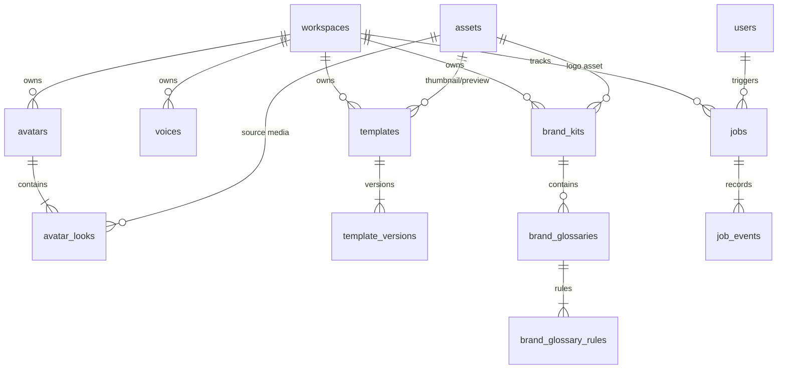
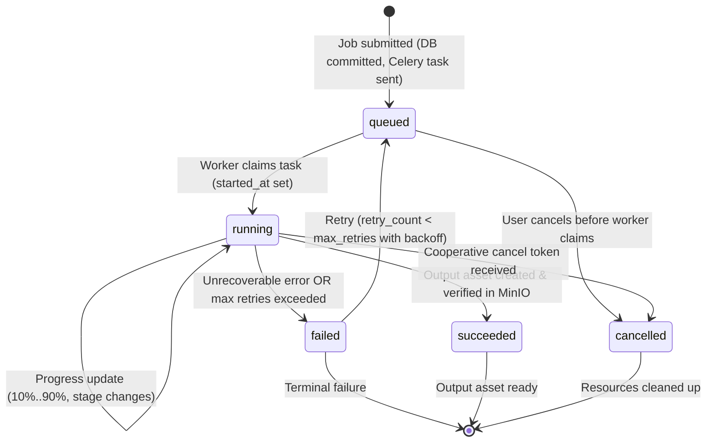

# HeyZen Phase 6 Implementation Plan: AI Provider Abstraction, Creative Library & Async Task Pipeline

**Document Version:** 1.0.0  
**Target Phase:** Phase 6 Foundation Design  
**Classification:** Technical Architecture & Implementation Blueprint  
**Workspace Root:** `d:\HeyGen\video-ai-tools`  
**Execution Mode:** PLAN-ONLY (Implementation strictly deferred)

---

## 1. Current Phase 5 Architecture Inspection Findings

A thorough inspection of the repository was conducted across `backend/app/`, `backend/alembic/`, `backend/tests/`, `docker-compose.yml`, and `docs/backend-architecture.md`.

### A. Current Implementation State
1. **Identity & Authorization Foundation (Phase 4)**:
   * Models: `User`, `UserCredential`, `UserSession`, `Workspace`, `WorkspaceMember`, `WorkspaceInvitation`.
   * RBAC: Centralized role hierarchy (`owner: 40`, `admin: 30`, `creator: 20`, `viewer: 10`) in `backend/app/core/permissions.py`.
   * Dependencies: `get_current_user`, `get_current_workspace`, `require_permission(...)`, `require_role(...)`.
   * Security: Argon2id password hashing, SHA-256 session token hashing, HttpOnly refresh cookies, rotating single-use refresh sessions.
2. **Content & Data Layer (Phase 5)**:
   * Models: `Folder`, `Project`, `ProjectVersion`, `Asset`.
   * Hierarchy & Concurrency: Self-referencing folder tree with cycle detection; immutable project version snapshots with optimistic concurrency control (`expected_revision` compare-and-swap via `SELECT ... FOR UPDATE`).
   * Structured Document: Canonical `ProjectDocumentV1` schema in PostgreSQL `JSONB` containing canvas settings, scenes, layers, avatars, speech, audio tracks, and metadata.
   * Storage: `S3StorageProvider` via MinIO on `http://127.0.0.1:9000`. Direct client uploads via pre-signed PUT URLs; server-side inspection via `get_object_metadata` (`head_object`); pre-signed GET URLs for direct download.
   * Testing & Verification: 72 automated backend tests passing across all suites (`pytest -v`).
3. **Manual Verification Anchor**:
   * Verified active project ID: `ab419823-1600-46ce-8168-6ad6bae612ca`.
   * Current revision: `2`.
   * Active version snapshot ID: `3108b779-660a-4946-8aa3-ec639ab7f16b`.
4. **Celery & Worker Foundation (Phase 3 Baseline)**:
   * `backend/app/workers/celery_app.py`: Celery instance connected to `redis://127.0.0.1:6379/0`.
   * Configuration: `task_serializer="json"`, `result_serializer="json"`, `task_acks_late=True`, `worker_prefetch_multiplier=1`.
   * Baseline task: `heyzen.ping` verified via `test_celery.py`.
5. **AI Protocol Stubs (Phase 3 Baseline)**:
   * `backend/app/ai/interfaces.py`: Protocol definitions for `LLMProvider`, `TTSProvider`, `ASRProvider`, `TranslationProvider`, `AvatarProvider`, `ImageProvider`, `VideoProvider`.
   * Data transfer objects: `ScriptGenerationResult`, `AudioSynthesisResult`, `TranscriptionResult`, `TranslationResult`.

### B. Architectural Observations & Corrections for Phase 6
* **Database Session Naming on Asset Model**: In `Asset`, the column is named `metadata` in SQL, mapped to Python attribute `extra_metadata` to prevent shadowing `Base.metadata`. The Pydantic schema uses `@model_validator(mode="before")` to map seamlessly. Any new model with metadata (e.g. `Avatar.provider_metadata`, `Job.payload`, `Job.result`) should use explicit non-conflicting names.
* **Celery Multi-Queue Setup**: Currently, Celery tasks default to the generic `celery` queue. Phase 6 must introduce explicit task routing into `cpu_media`, `gpu_ai`, and `maintenance` queues.
* **Separation of API vs Heavy Compute**: The FastAPI server must remain CPU-only and lightweight. Heavy PyTorch, CUDA, and model weight loading must remain in worker nodes or mock providers.

---

## 2. Existing Files/Modules That Should Be Reused

The Phase 6 design strictly reuses existing infrastructure without duplicate wheels:

| File / Module | Component | Reuse Strategy in Phase 6 |
| :--- | :--- | :--- |
| `backend/app/db/base.py` | `Base`, `UUIDPrimaryKeyMixin`, `TimestampMixin`, `SoftDeleteMixin` | Base classes for all new Creative Library and Job models. |
| `backend/app/db/session.py` | `get_db`, `async_session_factory` | Async SQLAlchemy sessions for repositories and services. |
| `backend/app/api/deps.py` | `get_current_user`, `get_current_workspace`, `require_permission` | Centralized route authorization and tenant resolution. |
| `backend/app/core/permissions.py` | `ROLE_PERMISSIONS`, `WorkspaceRole` | Existing permission mappings (`avatar.*`, `voice.*`, `template.*`, `brand.*`, `job.*`). |
| `backend/app/core/exceptions.py` | `AppException`, `ConflictException`, `NotFoundException`, `ForbiddenException` | Standardized error envelope responses. |
| `backend/app/core/redis.py` | `get_redis`, connection pool | Pub/Sub messaging for job event streaming and distributed locking. |
| `backend/app/storage/` | `StorageProvider`, `S3StorageProvider`, `get_storage_provider` | Media storage for avatar looks, voice previews, brand logos, job outputs. |
| `backend/app/workers/celery_app.py` | `celery_app` | Enhanced with task routing, queues, base task classes, and error handlers. |
| `backend/app/ai/interfaces.py` | AI Protocol interfaces | Expanded with provider registries, adapters, and mock implementations. |
| `backend/app/models/` | `Workspace`, `User`, `Asset`, `Project` | Foreign key references for avatars, voices, templates, brand kits, and jobs. |

---

## 3. Proposed Phase 6 Directory & File Structure

```text
backend/
├── alembic/
│   └── versions/
│       └── 0004_creative_library_and_jobs.py  # New: Alembic migration for Phase 6 tables
├── app/
│   ├── ai/
│   │   ├── __init__.py
│   │   ├── interfaces.py                      # Reused & expanded: AI protocols & DTOs
│   │   ├── registry.py                        # New: AI provider factory & registry
│   │   └── adapters/                          # New: Provider implementations
│   │       ├── __init__.py
│   │       ├── mock.py                        # New: Mock adapter for local dev & testing
│   │       ├── llm/
│   │       │   ├── __init__.py
│   │       │   ├── openai_adapter.py          # New: OpenAI / compatible (vLLM / Ollama)
│   │       │   └── local_stub.py              # New: Local heuristic fallback
│   │       ├── tts/
│   │       │   ├── __init__.py
│   │       │   └── xtts_adapter.py            # New: Coqui XTTS / ElevenLabs adapter
│   │       ├── asr/
│   │       │   ├── __init__.py
│   │       │   └── whisper_adapter.py         # New: Faster-Whisper adapter
│   │       └── avatar/
│   │           ├── __init__.py
│   │           └── liveportrait_adapter.py    # New: LivePortrait / SadTalker adapter
│   ├── models/
│   │   ├── __init__.py                        # Modified: Export new models
│   │   ├── avatar.py                          # New: Avatar, AvatarLook models
│   │   ├── voice.py                           # New: Voice model
│   │   ├── template.py                        # New: Template, TemplateVersion models
│   │   ├── brand.py                           # New: BrandKit, BrandGlossary, BrandGlossaryRule
│   │   └── job.py                             # New: Job, JobEvent models
│   ├── schemas/
│   │   ├── __init__.py                        # Modified: Export new schemas
│   │   ├── avatar.py                          # New: Avatar and Look request/response schemas
│   │   ├── voice.py                           # New: Voice request/response schemas
│   │   ├── template.py                        # New: Template request/response schemas
│   │   ├── brand.py                           # New: BrandKit & Glossary schemas
│   │   └── job.py                             # New: Job lifecycle, SSE events, submission schemas
│   ├── repositories/
│   │   ├── avatar.py                          # New: Avatar repository
│   │   ├── voice.py                           # New: Voice repository
│   │   ├── template.py                        # New: Template repository
│   │   ├── brand.py                           # New: Brand repository
│   │   └── job.py                             # New: Job & JobEvent repository
│   ├── services/
│   │   ├── avatar_service.py                  # New: Avatar business logic
│   │   ├── voice_service.py                   # New: Voice catalog & clone logic
│   │   ├── template_service.py                # New: Template instantiation logic
│   │   ├── brand_service.py                   # New: Brand kit & glossary management
│   │   ├── job_service.py                     # New: Job lifecycle, dispatch & event streaming
│   │   └── sse_service.py                     # New: Redis Pub/Sub -> FastAPI SSE bridge
│   ├── workers/
│   │   ├── __init__.py
│   │   ├── celery_app.py                      # Modified: Multi-queue routing configuration
│   │   ├── base.py                            # New: BaseTask with DB session & retry logic
│   │   └── tasks/                             # New: Celery background task definitions
│   │       ├── __init__.py
│   │       ├── media_tasks.py                 # New: CPU tasks (waveform, transcode, stitch)
│   │       ├── ai_tasks.py                    # New: GPU tasks (TTS, ASR, lip-sync, script)
│   │       └── maintenance_tasks.py           # New: Asset cleanup, temp file pruning
│   └── api/v1/endpoints/
│       ├── avatars.py                         # New: Avatar & look endpoints
│       ├── voices.py                          # New: Voice catalog endpoints
│       ├── templates.py                       # New: Template catalog & instantiate endpoints
│       ├── brand_kits.py                      # New: Brand kit & glossary endpoints
│       └── jobs.py                            # New: Job status, cancel & SSE stream endpoints
└── tests/
    ├── test_avatars.py                        # New: Avatar CRUD & workspace scoping tests
    ├── test_voices.py                         # New: Voice library & cloning tests
    ├── test_templates.py                      # New: Template instantiation & placeholder tests
    ├── test_brand_kits.py                     # New: Brand kit & glossary rule tests
    ├── test_jobs.py                           # New: Job lifecycle & state machine tests
    ├── test_ai_adapters.py                    # New: AI provider adapter contract tests
    └── test_celery_pipeline.py                # New: Celery async dispatch & retry tests
```

---

## 4. Database Models & Relationships

All models inherit from `Base` and utilize standard mixins (`UUIDPrimaryKeyMixin`, `TimestampMixin`, `SoftDeleteMixin`).



### A. Creative Library Models

#### 1. `Avatar` (`avatars`)
* `id`: UUID (PK, `UUIDPrimaryKeyMixin`)
* `workspace_id`: UUID (Nullable FK -> `workspaces.id` ON DELETE CASCADE). `NULL` signifies a global system-provided avatar visible to all tenants.
* `name`: VARCHAR(128), NOT NULL (e.g., "Evelyn in Studio", "Marcus Casual").
* `avatar_type`: VARCHAR(32), NOT NULL (`public`, `custom`, `photo`, `digital_twin`).
* `gender`: VARCHAR(16), NULLABLE (`male`, `female`, `neutral`).
* `preview_image_asset_id`: UUID (Nullable FK -> `assets.id` ON DELETE SET NULL).
* `preview_video_asset_id`: UUID (Nullable FK -> `assets.id` ON DELETE SET NULL).
* `is_public`: BOOLEAN, NOT NULL, default `FALSE`.
* `training_status`: VARCHAR(32), NOT NULL, default `'ready'` (`pending`, `training`, `ready`, `failed`).
* `model_provider`: VARCHAR(64), NOT NULL, default `'internal'` (e.g. `'liveportrait'`, `'sadtalker'`, `'heygen'`).
* `provider_metadata`: JSONB, NOT NULL, default `'{}'::jsonb` (model checkpoint paths, facial landmark config).
* `created_at`, `updated_at`, `deleted_at`: Mixin timestamps.

#### 2. `AvatarLook` (`avatar_looks`)
* `id`: UUID (PK, `UUIDPrimaryKeyMixin`)
* `avatar_id`: UUID (FK -> `avatars.id` ON DELETE CASCADE), NOT NULL.
* `name`: VARCHAR(128), NOT NULL (e.g., "Business Suit", "Casual Friday", "Circular Talking Head").
* `pose_type`: VARCHAR(32), NOT NULL, default `'half_body'` (`half_body`, `close_up`, `full_body`, `circular`).
* `thumbnail_asset_id`: UUID (Nullable FK -> `assets.id` ON DELETE SET NULL).
* `source_asset_id`: UUID (Nullable FK -> `assets.id` ON DELETE SET NULL) (High-res neutral reference frame/clip).
* `is_default`: BOOLEAN, NOT NULL, default `FALSE`.
* `created_at`, `updated_at`: `TimestampMixin`.

#### 3. `Voice` (`voices`)
* `id`: UUID (PK, `UUIDPrimaryKeyMixin`)
* `workspace_id`: UUID (Nullable FK -> `workspaces.id` ON DELETE CASCADE). `NULL` signifies a public library voice.
* `name`: VARCHAR(128), NOT NULL (e.g., "Marcus Authoritative", "Serena Warm").
* `voice_type`: VARCHAR(32), NOT NULL (`preset`, `cloned`, `custom`).
* `language`: VARCHAR(16), NOT NULL, default `'en'` (ISO 639-1 code).
* `locale`: VARCHAR(16), NOT NULL, default `'en-US'` (BCP 47 tag).
* `gender`: VARCHAR(16), NOT NULL (`male`, `female`, `neutral`).
* `preview_audio_asset_id`: UUID (Nullable FK -> `assets.id` ON DELETE SET NULL).
* `provider`: VARCHAR(64), NOT NULL, default `'internal_xtts'` (`internal_xtts`, `elevenlabs`, `openai`).
* `external_voice_id`: VARCHAR(255), NULLABLE (Remote provider identifier or local checkpoint path).
* `training_status`: VARCHAR(32), NOT NULL, default `'ready'` (`pending`, `processing`, `ready`, `failed`).
* `settings_schema`: JSONB, NOT NULL, default `'{"speed": 1.0, "pitch": 0.0, "stability": 0.75}'::jsonb`.
* `created_at`, `updated_at`, `deleted_at`: Mixin timestamps.

#### 4. `Template` (`templates`) & `TemplateVersion` (`template_versions`)
* **`Template`**:
  * `id`: UUID (PK, `UUIDPrimaryKeyMixin`)
  * `workspace_id`: UUID (Nullable FK -> `workspaces.id` ON DELETE CASCADE). `NULL` for public templates.
  * `title`: VARCHAR(128), NOT NULL.
  * `category`: VARCHAR(64), NOT NULL (`marketing`, `sales`, `onboarding`, `education`, `social`).
  * `aspect_ratio`: VARCHAR(16), NOT NULL, default `'16:9'`.
  * `thumbnail_asset_id`: UUID (Nullable FK -> `assets.id` ON DELETE SET NULL).
  * `preview_video_asset_id`: UUID (Nullable FK -> `assets.id` ON DELETE SET NULL).
  * `is_public`: BOOLEAN, NOT NULL, default `FALSE`.
  * `current_version_id`: UUID (Nullable FK -> `template_versions.id` ON DELETE SET NULL).
  * `created_at`, `updated_at`, `deleted_at`: Mixin timestamps.
* **`TemplateVersion`**:
  * `id`: UUID (PK, `UUIDPrimaryKeyMixin`)
  * `template_id`: UUID (FK -> `templates.id` ON DELETE CASCADE), NOT NULL.
  * `revision`: INTEGER, NOT NULL.
  * `document`: JSONB, NOT NULL (Compatible with `ProjectDocumentV1` scene structure, containing placeholder tokens `{{client_name}}`, `{{cta_url}}`).
  * `placeholders`: JSONB, NOT NULL, default `'[]'::jsonb` (Metadata array defining placeholder types and defaults).
  * `created_by`: UUID (FK -> `users.id` ON DELETE RESTRICT), NOT NULL.
  * `created_at`: TIMESTAMPTZ, NOT NULL.
  * *Constraint*: `UNIQUE(template_id, revision)`.

#### 5. `BrandKit` (`brand_kits`), `BrandGlossary` (`brand_glossaries`), `BrandGlossaryRule` (`brand_glossary_rules`)
* **`BrandKit`**:
  * `id`: UUID (PK, `UUIDPrimaryKeyMixin`)
  * `workspace_id`: UUID (FK -> `workspaces.id` ON DELETE CASCADE), NOT NULL.
  * `name`: VARCHAR(128), NOT NULL, default `'Default Brand Kit'`.
  * `primary_color`: VARCHAR(32), NOT NULL, default `'#6366F1'`.
  * `secondary_color`: VARCHAR(32), NOT NULL, default `'#1E1B4B'`.
  * `accent_color`: VARCHAR(32), NOT NULL, default `'#10B981'`.
  * `background_color`: VARCHAR(32), NOT NULL, default `'#0F172A'`.
  * `font_family_primary`: VARCHAR(128), NOT NULL, default `'Inter'`.
  * `font_family_heading`: VARCHAR(128), NOT NULL, default `'Cabinet Grotesk'`.
  * `logo_asset_id`: UUID (Nullable FK -> `assets.id` ON DELETE SET NULL).
  * `is_default`: BOOLEAN, NOT NULL, default `TRUE`.
  * `created_at`, `updated_at`, `deleted_at`: Mixin timestamps.
* **`BrandGlossary`**:
  * `id`: UUID (PK, `UUIDPrimaryKeyMixin`)
  * `brand_kit_id`: UUID (FK -> `brand_kits.id` ON DELETE CASCADE), NOT NULL.
  * `name`: VARCHAR(128), NOT NULL, default `'Pronunciation & Translation Glossary'`.
  * `created_at`, `updated_at`: `TimestampMixin`.
* **`BrandGlossaryRule`**:
  * `id`: UUID (PK, `UUIDPrimaryKeyMixin`)
  * `glossary_id`: UUID (FK -> `brand_glossaries.id` ON DELETE CASCADE), NOT NULL.
  * `term`: VARCHAR(128), NOT NULL (e.g., "HeyZen", "PostgreSQL").
  * `replacement_phonetic`: VARCHAR(128), NULLABLE (e.g., "Hay-Zen" for TTS phoneme guidance).
  * `action_type`: VARCHAR(32), NOT NULL, default `'phonetic_override'` (`phonetic_override`, `do_not_translate`, `force_translate`).
  * `target_language`: VARCHAR(16), NULLABLE (e.g. `'de'`, `'es'`).
  * `translated_term`: VARCHAR(128), NULLABLE.
  * `created_at`: TIMESTAMPTZ, NOT NULL.

---

### B. Async Task Engine Models

#### 1. `Job` (`jobs`)
Durable, transactional source of truth for all asynchronous pipeline executions.
* `id`: UUID (PK, `UUIDPrimaryKeyMixin`)
* `workspace_id`: UUID (FK -> `workspaces.id` ON DELETE CASCADE), NOT NULL.
* `user_id`: UUID (FK -> `users.id` ON DELETE RESTRICT), NOT NULL.
* `job_type`: VARCHAR(48), NOT NULL (`render_video`, `tts_synthesis`, `lip_sync`, `translate_project`, `avatar_train`, `voice_clone`, `asset_process`, `script_generate`).
* `status`: VARCHAR(32), NOT NULL, default `'queued'` (`queued`, `running`, `succeeded`, `failed`, `cancelled`).
* `progress_percent`: INTEGER, NOT NULL, default `0` (0-100).
* `stage`: VARCHAR(64), NULLABLE (e.g. `"synthesizing_audio"`, `"generating_lip_sync"`, `"rendering_frames"`, `"packaging_mp4"`).
* `priority`: INTEGER, NOT NULL, default `10` (0 = low, 10 = standard, 30 = premium).
* `retry_count`: INTEGER, NOT NULL, default `0`.
* `max_retries`: INTEGER, NOT NULL, default `3`.
* `idempotency_key`: VARCHAR(128), NULLABLE.
* `celery_task_id`: VARCHAR(128), NULLABLE (Links to Celery runtime task UUID).
* `payload`: JSONB, NOT NULL (Input parameters, entity references, model options).
* `result`: JSONB, NULLABLE (Output asset UUIDs, synthesized metadata, metrics).
* `error_details`: JSONB, NULLABLE (`{"code": "TTS_SYNTHESIS_FAILED", "message": "...", "retryable": false}`).
* `created_at`: TIMESTAMPTZ, NOT NULL.
* `started_at`: TIMESTAMPTZ, NULLABLE.
* `completed_at`: TIMESTAMPTZ, NULLABLE.
* *Constraints*: Unique partial index `UNIQUE(workspace_id, idempotency_key)` WHERE `idempotency_key IS NOT NULL AND status NOT IN ('failed', 'cancelled')`.

#### 2. `JobEvent` (`job_events`)
Audit trail and historical sequence of discrete progress events per job.
* `id`: BIGSERIAL (Primary Key, auto-incrementing integer).
* `job_id`: UUID (FK -> `jobs.id` ON DELETE CASCADE), NOT NULL.
* `event_type`: VARCHAR(48), NOT NULL (`status_change`, `progress_update`, `stage_start`, `warning`, `error`).
* `from_status`: VARCHAR(32), NULLABLE.
* `to_status`: VARCHAR(32), NULLABLE.
* `progress_percent`: INTEGER, NULLABLE.
* `stage`: VARCHAR(64), NULLABLE.
* `message`: VARCHAR(512), NOT NULL.
* `event_data`: JSONB, NOT NULL, default `'{}'::jsonb`.
* `created_at`: TIMESTAMPTZ, NOT NULL, default `now()`.
* *Index*: `(job_id, id ASC)`.

---

## 5. Migration Strategy

* **Migration Number**: `0004_creative_library_and_jobs`
* **Down Revision**: `0003_projects_folders_assets`
* **Execution Safety**:
  1. No drops or modifications of existing tables (`users`, `user_credentials`, `user_sessions`, `workspaces`, `workspace_members`, `workspace_invitations`, `folders`, `projects`, `project_versions`, `assets`).
  2. Creates tables in dependency order:
     1. `avatars`
     2. `avatar_looks`
     3. `voices`
     4. `templates`
     5. `template_versions`
     6. `brand_kits`
     7. `brand_glossaries`
     8. `brand_glossary_rules`
     9. `jobs`
     10. `job_events`
  3. Circular foreign keys (e.g. `templates.current_version_id -> template_versions.id`) added via `op.create_foreign_key` after table creation.
  4. Strategic indexing on `workspace_id`, `is_public`, `status`, `created_at`.
  5. Tested forward and backward (`alembic upgrade head`, `alembic downgrade -1`).

---

## 6. Pydantic Schemas

### A. Creative Library Schemas
* **Avatars (`backend/app/schemas/avatar.py`)**:
  * `AvatarLookCreate`: `name`, `pose_type`, `thumbnail_asset_id`, `source_asset_id`, `is_default`.
  * `AvatarLookResponse`: `id`, `avatar_id`, `name`, `pose_type`, `thumbnail_asset_id`, `source_asset_id`, `is_default`, `created_at`.
  * `AvatarCreate`: `name`, `avatar_type`, `gender`, `model_provider`, `looks: List[AvatarLookCreate]`.
  * `AvatarUpdate`: `name`, `gender`, `is_public`.
  * `AvatarResponse`: `id`, `workspace_id`, `name`, `avatar_type`, `gender`, `is_public`, `training_status`, `model_provider`, `preview_image_asset_id`, `preview_video_asset_id`, `looks: List[AvatarLookResponse]`, `created_at`.
* **Voices (`backend/app/schemas/voice.py`)**:
  * `VoiceCreate`: `name`, `language`, `locale`, `gender`, `provider`, `settings_schema`.
  * `VoiceCloneRequest`: `name`, `language`, `gender`, `sample_asset_ids: List[uuid.UUID]`.
  * `VoiceResponse`: `id`, `workspace_id`, `name`, `voice_type`, `language`, `locale`, `gender`, `preview_audio_asset_id`, `provider`, `training_status`, `settings_schema`, `created_at`.
* **Templates (`backend/app/schemas/template.py`)**:
  * `TemplateCreate`: `title`, `category`, `aspect_ratio`, `document: ProjectDocumentV1`, `placeholders: List[Dict[str, Any]]`.
  * `TemplateResponse`: `id`, `workspace_id`, `title`, `category`, `aspect_ratio`, `is_public`, `thumbnail_asset_id`, `preview_video_asset_id`, `current_version_id`, `created_at`.
  * `TemplateVersionResponse`: `id`, `template_id`, `revision`, `document`, `placeholders`, `created_at`.
  * `TemplateInstantiateRequest`: `title: str`, `folder_id: Optional[uuid.UUID]`, `variables: Dict[str, Any]`.
* **Brand Kits (`backend/app/schemas/brand.py`)**:
  * `BrandKitCreate`: `name`, `primary_color`, `secondary_color`, `accent_color`, `background_color`, `font_family_primary`, `font_family_heading`, `logo_asset_id`.
  * `BrandKitUpdate`: Optional fields of `BrandKitCreate`.
  * `BrandGlossaryRuleCreate`: `term`, `replacement_phonetic`, `action_type`, `target_language`, `translated_term`.
  * `BrandGlossaryRuleResponse`: `id`, `glossary_id`, `term`, `replacement_phonetic`, `action_type`, `target_language`, `translated_term`, `created_at`.
  * `BrandKitResponse`: Complete brand palette, typography, logo, and active glossary rules.

### B. Async Task Pipeline Schemas (`backend/app/schemas/job.py`)
* `JobSubmitRequest`:
  * `job_type`: str (`render_video`, `tts_synthesis`, `lip_sync`, `translate_project`, `voice_clone`, etc.).
  * `payload`: Dict[str, Any] (Strictly validated by job type).
  * `priority`: Optional[int] = 10.
  * `idempotency_key`: Optional[str] = None.
* `JobResponse`:
  * `id`: uuid.UUID
  * `workspace_id`: uuid.UUID
  * `job_type`: str
  * `status`: str (`queued`, `running`, `succeeded`, `failed`, `cancelled`)
  * `progress_percent`: int
  * `stage`: Optional[str]
  * `payload`: Dict[str, Any]
  * `result`: Optional[Dict[str, Any]]
  * `error_details`: Optional[Dict[str, Any]]
  * `created_at`: datetime
  * `started_at`: Optional[datetime]
  * `completed_at`: Optional[datetime]
* `JobEventResponse`:
  * `id`: int
  * `job_id`: uuid.UUID
  * `event_type`: str
  * `from_status`: Optional[str]
  * `to_status`: Optional[str]
  * `progress_percent`: Optional[int]
  * `stage`: Optional[str]
  * `message`: str
  * `created_at`: datetime

---

## 7. Repository & Service Boundaries

Following the layered architecture established in Phase 4 & 5:

```text
FastAPI Router
      │ (Dependency Injection: auth, workspace, permission)
      ▼
Domain Service
      ├── Business Rules & Validation
      ├── AI Provider Call / Celery Task Dispatch
      └── Redis Pub/Sub Publish
      │
      ▼
Domain Repository
      ├── Pure SQLAlchemy 2.0 Async Queries
      ├── Workspace Tenant Scoping
      └── Row-Level Locks (FOR UPDATE)
```

1. **`AvatarService` & `AvatarRepository`**:
   * Scopes queries to `workspace_id == workspace.id OR is_public == True`.
   * Enforces that custom digital twin training dispatches an async `Job` of type `avatar_train`.
2. **`VoiceService` & `VoiceRepository`**:
   * Lists combined catalog: public library voices + workspace cloned voices.
   * Dispatches voice cloning jobs through `JobService`.
3. **`TemplateService` & `TemplateRepository`**:
   * Handles template creation and versioning.
   * `instantiate_template(template_id, workspace_id, variables)`: Parses `TemplateVersion.document`, substitutes placeholder tokens (e.g. `{{client_name}}` -> `"Acme Corp"`), and invokes `ProjectService.create_project` to produce an editable project.
4. **`BrandService` & `BrandRepository`**:
   * Enforces single default brand kit per workspace.
   * CRUD on pronunciation and translation glossary rules.
5. **`JobService` & `JobRepository`**:
   * `submit_job(...)`: Transactionally creates `Job` in PostgreSQL, checks idempotency key, records initial `JobEvent`, commits DB, and calls `celery_app.send_task(task_name, args=[job.id, payload], queue=queue_name)`.
   * `update_progress(job_id, progress_percent, stage, message)`: Worker-facing hook that updates `jobs` row, appends `JobEvent`, and publishes JSON event to Redis Pub/Sub channel `job:events:{job_id}`.
   * `cancel_job(job_id, workspace_id)`: Verifies ownership, updates status to `cancelled`, revokes Celery task, and publishes cancellation event.

---

## 8. API Endpoint Design

All workspace-scoped endpoints use `/api/v1/workspaces/{workspace_id}/...`. Public libraries provide root fallback endpoints.

### Creative Library Endpoints
* **Avatars**:
  * `GET /api/v1/avatars/public` (`avatar.read` or authenticated): Browse global public avatar library.
  * `GET /api/v1/workspaces/{workspace_id}/avatars` (`avatar.read`): List workspace avatars (public + custom).
  * `GET /api/v1/workspaces/{workspace_id}/avatars/{avatar_id}` (`avatar.read`): Get avatar details and looks.
  * `POST /api/v1/workspaces/{workspace_id}/avatars` (`avatar.create`): Create custom avatar definition.
  * `POST /api/v1/workspaces/{workspace_id}/avatars/{avatar_id}/looks` (`avatar.create`): Add look/pose to avatar.
  * `DELETE /api/v1/workspaces/{workspace_id}/avatars/{avatar_id}` (`avatar.delete`): Soft-delete avatar.
* **Voices**:
  * `GET /api/v1/voices/public`: Browse global public voice catalog.
  * `GET /api/v1/workspaces/{workspace_id}/voices` (`voice.read`): List voices (filtered by language, gender).
  * `POST /api/v1/workspaces/{workspace_id}/voices/clone` (`voice.create`): Submit voice cloning job.
* **Templates**:
  * `GET /api/v1/templates/public`: Browse public template catalog.
  * `GET /api/v1/workspaces/{workspace_id}/templates` (`template.read`): List workspace templates.
  * `GET /api/v1/workspaces/{workspace_id}/templates/{template_id}` (`template.read`): View template scenes and placeholders.
  * `POST /api/v1/workspaces/{workspace_id}/templates` (`template.create`): Save current project as template.
  * `POST /api/v1/workspaces/{workspace_id}/templates/{template_id}/instantiate` (`project.create`): Instantiate new project from template.
* **Brand Kits**:
  * `GET /api/v1/workspaces/{workspace_id}/brand-kits` (`brand.read`): List workspace brand kits.
  * `POST /api/v1/workspaces/{workspace_id}/brand-kits` (`brand.create`): Create brand kit.
  * `PATCH /api/v1/workspaces/{workspace_id}/brand-kits/{kit_id}` (`brand.update`): Update brand colors, fonts, logo.
  * `GET /api/v1/workspaces/{workspace_id}/brand-kits/{kit_id}/glossary` (`brand.read`): Get glossary rules.
  * `POST /api/v1/workspaces/{workspace_id}/brand-kits/{kit_id}/glossary/rules` (`brand.create`): Add pronunciation rule.
  * `DELETE /api/v1/workspaces/{workspace_id}/brand-kits/{kit_id}/glossary/rules/{rule_id}` (`brand.delete`): Remove rule.

### Async Task Pipeline Endpoints
* **Jobs**:
  * `POST /api/v1/workspaces/{workspace_id}/jobs` (`job.read`): Submit an async job.
  * `GET /api/v1/workspaces/{workspace_id}/jobs/{job_id}` (`job.read`): Poll current status, progress, stage, error details.
  * `GET /api/v1/workspaces/{workspace_id}/jobs/{job_id}/events` (`job.read`): Audit historical stage events.
  * `POST /api/v1/workspaces/{workspace_id}/jobs/{job_id}/cancel` (`job.cancel`): Cancel running/queued job.
  * `GET /api/v1/workspaces/{workspace_id}/jobs/{job_id}/stream` (`job.read`): **Server-Sent Events (SSE)** endpoint streaming real-time stage updates (`text/event-stream`).

---

## 9. Permission Requirements

Permissions are already mapped in `backend/app/core/permissions.py` and strictly enforced:

| Resource Action | Permission Key | Owner | Admin | Creator | Viewer |
| :--- | :--- | :---: | :---: | :---: | :---: |
| Read Avatars / Looks | `avatar.read` | Yes | Yes | Yes | Yes |
| Create Avatar / Look / Clone | `avatar.create` | Yes | Yes | Yes | No (403) |
| Update Avatar | `avatar.update` | Yes | Yes | No | No (403) |
| Delete Avatar | `avatar.delete` | Yes | Yes | No | No (403) |
| Read Voices | `voice.read` | Yes | Yes | Yes | Yes |
| Clone Voice | `voice.create` | Yes | Yes | Yes | No (403) |
| Read Templates | `template.read` | Yes | Yes | Yes | Yes |
| Create Template | `template.create` | Yes | Yes | Yes | No (403) |
| Read Brand Kits | `brand.read` | Yes | Yes | Yes | Yes |
| Manage Brand Kits & Rules | `brand.create`, `brand.update`, `brand.delete` | Yes | Yes | Yes (Create) | No (403) |
| Read Job & Stream Events | `job.read` | Yes | Yes | Yes | Yes |
| Cancel Job | `job.cancel` | Yes | Yes | Yes | No (403) |

---

## 10. AI Provider Interface Contracts

Building upon `backend/app/ai/interfaces.py`, Phase 6 defines provider-neutral adapters with self-hosted / local open-source implementations prioritized:

```text
                    ┌─────────────────────────┐
                    │    Domain Services      │
                    └────────────┬────────────┘
                                 │
                    ┌────────────▼────────────┐
                    │   AIProviderRegistry    │
                    └────────────┬────────────┘
                                 │
      ┌──────────────┬───────────┴───┬──────────────┬──────────────┐
      ▼              ▼               ▼              ▼              ▼
┌───────────┐  ┌───────────┐   ┌───────────┐  ┌───────────┐  ┌───────────┐
│LLMProvider│  │TTSProvider│   │ASRProvider│  │AvatarProv.│  │ImageProv. │
└─────┬─────┘  └─────┬─────┘   └─────┬─────┘  └─────┬─────┘  └─────┬─────┘
      │              │               │              │              │
      ▼              ▼               ▼              ▼              ▼
[OpenAI/vLLM]   [Coqui XTTS]     [Faster-      [LivePortrait/ [ComfyUI /
/ Ollama]       / Piper]         Whisper]       SadTalker]     Diffusers]
```

### Protocol Contracts & Method Signatures

1. **`LLMProvider`**:
   * `async def generate_script(prompt: str, system_prompt: Optional[str], context: Optional[dict]) -> ScriptGenerationResult`
   * `async def stream_script(prompt: str, system_prompt: Optional[str], context: Optional[dict]) -> AsyncGenerator[str, None]`
   * *Adapters*: `OpenAILLMAdapter` (supports OpenAI API, vLLM, Ollama, DeepSeek-compatible endpoints), `MockLLMAdapter`.
2. **`TTSProvider`**:
   * `async def synthesize_speech(text: str, voice_id: str, speed: float, pitch: float, pronunciation_rules: Optional[list]) -> AudioSynthesisResult`
   * `async def clone_voice(voice_name: str, sample_audio_keys: list[str], language: str) -> str`
   * *Adapters*: `XTTSAdapter` (Coqui XTTS v2 self-hosted), `ElevenLabsTTSAdapter` (Cloud fallback), `MockTTSAdapter`.
3. **`ASRProvider`**:
   * `async def transcribe_audio(audio_storage_key: str, language: Optional[str]) -> TranscriptionResult`
   * *Adapters*: `FasterWhisperAdapter` (CTranslate2-backed Whisper self-hosted), `MockASRAdapter`.
4. **`TranslationProvider`**:
   * `async def translate_text(text: str, source_lang: str, target_lang: str, glossary_rules: Optional[list]) -> TranslationResult`
   * *Adapters*: `LocalTranslationAdapter` (MarianMT / NLLB-200), `DeepLAdapter`, `MockTranslationAdapter`.
5. **`AvatarProvider`**:
   * `async def generate_lip_sync(avatar_look_key: str, audio_storage_key: str, output_format: str = "mp4") -> str` (Returns generated video MinIO storage key).
   * `async def train_digital_twin(training_video_keys: list[str], avatar_name: str) -> str`
   * *Adapters*: `LivePortraitAdapter` (Fast lip-sync & expression retargeting), `MockAvatarAdapter`.
6. **`ImageProvider`**:
   * `async def generate_image(prompt: str, aspect_ratio: str, negative_prompt: Optional[str]) -> str`
   * *Adapters*: `DiffusersAdapter` (SDXL / Flux local worker), `MockImageAdapter`.

---

## 11. Celery Architecture & Task Routing

### Worker & Queue Topology
```text
Redis Message Broker (redis://127.0.0.1:6379/0)
  ├── Queue: "cpu_media" ────> Media Workers (FFmpeg, audio normalize, thumbnailing)
  ├── Queue: "gpu_ai"    ────> AI Workers (PyTorch, vLLM, Whisper, XTTS, LivePortrait)
  └── Queue: "maintenance" ──> Background Workers (Autosave cleanup, object GC)
```

### Configuration Specifications
* **Task Routing (`celery_app.conf.task_routes`)**:
  ```python
  task_routes = {
      "tasks.media.*": {"queue": "cpu_media"},
      "tasks.ai.tts_*": {"queue": "gpu_ai"},
      "tasks.ai.lip_sync_*": {"queue": "gpu_ai"},
      "tasks.ai.transcribe_*": {"queue": "gpu_ai"},
      "tasks.ai.translate_*": {"queue": "gpu_ai"},
      "tasks.maintenance.*": {"queue": "maintenance"},
  }
  ```
* **Late Acknowledgments (`task_acks_late=True`)**:
  * Tasks are only acknowledged *after* successful completion or recorded failure. If a worker crashes mid-task, Celery redelivers the message to another worker.
* **Prefetch Multiplier (`worker_prefetch_multiplier=1`)**:
  * Workers take exactly 1 task at a time, preventing heavy video generation tasks from queue-starving fast audio tasks on the same worker.
* **Result Backend**:
  * PostgreSQL `jobs` table is the **primary** durable result store. Redis backend is used only for short-lived Celery task metadata.

---

## 12. Job Lifecycle & State Machine



### State Transition Invariants
1. **`queued -> running`**: Can only occur if current status is `queued`.
2. **`running -> succeeded`**: Can only occur if current status is `running`. Requires output asset reference in `result`.
3. **`running -> failed`**: Sets `error_details = {"code": "...", "message": "...", "traceback": "..."}`.
4. **Terminal States**: `succeeded`, `failed` (when `retry_count >= max_retries`), and `cancelled` are terminal. No further updates are permitted.

---

## 13. Job Event & Progress Design (SSE Stream)

### Real-Time Pub/Sub Bridge
1. **Worker Emits**: When a worker finishes a pipeline stage (e.g. 50% - "Audio synthesized"), it calls:
   ```python
   await job_service.update_progress(
       job_id=job.id,
       progress_percent=50,
       stage="audio_synthesized",
       message="TTS audio stem generated successfully.",
   )
   ```
2. **PostgreSQL Audit**: Inserts a row into `job_events` (`event_type="progress_update"`, `progress_percent=50`, `stage="audio_synthesized"`).
3. **Redis Pub/Sub**: Publishes payload to Redis channel `job:events:{job_id}`:
   ```json
   {
     "job_id": "9b1deb4d-3b7d-4bad-9bdd-2b0d7b3dcb6d",
     "status": "running",
     "progress_percent": 50,
     "stage": "audio_synthesized",
     "message": "TTS audio stem generated successfully."
   }
   ```
4. **FastAPI SSE Endpoint (`GET /api/v1/workspaces/{ws_id}/jobs/{job_id}/stream`)**:
   * Uses `StreamingResponse(media_type="text/event-stream")`.
   * Subscribes asynchronously to `job:events:{job_id}`.
   * Yields formatted events to the client:
     ```text
     event: progress
     data: {"progress_percent": 50, "stage": "audio_synthesized", "message": "..."}

     ```
   * On terminal status (`succeeded`, `failed`, `cancelled`), yields final event and gracefully closes the connection.

---

## 14. Idempotency Strategy

* **Problem**: Network retries or rapid double-clicks on "Generate Video" could launch redundant GPU jobs.
* **Mechanism**:
  1. Client generates UUIDv4 `idempotency_key` and passes it in `JobSubmitRequest`.
  2. The service executes an atomic check in PostgreSQL:
     ```sql
     SELECT id, status FROM jobs 
     WHERE workspace_id = :ws_id 
       AND idempotency_key = :idempotency_key 
       AND status NOT IN ('failed', 'cancelled');
     ```
  3. If an existing job is found, the backend returns the existing `JobResponse` (HTTP 200) without dispatching a new Celery task.
  4. Database constraint: Unique partial index `CREATE UNIQUE INDEX uq_jobs_workspace_idempotency ON jobs (workspace_id, idempotency_key) WHERE idempotency_key IS NOT NULL AND status NOT IN ('failed', 'cancelled');`.

---

## 15. Retry Strategy

* **Transient vs Permanent Errors**:
  * **Transient (Retryable)**: Network timeout to S3, temporary Redis disconnect, GPU out-of-memory due to temporary load.
  * **Permanent (Non-retryable)**: Corrupted audio sample, invalid avatar look ID, malformed script text.
* **Celery Backoff**:
  * Configured via `BaseTask`:
    ```python
    @celery_app.task(
        bind=True,
        max_retries=3,
        autoretry_for=(TransientStorageError, GPUOutOfMemoryError),
        retry_backoff=True,         # Exponential: 2s, 4s, 8s
        retry_backoff_max=60,       # Cap at 60s
        retry_jitter=True,          # Prevent thundering herd
    )
    ```
* **PostgreSQL State Synchronization**:
  * In the Celery `on_retry` hook, `job.retry_count` is incremented and a `JobEvent` of type `'warning'` is recorded.

---

## 16. Cancellation Strategy

* **Two-Layer Cooperative Cancellation**:
  1. **Layer 1: Celery Revocation**:
     * Client calls `POST /jobs/{job_id}/cancel`.
     * If `job.status == 'queued'`, backend invokes `celery_app.control.revoke(job.celery_task_id, terminate=True)`.
     * `jobs.status` immediately set to `'cancelled'`.
  2. **Layer 2: Cooperative Redis Token (Running Tasks)**:
     * For jobs already executing on a worker (`status == 'running'`), hard killing the process could corrupt FFmpeg pipelines or leak GPU memory.
     * The backend sets a Redis cancellation flag: `SET job:cancel:{job_id} 1 EX 3600`.
     * The worker checks `is_cancelled(job_id)` at discrete stage boundaries (e.g. between audio synthesis and video rendering).
     * If cancelled, the worker cleanly aborts, purges temporary files from disk/MinIO, updates PostgreSQL to `cancelled`, and exits.

---

## 17. CPU/GPU Worker Strategy

* **Deployment Decoupling**:
  * The FastAPI web container has **zero** GPU dependencies and runs on lightweight CPU instances.
  * Media workers (FFmpeg, audio stitching) run on CPU worker nodes.
  * AI workers (PyTorch, vLLM, XTTS, Whisper, LivePortrait) run on dedicated GPU nodes with access to shared MinIO storage.
* **Environment Configuration**:
  * Workers communicate solely via Redis (broker) and MinIO (media I/O). They do not require shared POSIX filesystem mounts, ensuring cloud portability (AWS EC2, RunPod, Lambda Labs, on-premise).

---

## 18. MinIO / Object Storage Integration

All worker intermediate files and output artifacts are stored in MinIO with deterministic, workspace-isolated keys:

```text
heyzen-media/
├── workspaces/{workspace_id}/
│   ├── avatars/{avatar_id}/
│   │   ├── looks/{look_id}/source.png
│   │   └── preview.mp4
│   ├── voices/{voice_id}/
│   │   ├── samples/{sample_id}.wav
│   │   └── preview.mp3
│   ├── templates/{template_id}/
│   │   └── preview.mp4
│   ├── brands/{brand_kit_id}/
│   │   └── logo.svg
│   └── jobs/{job_id}/
│       ├── audio_stem.wav
│       ├── raw_avatar_cut.mp4
│       └── output.mp4
```

* **No Binary Over-the-Wire**: Workers fetch inputs from MinIO and write outputs directly to MinIO. Celery task arguments contain **only** S3 storage keys (strings), never raw binary blobs or base64 strings.

---

## 19. Asset & Creative Library Relationships

* Every visual and audio entity in the Creative Library maps to the durable `Asset` catalog:
  * `AvatarLook.source_asset_id -> Asset.id` (MIME: `image/png` or `video/mp4`)
  * `Avatar.preview_image_asset_id -> Asset.id`
  * `Voice.preview_audio_asset_id -> Asset.id` (MIME: `audio/mpeg` or `audio/wav`)
  * `BrandKit.logo_asset_id -> Asset.id` (MIME: `image/svg+xml` or `image/png`)
* **Workspace Invariant**:
  * When assigning an asset to a brand kit or avatar look, the repository verifies that `asset.workspace_id == workspace.id` (or the asset is marked public). Cross-workspace asset linkage is rejected with HTTP 404.

---

## 20. Project Integration Strategy

The Creative Library seamlessly integrates into the canonical `ProjectDocumentV1` schema established in Phase 5:

1. **Avatar Integration**:
   * Canvas scene `Scene.avatar.avatar_id` references `avatars.id`.
   * Canvas scene `Scene.avatar.look_id` references `avatar_looks.id`.
2. **Voice & Speech Integration**:
   * Canvas scene `Scene.speech.voice_id` references `voices.id`.
   * Pronunciation rules from `brand_glossary_rules` are automatically passed to `TTSProvider.synthesize_speech` during speech generation.
3. **Brand Kit Integration**:
   * `Project.brand_kit_id` or `ProjectDocumentV1.metadata.brand_kit_id` applies default brand colors and typography to text and shape canvas layers.
4. **Template Instantiation**:
   * Calling `POST /templates/{id}/instantiate` loads `TemplateVersion.document`, replaces placeholder tokens with client variables, and initializes a new `Project` with revision 1.

---

## 21. Testing Strategy

Comprehensive automated tests in `backend/tests/` matching Phase 4 & 5 quality:

1. **`test_avatars.py`**:
   * Create public preset avatar; verify visible across workspaces.
   * Create custom workspace avatar; verify isolated to owner workspace.
   * Add avatar looks; verify default look constraint.
   * Viewer role cannot create/delete avatars (403).
2. **`test_voices.py`**:
   * List combined public and workspace cloned voices.
   * Submit voice clone intent; verify validation of sample audio assets.
3. **`test_templates.py`**:
   * Create template with `ProjectDocumentV1` scene graph.
   * Instantiate template with dynamic variables; verify new Project created at revision 1.
4. **`test_brand_kits.py`**:
   * Create brand kit with custom palette and logo.
   * Add pronunciation and translation glossary rules.
   * Verify workspace isolation.
5. **`test_jobs.py`**:
   * Submit job; verify initial status is `queued`.
   * State machine transitions (`queued -> running -> succeeded / failed`).
   * Idempotency key deduplication.
   * Cancellation flow and terminal state protection.
6. **`test_ai_adapters.py`**:
   * Verify `MockLLMAdapter`, `MockTTSAdapter`, `MockASRAdapter`, `MockAvatarAdapter` conform to protocols.
   * Verify mock outputs return expected DTO structures.
7. **`test_celery_pipeline.py`**:
   * Verify Celery task routing and execution.
   * Verify retry backoff behavior on simulated transient error.

---

## 22. Security Considerations

1. **Tenant Isolation**:
   * All database queries filter by `workspace_id` (or `workspace_id IS NULL AND is_public = TRUE`).
   * Workers verify job tenant ownership before writing output assets.
2. **Media Sanitization**:
   * Magic byte verification on uploaded voice samples and avatar training footage.
   * Strict file size and duration limits on voice clone inputs.
3. **Prompt Injection & Script Guardrails**:
   * LLM script generation system prompts enforce system boundaries.
   * Pydantic validation rejects script payloads exceeding character limits.
4. **Storage Key Tampering**:
   * Storage keys are generated strictly on the server; clients cannot dictate arbitrary S3 paths.

---

## 23. Observability Considerations

1. **Distributed Tracing & Request ID**:
   * Every job execution carries `request_id`, `workspace_id`, `user_id`, and `job_id` in log context.
2. **Job Event Ledger (`job_events`)**:
   * Complete chronological history of every stage transition, progress percentage, warning, and failure.
3. **Celery Monitoring**:
   * Celery task events enabled for Flower / Prometheus integration (`task_send_sent_event=True`).
4. **Redis Queue Health**:
   * Queue length monitoring on `cpu_media` and `gpu_ai` queues.

---

## 24. Explicit List of Files That MUST NOT Be Changed

To maintain architectural integrity and respect the absolute frontend lock:

### Frontend (Permanently Locked)
* `src/*` (All TypeScript, React, canvas editor, and layout components)
* `public/*` (All static assets)
* `package.json`, `package-lock.json`
* `next.config.ts`, `tsconfig.json`

### Backend Baseline (Preserve Existing Logic)
* `backend/alembic/versions/0001_initial_user_schema.py`
* `backend/alembic/versions/0002_workspaces_and_auth.py`
* `backend/alembic/versions/0003_projects_folders_assets.py`
* `backend/app/models/user.py` (Do not modify existing user/credential columns)
* `backend/app/models/workspace.py` (Do not modify workspace/member schema)
* `backend/app/models/folder.py` (Preserve Phase 5 folder implementation)
* `backend/app/models/project.py` (Preserve Phase 5 project/version models)
* `backend/app/models/asset.py` (Preserve Phase 5 asset catalog model)
* `backend/app/api/deps.py` (Preserve existing auth/workspace dependency signatures)

---

## 25. Explicit List of Packages That Would Need to Be Installed

### API Server Requirements (Zero Heavy ML)
* The existing virtual environment already contains `fastapi`, `sqlalchemy`, `alembic`, `redis`, `celery`, `boto3`, `pydantic`, `httpx`, `pytest`.
* **No new packages** are required for the Phase 6 foundation interfaces, models, repositories, and Celery pipelines.
* All AI adapters for local development and unit tests use standard library and existing dependencies (`httpx` for remote LLM APIs, mock generators for audio/video).

### Future GPU Worker Container Requirements (Deferred to Phase 8)
* `torch`, `torchaudio`, `torchvision` (CUDA 12.x)
* `vllm` (LLM inference)
* `faster-whisper` (ASR transcription)
* `TTS` / `coqui-tts` (XTTS v2 voice cloning)
* `liveportrait` / `opencv-python` (Avatar lip-sync)
* `diffusers`, `transformers` (Image generation)

---

## 26. What Is Intentionally Deferred to Later Phases

* **Phase 7**: Full Video Rendering Pipeline (FFmpeg timeline stitching, audio mixing, subtitle hardcoding, MP4 export).
* **Phase 8**: Live GPU Worker Deployment (Containerizing PyTorch workers, downloading model weights, CUDA optimization).
* **Phase 9**: Credit Ledger & Billing Integration (Double-entry credit hold/capture on job launch/completion).
* **Phase 10**: Frontend Integration (Connecting Next.js React canvas editor to backend REST & SSE APIs).

---

## 27. Step-by-Step Implementation Order

When Phase 6 execution is authorized, work will proceed in this strict sequential order:

1. **Step 1: AI Provider Protocols & Mock Registry** [COMPLETED]:
   * Created `backend/app/ai/registry.py` (`AIProviderRegistry`, `AICapability`, runtime protocol conformance check, default provider resolution).
   * Created `backend/app/ai/adapters/mock.py` implementing all 7 protocol interfaces (`MockLLMProvider`, `MockTTSProvider`, `MockASRProvider`, `MockTranslationProvider`, `MockAvatarProvider`, `MockImageProvider`, `MockVideoProvider`).
   * Added AI provider settings in `backend/app/core/config.py` and AI exceptions in `backend/app/core/exceptions.py`.
   * Added 14 unit and contract tests in `backend/tests/test_ai_adapters.py`. All 86 tests passing (72 pre-existing + 14 Step 1).
   * Verified zero database migrations, zero schema changes, zero frontend changes, zero heavy ML packages.
2. **Step 2: Database Models & Alembic Migration**:
   * Create domain models in `backend/app/models/` (`avatar.py`, `voice.py`, `template.py`, `brand.py`, `job.py`).
   * Register in `backend/app/models/__init__.py`.
   * Generate and apply Alembic migration `0004_creative_library_and_jobs`.
3. **Step 3: Pydantic Schemas**:
   * Create request/response schemas in `backend/app/schemas/` (`avatar.py`, `voice.py`, `template.py`, `brand.py`, `job.py`).
4. **Step 4: Repositories & Services**:
   * Implement repositories in `backend/app/repositories/`.
   * Implement business services in `backend/app/services/` with workspace tenant scoping and Redis event publishing.
5. **Step 5: Celery Worker Pipeline & Routing**:
   * Update `backend/app/workers/celery_app.py` with multi-queue routing (`cpu_media`, `gpu_ai`, `maintenance`).
   * Implement `BaseTask` with retry backoff and cancellation checks in `backend/app/workers/base.py`.
   * Implement task entry points in `backend/app/workers/tasks/`.
6. **Step 6: API Endpoints & SSE Streaming**:
   * Create endpoints in `backend/app/api/v1/endpoints/` (`avatars.py`, `voices.py`, `templates.py`, `brand_kits.py`, `jobs.py`).
   * Implement `GET /jobs/{id}/stream` with `StreamingResponse(media_type="text/event-stream")`.
   * Mount routers in `backend/app/api/v1/router.py`.
7. **Step 7: Comprehensive Automated Testing**:
   * Implement unit and integration tests in `backend/tests/`.
   * Execute full test suite across Phases 1-6 (`pytest -v`).
8. **Step 8: System & Live Verification**:
   * Verify OpenAPI `/docs`.
   * Verify health and readiness probes.
   * Verify Next.js frontend on port 3000 remains untouched and responsive (200 OK).

---

## 28. Acceptance Criteria

Phase 6 will be considered complete and verified when:

1. **Database Schema**:
   * Migration `0004_creative_library_and_jobs` upgrades cleanly and downgrades cleanly.
   * All 10 new tables created with foreign keys, indexes, and unique constraints.
2. **Creative Library**:
   * Avatars, looks, voices, templates, brand kits, and glossary rules can be created, listed, updated, and soft-deleted.
   * System public items (`workspace_id IS NULL`) are readable by all tenants but editable only by system admins.
   * Workspace custom items are strictly isolated to their owning workspace.
   * Template instantiation produces a valid `Project` initialized with `ProjectDocumentV1` revision 1.
3. **Async Task Pipeline**:
   * Jobs can be submitted with typed payload and idempotency key.
   * Duplicate submissions with the same idempotency key return the existing job without creating duplicate Celery tasks.
   * Job state transitions follow the deterministic state machine (`queued -> running -> succeeded / failed / cancelled`).
   * Every state change and progress update appends an immutable `JobEvent` row and publishes to Redis Pub/Sub.
   * The SSE stream endpoint (`/jobs/{id}/stream`) yields events in standard Server-Sent Events format and terminates cleanly.
   * Cancellation revokes the Celery task and marks the job `cancelled`.
4. **AI Provider Abstraction**:
   * All AI provider interfaces have working mock implementations passing contract tests.
   * No heavy GPU/ML packages are required on the core API gateway.
5. **Testing**:
   * 100% test pass rate across all existing (72 tests) and new Phase 6 test suites.
6. **Frontend Integrity**:
   * Zero lines modified in `src/`, `public/`, `package.json`.
   * `http://localhost:3000` continues to return HTTP 200 OK.
