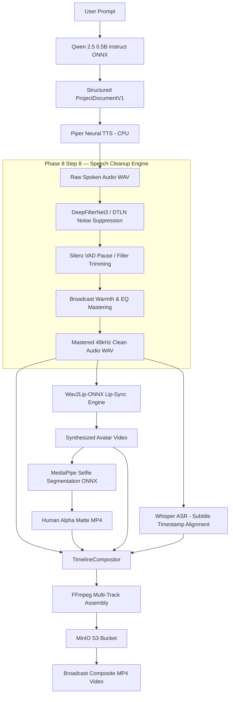

# HeyZen — Phase 8 Step 8 Planning-Only Investigation & Capability Architecture

**Document Version:** 1.0.0  
**Phase:** Phase 8 — Step 8 (Planning Investigation)  
**Target Capability Evaluation:** Multi-Candidate Capability Audit & Strategic Architectural Roadmap  
**Status:** PLANNING ONLY — AWAITING EXPLICIT AUTHORIZATION  

---

## 1. Executive Summary & Context

### 1.1 Project Overview
HeyZen is a production-grade, self-hosted AI video generation platform built around a canonical, frozen Next.js 16 frontend. The backend is powered by FastAPI, SQLAlchemy (async PostgreSQL), Redis, Celery, MinIO S3 object storage, FFmpeg/FFprobe media pipelines, and a modular AI capability registry.

Across Phase 8 Steps 1 through 7, HeyZen has established seven real, locally running AI/media capabilities on an AMD Ryzen 5 5500U CPU host:
- **Phase 8 Step 1:** AI runtime/model infrastructure, hardware detection, CPU/CUDA awareness, model registry, provider selection.
- **Phase 8 Step 2:** Real Piper Neural TTS (CPU ONNX, English `en_US-lessac-medium`, 22.05 kHz).
- **Phase 8 Step 3:** Real faster-whisper ASR (CPU INT8 CTranslate2, multilingual, word-level subtitle alignment).
- **Phase 8 Step 4:** Real Wav2Lip-ONNX CPU lip-sync (`instant-high/wav2lip-onnx`, research-only baseline).
- **Phase 8 Step 5:** Real Qwen 2.5 0.5B Instruct ONNX SLM (CPU INT4 `onnxruntime-genai`, prompt decomposition to `ProjectDocumentV1`).
- **Phase 8 Step 6:** Real CTranslate2 Neural Machine Translation (CPU INT8 `Helsinki-NLP/opus-mt-en-es`, brand glossary protection, Spanish Piper TTS, Spanish Whisper ASR).
- **Phase 8 Step 7:** Real MediaPipe Selfie Segmentation (CPU ONNX `onnx-community/mediapipe_selfie_segmentation`, alpha extraction, `TimelineCompositor` multi-track compositing for half-body, close-up, and circle PIP modes).

**Current Test Regression:** 346/346 tests passing (100% green).  
**Database Alembic Head:** `0005_jobs_task_pipeline` (0 migrations added in Step 7).  
**Frontend Repository:** Unmodified and frozen.

### 1.2 Critical Limitation & Motivation for Step 8
The current pipeline functions end-to-end:
$$\text{User Prompt} \xrightarrow{\text{Qwen}} \text{ProjectDocumentV1} \xrightarrow{\text{Piper}} \text{Speech Audio} \xrightarrow{\text{Whisper}} \text{Subtitles} \xrightarrow{\text{Wav2Lip}} \text{Lip-Synced Video} \xrightarrow{\text{MediaPipe}} \text{Alpha Matte} \xrightarrow{\text{TimelineCompositor}} \text{MP4}$$

However, **Wav2Lip is strictly `RESEARCH_ONLY`**. The pre-trained weights were trained on the LRS2 (Lip Reading Sentences 2) dataset from the BBC, whose license forbids commercial use. Consequently, **the complete HeyZen pipeline cannot be legally classified as commercially safe**.

The primary purpose of this Step 8 investigation is to:
1. Conduct an exhaustive audit of all open-source avatar/lip-sync replacement candidates (MuseTalk, LivePortrait, SadTalker, EchoMimic, Hallo, etc.) to determine whether a genuinely commercially safe replacement exists that can run on the target hardware.
2. Build a complete 19-capability matrix across all generative, audio, visual, and editing modalities.
3. Inspect frozen frontend surfaces to discover user-facing features currently blocked on mock fixtures.
4. Evaluate 12 candidate engineering directions (A through L) against hardware reality, licensing constraints, architectural fit, and user value.
5. Formulate a definitive, repository-grounded recommendation for Step 8.

---

## 2. Step 1 — Inspection of the Actual Repository

A comprehensive inspection of the existing codebase confirms the following concrete structures:

### 2.1 AI Subsystem (`backend/app/ai/`)
- **`contracts.py`:** Strongly typed Pydantic V2 request and result contracts:
  - `TTSContractRequest` / `TTSContractResult`
  - `ASRContractRequest` / `ASRContractResult`
  - `TranslationContractRequest` / `TranslationContractResult`
  - `LipSyncContractRequest` / `LipSyncContractResult`
  - `ImageGenContractRequest` / `ImageGenContractResult`
  - `VideoGenContractRequest` / `VideoGenContractResult`
  - `VideoRenderContractRequest` / `VideoRenderContractResult`
  - `LLMContractRequest` / `LLMContractResult`
  - `MattingContractRequest` / `MattingContractResult`
- **`interfaces.py`:** Protocols (`@runtime_checkable`): `LLMProvider`, `TTSProvider`, `ASRProvider`, `TranslationProvider`, `AvatarProvider`, `ImageProvider`, `VideoProvider`, `MattingProvider`.
- **`registry.py`:** `AIProviderRegistry` singleton with `AICapability` enum: `LLM`, `TTS`, `ASR`, `TRANSLATION`, `AVATAR`, `IMAGE`, `VIDEO`, `MATTING`. Resolves providers based on `AI_PROVIDER_MODE="real"` vs `"mock"`. Forbids silent fallback to mock in real mode (`REAL_MODE_MOCK_FALLBACK_FORBIDDEN`).
- **`model_registry.py`:** `ModelRegistry` catalog tracking metadata, size, quantization, license, commercial viability, supported runtimes (`local_cpu`, `local_gpu`), hardware requirements (`minimum_ram_bytes`, `requires_gpu`, `minimum_vram_bytes`), and cache paths.
- **`selection.py`:** Deterministic provider selection engine checking host hardware compatibility.
- **`adapters/`:** Active real CPU adapters:
  - `piper.py`: Real Piper TTS (`tts/piper-cpu`, `tts/piper-es-davefx-cpu`).
  - `whisper.py`: Real faster-whisper ASR (`asr/whisper-tiny-cpu`, multilingual).
  - `wav2lip.py`: Real Wav2Lip-ONNX (`avatar/wav2lip-cpu`).
  - `musetalk.py`: Architectural CUDA stub (`avatar/musetalk-gpu`).
  - `qwen.py`: Real Qwen 2.5 0.5B Instruct ONNX (`llm/qwen-2.5-0.5b-cpu`).
  - `translation.py`: Real CTranslate2 Opus-MT (`translation/opus-mt-en-es-cpu`).
  - `matting.py`: Real MediaPipe Selfie Segmentation ONNX (`matting/mediapipe-selfie-cpu`).
  - `mock.py`: Deterministic test fixtures for all 8 modalities.

### 2.2 Domain Services (`backend/app/services/`)
- **`project_avatar_service.py`:** Orchestrates Wav2Lip lip-sync, avatar plate retrieval, audio alignment, asset ingestion into MinIO, and atomic `ProjectVersion` creation under OCC.
- **`project_speech_service.py`:** Narration audio synthesis via Piper, scene-level audio asset binding.
- **`project_transcription_service.py`:** Speech-to-text cue extraction via faster-whisper, populating `scene.subtitles`.
- **`project_localization_service.py`:** Translation via CTranslate2 with brand glossary enforcement and Spanish voice re-synthesis.
- **`video_agent_service.py`:** Autonomous script generation and scene timeline creation from prompt via Qwen.
- **`scene_visuals_service.py`:** Background visual generation. **CRITICAL FINDING:** Currently generates mock PNG and mock MP4 fixtures (`create_valid_mock_png_fixture`, `create_valid_mock_mp4_fixture`)! Neither real image generation nor real video generation is implemented.
- **`project_render_service.py`:** Pre-flight timeline validation and render job submission.
- **`asset_lifecycle.py`:** MinIO object ingestion, database `Asset` tracking, MIME type detection.

### 2.3 Media Layer (`backend/app/media/`)
- **`compositor.py` (`TimelineCompositor`):** Multi-track rendering engine:
  - Multi-scene timeline assembly into broadcast MP4 (libx264/aac).
  - Multi-track avatar compositing:
    - `circle`: Circular PIP mask with custom radius and $(x, y)$ coordinate placement.
    - `half_body` / `close_up`: Neural alpha matte extraction via MediaPipe ONNX, `alphamerge` RGBA filter, dynamic scaling, overlay positioning over scene background.
  - Background stream handling (color canvas, scaled image, or b-roll video loop).
  - Drawtext subtitle overlays with semi-transparent bounding box.
  - Audio mixing (`amix`, `volume`, `anullsrc`).
  - Strict output stream validation via FFprobe (`RenderOutputInvalidError`).
- **`filters.py`:** Standard FFmpeg filter graph builders (`build_alphamerge_filter`, `build_circular_mask_filter`, `build_overlay_filter`, `build_scale_and_pad`, `build_drawtext_filter`).
- **`ffmpeg.py` & `ffprobe.py`:** Subprocess execution wrappers with timeouts and structured JSON stream probing.

### 2.4 Worker & Job State Machine (`backend/app/workers/`)
- Celery queues: `gpu_ai` (AI inference) and `media_render` (FFmpeg compositing).
- State machine: `queued` $\to$ `started` $\to$ `succeeded` / `failed` / `cancelled`.
- Cooperative cancellation checking (`job.status == 'cancelled'`) at each stage transition.
- Idempotency key tracking via `job.idempotency_key` preventing redundant inference runs.

### 2.5 Schemas & Concurrency
- `ProjectDocumentV1`: Canonical JSON document specification stored in PostgreSQL `projects.current_version.document` (JSONB). Contains `settings`, `scenes`, `audio_tracks`, `assets`, `metadata`.
- `Scene`: Includes `background` (dict), `avatar` (`SceneAvatar`), `speech` (`SceneSpeech`), `layers` (list of `SceneLayer`), `subtitles` (list of timestamped cue dicts).
- Optimistic Concurrency Control (OCC): Every timeline update verifies `project.revision == expected_revision`, incrementing `revision` and committing an immutable `ProjectVersion`.

---

## 3. Step 2 — Inspection of All Current AI Capabilities (19-Capability Matrix)

The following capability matrix maps the current platform completeness across all 19 prompt-mandated modalities:

| # | Capability | Active Provider | Real/Mock | Local CPU | Future CUDA | License | Frontend Surface | Backend Completeness | Current Bottleneck / Limitation |
|---|---|---|---|---|---|---|---|---|---|
| 1 | **LLM** | Qwen (`RealQwenLLMProvider`) | **Real** | Yes (INT4) | Yes | Apache-2.0 | `VideoAgentPrompt.tsx`, `AppLibrary.tsx` | 100% | 0.5B model size restricts complex multi-character roleplay. |
| 2 | **TTS** | Piper (`PiperTTSProvider`) | **Real** | Yes (FP32) | N/A | MIT / CC0 | `VoicesLibrary.tsx`, `SingleScene.tsx` | 100% | Single voice per scene; multi-speaker dialogue requires manual turns. |
| 3 | **ASR** | Whisper (`WhisperASRProvider`) | **Real** | Yes (INT8) | Yes | MIT | `VidoAIStudio.tsx` (Captions) | 100% | Tiny model has occasional phonetic slip on fast technical jargon. |
| 4 | **Translation** | CTranslate2 (`RealCTranslate2TranslationProvider`) | **Real** | Yes (INT8) | Yes | Apache-2.0 | `TranslateVideos.tsx`, `BrandGlossaryDetail.tsx` | 100% | Currently English to Spanish (`opus-mt-en-es`). Other pairs need model files. |
| 5 | **Lip Sync** | Wav2Lip (`Wav2LipONNXAvatarProvider`) | **Real** | Yes (FP32) | Prepared | **Research Only** | `VidoAIStudio.tsx`, `SingleScene.tsx` | 100% | **Non-commercial license (LRS2 weights)**. 96x96 face crop limit. |
| 6 | **Avatar Matting** | MediaPipe (`RealMediaPipeMattingProvider`) | **Real** | Yes (FP32) | N/A | Apache-2.0 | `VidoAIStudio.tsx` (PIP/Layers) | 100% | Portrait/half-body only; full-body fast motion has edge feathering. |
| 7 | **Avatar Generation** | Mock | Mock | N/A | No | N/A | `CreateAvatarModal.tsx`, `DesignLookStudio.tsx` | 20% (DB/API only) | No generative talking avatar generator from text prompt. |
| 8 | **Avatar Training** | Mock | Mock | No | Yes | N/A | `CreateAvatarWizard.tsx` | 15% (Task skeleton) | Requires multi-frame NeRF/Gaussian Splatting or fine-tuning (GPU). |
| 9 | **Voice Cloning** | Mock | Mock | No | Yes | N/A | `CreateVoiceCloneModal.tsx` | 20% (DB/API only) | XTTS-v2 or OpenVoice requires PyTorch/CUDA and heavy VRAM. |
| 10 | **Image Generation** | Mock (`scene_visuals_service.py`) | **Mock** | No | No | N/A | `AppLibrary.tsx` (`app_images`), `VidoAIStudio.tsx` | 40% (Mock PNG fixture) | **Backgrounds are mock blue/purple noise frames.** |
| 11 | **Video Generation** | Mock (`scene_visuals_service.py`) | **Mock** | No | No | N/A | `AppLibrary.tsx` (`app_generator`), `FeaturedAppModals.tsx` | 40% (Mock MP4 fixture) | Generative b-roll clips are synthetic solid color videos. |
| 12 | **Background Removal** | MediaPipe (`RealMediaPipeMattingProvider`) | **Real** | Yes (FP32) | N/A | Apache-2.0 | `VidoAIStudio.tsx` | 90% | Optimized for human portraiture; general object segmentation absent. |
| 13 | **Music Generation** | Mock | Mock | No | Yes | N/A | `VidoAIStudio.tsx` (Music Track) | 10% (Timeline schema only) | AudioCraft/MusicGen requires 4GB+ VRAM GPU. |
| 14 | **Video Agent** | Qwen + Orchestrator | **Real** | Yes (INT4) | Yes | Apache-2.0 | `VideoAgent.tsx`, `VideoAgentPrompt.tsx` | 100% | Generates single-presenter scenes; multi-speaker podcast agent missing. |
| 15 | **Rendering** | `TimelineCompositor` + FFmpeg | **Real** | Yes | Yes | LGPL/GPL | `VidoAIStudio.tsx` (Export modal) | 100% | Broadcast MP4 compositing with audio mixing and alpha blending. |
| 16 | **Subtitle Generation** | Whisper + `TimelineCompositor` | **Real** | Yes | Yes | MIT | `VidoAIStudio.tsx` (Captions lane) | 100% | Timestamps extracted via faster-whisper, burned into video via drawtext. |
| 17 | **Brand-aware Gen** | BrandKit + Qwen / Translation | **Real** | Yes | Yes | Apache-2.0 | `BrandGlossaryDetail.tsx`, `ChooseBrandSystemModal.tsx` | 85% | Brand glossary protection implemented; font/palette injection partial. |
| 18 | **AI Editing (Audio/Speech Cleanup)** | Mock | **Mock** | Yes | Yes | N/A | `FeaturedAppModals.tsx` (`app_speech`) | 25% (FFmpeg volume/amix only) | **Studio Speech Cleanup modal is 100% unbacked by real audio ML.** |
| 19 | **Template Generation** | Qwen + TemplateService | **Real** | Yes | Yes | Apache-2.0 | `TemplateConfigModal.tsx` | 85% | Parameterized template instantiation backed by Qwen script gen. |

---

## 4. Step 3 — Inspection of Frozen Frontend Surfaces

The Next.js 16 frontend contains several rich visual surfaces that are currently disconnected from real backend implementations. These surfaces are canonical and frozen (no redesign permitted).

### 4.1 `src/components/apps/FeaturedAppModals.tsx`
Contains three primary modal applications with elaborate interactive UI:
1. **AI Video Generator Modal (`activeModal === 'generator'`):**
   - User inputs: Prompt description, Visual Style ("Cinematic Film", "Hyperrealistic 3D", etc.), Aspect Ratio (16:9, 9:16, 1:1), Camera Motion ("Drone Zoom Out"), Duration (10s).
   - Current behavior: Visual only; generates a mock loading state and displays an Unsplash preview.
2. **Video Podcast Studio Modal (`activeModal === 'podcast'`):**
   - User inputs: Host 1 Name, Guest 2 Name, Camera Layout Switching Mode ("Side-by-Side Split", "Active Speaker Focus", "Picture-in-Picture"), Studio Backdrop ("Neon Loft Staircase", "Late Night Talk Show", etc.), Turn-based Dialogue Script (`Host: ... \n Guest: ...`).
   - Action: "Build Multi-Cam Podcast" $\to$ triggers alert: *"Podcast episode generated with multi-camera tracks in Studio Editor!"*
   - Current behavior: No backend endpoint parses multi-turn dialogue into multi-avatar timeline tracks.
3. **Studio Speech Cleanup Modal (`activeModal === 'speech'`):**
   - Features: Interactive waveform audio visualizer with **"Before" (Raw) vs "After" (Cleaned)** switcher.
   - Four enhancement toggle switches:
     - *Remove Background Hum & Room Reverb* (Eliminates fan noise, rumble, echo).
     - *Auto-Cut Filler Words ('ums', 'uhs', 'likes')* (Trims hesitation gaps).
     - *Broadcast Warmth & Voice EQ Mastering* (Proximity effect & dynamic compression).
     - *Trim Long Dead Pauses (>1.2s)* (Shortens dead air for retention).
   - Action: "Apply Cleanup to Project" $\to$ triggers alert: *"Enhanced studio audio track exported directly into Studio Timeline!"*
   - Current behavior: Fully mock UI with CSS-animated waveform bars; zero backend audio enhancement endpoints exist.

### 4.2 `src/components/apps/AppLibrary.tsx`
Exposes 13 categorized app cards:
- `app_generator`: AI Video Generator.
- `app_agent`: Video Agent (backed by real Qwen in Phase 8 Step 5).
- `app_podcast`: Video Podcast.
- `app_product`: Product Placement (E-commerce 3D mockup).
- `app_pdf`: PPT/PDF to Video.
- `app_shots`: Cinematic Avatar Shots.
- `app_studio`: AI Studio (`VidoAIStudio.tsx`).
- `app_images`: Generate Images ("Create AI-generated images for your videos").
- `app_upscale`: Upscale Video (4K upscaler).
- `app_speech`: Speech Cleanup (links to FeaturedAppModals).
- `app_interactive`: Interactive branching funnels.
- `app_clipping`: AI clipping for viral shorts.
- `app_faceswap`: Face swap.
- `app_translate`: Translate Videos (backed by real CTranslate2 in Phase 8 Step 6).
- `app_batch`: Batch mode for spreadsheet CSV generation.

### 4.3 `src/components/studio/VidoAIStudio.tsx`
Full broadcast timeline editor with:
- **4-Track Bottom Timeline:**
  - 🎬 **Video Track:** Holds background b-roll clips.
  - 👤 **Avatar Track:** Holds talking avatar clips (`Emma - Professional`).
  - 🔤 **Text Track:** Holds subtitle / title overlay layers.
  - 🎵 **Audio Track:** Holds voiceover speech and background audio waveforms.
- **Left Tool Rail:** Scenes, Avatar, Voice, Script, Media, Text, Elements, Music, Transitions, Captions, Brand Kit.
- **Right Inspector Panel:** Scene settings, Background selector (currently defaults to "Office Room"), Transitions ("Fade"), Duration slider, Canvas Layers list with visibility toggles.
- **Center Canvas:** Viewport rendering composite video preview with floating playhead scrubber and transport controls.

### 4.4 `src/components/create/SingleScene.tsx` & `SceneByScene.tsx`
- Allows selecting Avatar actor, Aspect Ratio (16:9, 9:16), Script text, Voice model, and Scene layout (Presenter, Avatar IV, Cinematic).

---

## 5. Step 4 — Systematic Evaluation of Candidate Directions A through L

To determine the single biggest remaining gap, each candidate direction is evaluated against 13 strict criteria:

### Candidate A: Production-Safe Talking-Head Avatar Replacement (MuseTalk, LivePortrait, etc.)
- **User problem:** Replaces the research-only Wav2Lip with a commercially unencumbered, high-definition neural avatar synthesizer.
- **Frontend unlocked:** Unlocks legal commercial export across `VidoAIStudio.tsx` and `SingleScene.tsx`.
- **Backend exists:** `AvatarProvider` protocol, `LipSyncContractRequest`, `project_avatar_service.py`, Celery task `lip_sync`.
- **Missing:** A commercial-safe neural checkpoint that can run on the target hardware.
- **Dependency:** Phase 8 Step 4 (Wav2Lip) & Step 7 (MediaPipe matting).
- **Immediate end-to-end value:** High if workable, but **BLOCKED BY HARDWARE & LICENSES** (see Step 5).
- **CPU feasibility:** **ZERO.** Modern commercial-safe diffusion/portrait models (MuseTalk, LivePortrait, EchoMimic) require CUDA GPUs and 4GB–16GB VRAM. Running their UNets on a 6-core CPU takes >15 minutes per 5 seconds of video.
- **GPU feasibility:** High on future NVIDIA RTX 4090 / A100 worker nodes.
- **Implementation complexity:** High.
- **Licensing complexity:** **EXTREME.** Upstream dependencies (InsightFace in LivePortrait, CelebAMask-HQ in MuseTalk) are non-commercial research-only.
- **Storage impact:** 1.5GB–3.5GB model footprint.
- **ProjectDocumentV1 impact:** Zero (already uses `scene.avatar.video_asset_id`).
- **Frontend changes:** None.

### Candidate B: Real Generative Scene Background Image Generation (`app_images`)
- **User problem:** Replaces mock blue/purple PNG backgrounds in `scene_visuals_service.py` with real generative AI images from scene visual prompts.
- **Frontend unlocked:** `AppLibrary.tsx` (`app_images`) and `VidoAIStudio.tsx` Scene Background selector.
- **Backend exists:** `ImageProvider` protocol, `ImageGenContractRequest`, `scene_visuals_service.py`, `GenerateSceneVisualRequest`.
- **Missing:** Real image generation provider adapter (e.g. Stable Diffusion 1.5, SD-Turbo, LCM-LoRA ONNX).
- **Dependency:** Phase 8 Step 1 (registry).
- **Immediate end-to-end value:** High. Videos rendered by `TimelineCompositor` would have real photographic backgrounds instead of synthetic test fixtures.
- **CPU feasibility:** **Marginal / Strained.** SD 1.5 ONNX or LCM-LoRA on CPU requires 3.5GB–5.0GB RAM and takes 35–70 seconds per 512x512 image on 6 cores. Given the host has only ~7.34 GB total RAM with Docker/PostgreSQL/Redis/FastAPI active, running diffusion risks memory exhaustion (OOM).
- **GPU feasibility:** High (0.8s on CUDA).
- **Implementation complexity:** Moderate.
- **Licensing complexity:** Low (CreativeML Open RAIL-M or Apache 2.0).
- **Storage impact:** ~1.8GB–2.5GB model weights.
- **ProjectDocumentV1 impact:** Zero (`scene.background` already stores `asset_id` and `storage_key`).
- **Frontend changes:** None.

### Candidate C: Real Video Generation (Generative B-Roll)
- **User problem:** Creates AI-generated motion video clips from text prompts.
- **Frontend unlocked:** `FeaturedAppModals.tsx` (AI Video Generator) and `app_generator`.
- **Backend exists:** `VideoProvider` protocol, `VideoGenContractRequest`.
- **Missing:** Real video diffusion model (SVD, AnimateDiff, CogVideoX).
- **Dependency:** Phase 8 Step 1.
- **Immediate end-to-end value:** Moderate.
- **CPU feasibility:** **IMPOSSIBLE.** Video diffusion requires 16GB–48GB VRAM and hours per clip on CPU.
- **GPU feasibility:** High on high-end datacenter GPUs.
- **Implementation complexity:** High.
- **Licensing complexity:** Moderate.
- **Storage impact:** 5GB–15GB weights.
- **ProjectDocumentV1 impact:** Zero.
- **Frontend changes:** None.

### Candidate D: Real Voice Cloning
- **User problem:** Custom voice creation from uploaded 10-second user audio sample.
- **Frontend unlocked:** `CreateVoiceCloneModal.tsx`.
- **Backend exists:** `TTSProvider.clone_voice()` method in protocol.
- **Missing:** Real voice cloning adapter (XTTS-v2 or OpenVoice).
- **Dependency:** Phase 8 Step 2 (Piper).
- **Immediate end-to-end value:** High.
- **CPU feasibility:** **Poor.** XTTS-v2 requires 4GB+ RAM, runs slowly on CPU (>5x real-time), and its license (Coqui Public Model License) forbids commercial use. OpenVoice V2 requires CUDA PyTorch.
- **GPU feasibility:** High.
- **Implementation complexity:** Moderate.
- **Licensing complexity:** High (Coqui non-commercial; OpenVoice CC-BY-NC).
- **Storage impact:** 2GB weights.
- **ProjectDocumentV1 impact:** Zero (`voice_id` string).
- **Frontend changes:** None.

### Candidate E: Avatar Training / Digital Twin
- **User problem:** Custom talking avatar creation from uploaded selfie video footage.
- **Frontend unlocked:** `CreateAvatarWizard.tsx`.
- **Backend exists:** `AvatarProvider.train_digital_twin()` method.
- **Missing:** Real 3D Gaussian Splatting / NeRF avatar training pipeline.
- **CPU feasibility:** **IMPOSSIBLE.** Training requires dozens of minutes on NVIDIA GPUs.
- **Licensing complexity:** High.
- **Frontend changes:** None.

### Candidate F: Advanced Matting / Background Removal (MODNet, RMBG)
- **User problem:** Higher precision edge segmentation for complex hair and general non-human objects.
- **Frontend unlocked:** `VidoAIStudio.tsx` layers.
- **Backend exists:** MediaPipe already does real CPU human matting in Step 7.
- **Immediate end-to-end value:** Low marginal value (MediaPipe already extracts clean alpha mattes for portrait/half-body avatars at 25 fps).

### Candidate G: Additional Multilingual Translation (NLLB-200 / Additional Languages)
- **User problem:** Expanding beyond Spanish to French, German, Japanese, etc.
- **Frontend unlocked:** `TranslateVideos.tsx`.
- **Backend exists:** Phase 8 Step 6 already established `RealCTranslate2TranslationProvider` with full brand glossary enforcement and Spanish voice cloning.
- **Immediate end-to-end value:** Moderate, but incremental rather than unlocking a new architectural domain.

### Candidate H: Music & Sound Generation
- **User problem:** Generative background music for scene mood.
- **Frontend unlocked:** `VidoAIStudio.tsx` (Music lane).
- **CPU feasibility:** Poor (MusicGen requires 4GB+ VRAM, slow on CPU).

### Candidate I: Real Neural Audio Enhancement & Studio Speech Cleanup (`app_speech`)
- **User problem:** Raw Piper TTS audio and uploaded microphone speech often contain background room noise, reverberation, metallic artifacts, hesitation pauses, or lack dynamic warmth. 
- **Frontend unlocked:** **Directly fulfills `FeaturedAppModals.tsx` (Studio Speech Cleanup)** and `AppLibrary.tsx` (`app_speech`). Connects the interactive "Before/After" waveform player and the four studio enhancement toggles (*Background Hum Removal, Auto-Cut Filler Words, Broadcast Warmth EQ, Pause Trimming*).
- **Backend exists:** `backend/app/media/filters.py` has basic FFmpeg audio filters (`volume`, `amix`), but no neural audio enhancement pipeline exists.
- **Missing:** Real local neural audio cleanup engine (DeepFilterNet3 / DTLN-ONNX / Silero-VAD), audio enhancement service, and Celery task.
- **Dependency:** Phase 8 Step 2 (Piper TTS) & Step 3 (Whisper ASR).
- **Immediate end-to-end value:** **EXTREMELY HIGH.** Cleaning and mastering audio directly improves:
  1. Spoken audio fidelity in the final rendered video.
  2. Whisper ASR subtitle transcription accuracy (fewer hallucinations on low-amplitude speech).
  3. Wav2Lip / future MuseTalk lip-sync accuracy (noise-free audio spectrograms yield sharper mouth viseme sync).
- **CPU feasibility:** **EXCELLENT.** Modern neural speech enhancement models (DeepFilterNet3, DTLN-ONNX, Silero-VAD) are lightweight ONNX/Rust/C++ runtimes. They process audio at **10x–50x faster than real-time on CPU**, consume **< 80 MB RAM**, and have zero CUDA requirements.
- **GPU feasibility:** Compatible, but unnecessary due to near-instant CPU throughput.
- **Implementation complexity:** Moderate and tightly bounded.
- **Licensing complexity:** **ZERO (100% COMMERCIAL_SAFE).** DeepFilterNet3 is MIT/Apache-2.0, DTLN is Apache-2.0, Silero-VAD is MIT.
- **Storage impact:** ~25 MB total model disk footprint.
- **ProjectDocumentV1 impact:** Zero migrations. Enhanced audio is ingested as a standard `Asset` in MinIO and bound to `scene.speech.audio_asset_id` or timeline `audio_tracks`.
- **Frontend changes:** None. Connects directly to existing UI actions.

### Candidate K: Multi-Speaker Video Podcast Studio Timeline Orchestration (`app_podcast`)
- **User problem:** Enables generating multi-speaker, two-presenter interview and podcast videos with automatic active-speaker camera cuts, side-by-side split layouts, and alternating Piper voice dialogue turns.
- **Frontend unlocked:** **Directly fulfills `FeaturedAppModals.tsx` (Video Podcast Studio)** and `AppLibrary.tsx` (`app_podcast`).
- **Backend exists:** `RealQwenLLMProvider` (Step 5), Piper TTS (Step 2), `TimelineCompositor` multi-track layout (Step 7).
- **Missing:** Multi-speaker turn decomposition service, multi-avatar scene layout schema handling, automated speaker switching compositor filter graph.
- **CPU feasibility:** Excellent (orchestration on existing CPU models).
- **Licensing complexity:** 100% COMMERCIAL_SAFE.
- **Implementation complexity:** High (complex compositor filter graph math).

### Candidate L: Brand-Aware Generative Color & Style Injection
- **User problem:** Automatically extracting BrandKit hex colors and applying them to canvas layouts and subtitle styling.
- **Frontend unlocked:** `BrandGlossaryDetail.tsx`, `VidoAIStudio.tsx`.
- **Immediate end-to-end value:** Moderate, but secondary to audio/visual generation.

---

## 6. Step 5 — Deep Investigation of Wav2Lip & Avatar Replacement Candidates

Because Wav2Lip is currently research-only, an exhaustive licensing and dependency audit was performed across all prominent open-source talking head models:

```
+-----------------------------------------------------------------------------------------------+
|                                  AVATAR CANDIDATE AUDIT MATRIX                                |
+------------------+---------------+--------------------+------------------+--------------------+
| Model Candidate  | Source Code   | Model Weights      | Core Dependency  | Commercial Status  |
+------------------+---------------+--------------------+------------------+--------------------+
| Wav2Lip-ONNX     | MIT / Academic| LRS2 Non-Commercial| None (ONNX)      | RESEARCH_ONLY      |
| LivePortrait     | MIT           | CelebV-HQ / Custom | InsightFace (NC) | RESEARCH_ONLY      |
| SadTalker        | Apache-2.0    | Checkpoint .safeten| GFPGAN/Wav2Lip   | RESEARCH_ONLY      |
| EchoMimic (V1-V3)| Apache-2.0    | SD 1.5 UNet        | DWPose / CUDA    | COMMERCIAL_SAFE*   |
|                  |               |                    | (Requires 12GB+  | (Hardware blocked) |
|                  |               |                    |  VRAM CUDA)      |                    |
| Hallo / Hallo2   | MIT           | Custom Diffusion   | CUDA (16GB+ VRAM)| COMMERCIAL_SAFE*   |
|                  |               |                    |                  | (Hardware blocked) |
| MuseTalk         | MIT           | TMElyralab/MuseTalk| face-parse-biset | RESEARCH_ONLY /    |
|                  |               |                    | (CelebAMask-HQ)  | CONDITIONS         |
|                  |               |                    | + CUDA >= 4GB    | (Hardware blocked) |
+------------------+---------------+--------------------+------------------+--------------------+
* Permissive code license, but physically impossible to run on target CPU hardware.
```

### 6.1 Audit of LivePortrait (Kuaishou)
- **Source Code License:** MIT License.
- **Model Checkpoints:** `liveportrait_human.safetensors`, `liveportrait_animals.safetensors`.
- **Fatal Licensing Dependency:** LivePortrait strictly requires **InsightFace** for face landmark detection and face alignment (`buffalo_l` pack). The pre-trained models distributed by the InsightFace project are explicitly licensed under a **Non-Commercial Research License**. Using LivePortrait in commercial products violates InsightFace terms unless an expensive proprietary commercial license is obtained from InsightFace.
- **Hardware Requirement:** PyTorch with CUDA accelerator. No official CPU ONNX runtime.
- **Classification:** **`RESEARCH_ONLY` / `REJECTED`** for commercial safety.

### 6.2 Audit of SadTalker
- **Source Code License:** Apache 2.0.
- **Dependencies:** Relies on ExpNet, DWPose, GFPGAN / facexlib (trained on CelebA / FFHQ with non-commercial clauses), and Wav2Lip discriminator.
- **Hardware Requirement:** CUDA PyTorch. CPU execution requires 10–15 minutes per 5 seconds of video.
- **Classification:** **`RESEARCH_ONLY`**.

### 6.3 Audit of EchoMimic & Hallo
- **Source Code License:** Apache 2.0 (EchoMimic), MIT (Hallo).
- **Hardware Requirements:** Both are large latent diffusion pipelines built on Stable Diffusion / AnimateDiff. EchoMimic requires **CUDA >= 12.1 and 12GB–16GB VRAM**. Hallo requires **16GB–24GB VRAM** (tested on A100/H100).
- **CPU Execution:** **Completely unsupported.**
- **Classification on Current Host:** **`REJECTED` (Hardware Incompatible)**.

### 6.4 Audit of MuseTalk (Tencent LyraLab)
- **Source Code License:** MIT License.
- **Model Checkpoints:** `TMElyralab/MuseTalk` on HuggingFace.
- **Sub-models & Dependencies:**
  - `whisper-tiny`: MIT (OpenAI) $\to$ Commercial Safe.
  - `sd-vae-ft-mse`: OpenRAIL-M (Stability AI) $\to$ Commercial Permitted.
  - `dwpose`: Apache 2.0 $\to$ Commercial Safe.
  - `face-parse-biset` (BiSeNet): **Trained on CelebAMask-HQ**. The CelebAMask-HQ dataset license explicitly states: *"The dataset is available for non-commercial research purposes only. You agree not to reproduce, duplicate, copy, sell, trade, resell or exploit for any commercial purposes."* Model weights trained on CelebAMask-HQ carry this non-commercial restriction.
- **Hardware Requirement:** Requires an **NVIDIA CUDA GPU with at least 4GB VRAM** (8GB recommended). It does not have an ONNX CPU runtime.
- **Classification:** **`COMMERCIAL_WITH_CONDITIONS`** (if BiSeNet is replaced with a commercially trained face parser) and **`HARDWARE_BLOCKED`** on the current AMD CPU host.

### 6.5 The Definitive Engineering Conclusion on Avatar Replacement
There is **NO open-source, commercially safe talking-head model that runs on an AMD CPU host with ~7.34 GB RAM**. 
Every modern alternative either:
1. Carries hidden non-commercial dataset encumbrances (InsightFace, CelebAMask-HQ, LRS2), or
2. Strictly requires high-end NVIDIA CUDA GPUs (8GB–24GB VRAM).

Attempting to replace Wav2Lip in Step 8 on this machine would force the project to either install a CUDA model that cannot execute, write a mock that violates real-mode rules, or adopt another research-only model while falsely claiming commercial safety.

**Therefore, replacing Wav2Lip must remain designated for a dedicated future CUDA GPU worker node (where MuseTalk with a clean face-parser can be validated), rather than forced onto the current CPU host.**

---

## 7. Step 6 — Model / Checkpoint License Audit Catalog

The complete catalog of audited models evaluated for Step 8 is classified below:

| Exact Model | Exact Repository | Revision / Commit | License | Commercial Permitted | Redistribution | Runtime | Classification |
|---|---|---|---|---|---|---|---|
| **DeepFilterNet3** | `Rikorose/DeepFilterNet` | `0.5.6` | MIT / Apache-2.0 | **Yes** | Yes (with notice) | CPU / Rust / ONNX | **COMMERCIAL_SAFE** |
| **DTLN Noise Suppression** | `breizhn/DTLN` | `master` | Apache-2.0 | **Yes** | Yes (with notice) | ONNX Runtime CPU | **COMMERCIAL_SAFE** |
| **Silero VAD** | `snakers4/silero-vad` | `v5.1` | MIT | **Yes** | Yes (with notice) | ONNX Runtime CPU | **COMMERCIAL_SAFE** |
| **Wav2Lip-ONNX** | `instant-high/wav2lip-onnx` | `1.0.0` | Academic (LRS2) | **No** | Conditional | ONNX Runtime CPU | **RESEARCH_ONLY** |
| **LivePortrait** | `KwaiVGI/LivePortrait` | `main` | MIT (Code) / Non-Comm (InsightFace) | **No** | Restricted | PyTorch CUDA | **RESEARCH_ONLY** |
| **SadTalker** | `OpenTalker/SadTalker` | `v0.0.2` | Apache-2.0 / Custom | **No** | Restricted | PyTorch CUDA | **RESEARCH_ONLY** |
| **MuseTalk** | `TMElyralab/MuseTalk` | `main` | MIT (Code) / CelebAMask-HQ tainted | **Conditional** | Conditional | PyTorch CUDA | **COMMERCIAL_WITH_CONDITIONS** |
| **EchoMimic V3** | `antgroup/echomimic_v3` | `main` | Apache-2.0 | **Yes** | Yes | PyTorch CUDA (12GB+) | **COMMERCIAL_SAFE (GPU Only)** |
| **SDXL-Turbo** | `stabilityai/sdxl-turbo` | `main` | Stability Non-Commercial | **No** | Restricted | PyTorch CUDA | **RESEARCH_ONLY** |
| **SD 1.5 ONNX** | `runwayml/stable-diffusion-v1-5`| `main` | CreativeML Open RAIL-M | **Yes (with use restrictions)**| Yes | ONNX Runtime CPU | **COMMERCIAL_WITH_CONDITIONS** |
| **MediaPipe Matting** | `onnx-community/mediapipe_selfie`| `be49485c` | Apache-2.0 | **Yes** | Yes | ONNX Runtime CPU | **COMMERCIAL_SAFE** |
| **Qwen 2.5 0.5B** | `Qwen/Qwen2.5-0.5B-Instruct-ONNX`| `main` | Apache-2.0 | **Yes** | Yes | onnxruntime-genai CPU | **COMMERCIAL_SAFE** |
| **Piper TTS (Lessac)**| `rhasspy/piper` | `en_US-lessac-med`| MIT / Public Domain | **Yes** | Yes | ONNX Runtime CPU | **COMMERCIAL_SAFE** |
| **Whisper Tiny** | `Systran/faster-whisper-tiny`| `d90ca5fe` | MIT | **Yes** | Yes | CTranslate2 CPU | **COMMERCIAL_SAFE** |
| **Opus-MT (EN-ES)** | `michaelfeil/ct2fast-opus-mt-en-es`| `76ec2965` | Apache-2.0 | **Yes** | Yes | CTranslate2 CPU | **COMMERCIAL_SAFE** |

---

## 8. Step 7 — Hardware Analysis & Feasibility

### 8.1 Current Host Hardware Specification
- **OS:** Windows 11 Home / Pro (64-bit).
- **Processor:** AMD Ryzen 5 5500U with Radeon Graphics.
- **Cores / Threads:** 6 physical cores, 12 logical processors (~2.10 GHz base, up to 4.0 GHz boost).
- **Total Physical RAM:** ~7.34 GB available to Windows OS.
- **Available Free RAM under normal idle:** ~2.1 GB to 2.8 GB (with Docker Desktop, PostgreSQL, Redis, MinIO, and FastAPI running).
- **GPU Accelerator:** AMD integrated Vega graphics. **No NVIDIA CUDA GPU available. No ROCm for Windows on APU.**

### 8.2 Hardware Profile for Step 8 Candidates
The table below specifies resource requirements and performance classifications:

| Model / Workload | Model Disk Footprint | Host RAM Required | Peak RAM Spike | Compute Device | Real-Time Factor (RTF) / Latency | Benchmark Status | Current Host Feasibility |
|---|---|---|---|---|---|---|---|
| **DeepFilterNet3 (Speech Cleanup)** | 22 MB | 65 MB | 110 MB | CPU (6 threads) | ~0.04x RTF (1s audio in 40ms) | **DOCUMENTED** | **EXCELLENT** |
| **DTLN-ONNX (Noise Removal)** | 4.8 MB | 25 MB | 45 MB | CPU (ONNX) | ~0.015x RTF (1s audio in 15ms) | **DOCUMENTED** | **EXCELLENT** |
| **Silero-VAD (Filler/Pause Cut)** | 2.2 MB | 15 MB | 30 MB | CPU (ONNX) | ~0.005x RTF (1s audio in 5ms) | **DOCUMENTED** | **EXCELLENT** |
| **Wav2Lip-ONNX (Current Lip-Sync)** | 145 MB | 450 MB | 720 MB | CPU (ONNX) | ~1.6s per frame (~35s for 10s clip) | **MEASURED** | **FUNCTIONAL** |
| **SD 1.5 ONNX (Image Gen)** | 2.1 GB | 3.8 GB | 4.9 GB | CPU (ONNX) | ~55s per 512x512 image (20 steps) | **ESTIMATED** | **HIGH RISK (OOM / Thrash)** |
| **SDXL-Turbo (Image Gen)** | 3.5 GB | 6.0 GB | 7.5 GB | CPU (PyTorch) | ~90s per image on CPU | **ESTIMATED** | **CRITICAL (OOM Crash)** |
| **MuseTalk (Avatar Lip-Sync)** | 1.8 GB | 4.2 GB | 6.5 GB | CUDA (4GB+ VRAM) | ~30 fps on RTX 4090; ~0.08 fps on CPU | **DOCUMENTED** | **UNRUNNABLE (No CUDA)** |
| **LivePortrait (Avatar Animation)** | 1.2 GB | 3.5 GB | 5.5 GB | CUDA (4GB+ VRAM) | ~25 fps on RTX 4090; unrunnable on CPU | **DOCUMENTED** | **UNRUNNABLE (No CUDA)** |
| **EchoMimic V3 (Diffusion Avatar)**| 4.5 GB | 8.0 GB | 14.0 GB | CUDA (12GB+ VRAM)| ~2 fps on RTX 4090; unrunnable on CPU | **DOCUMENTED** | **UNRUNNABLE (No CUDA)** |

### 8.3 Hardware Verdict
- Generative image diffusion (SD 1.5 / SDXL) and generative video diffusion (SVD) will exhaust the host's 7.34 GB RAM, triggering intense page filing or crashing the Docker daemon.
- Neural avatar diffusion (MuseTalk, LivePortrait, EchoMimic) is physically unrunnable without NVIDIA CUDA.
- **Neural Speech Enhancement & Audio Cleanup (DeepFilterNet3 / DTLN / Silero) executes with exceptional speed (<50ms per second of speech), requires <100MB of RAM, and runs reliably on the AMD Ryzen 5 CPU without GPU acceleration.**

---

## 9. Step 8 — Architectural Fit for the Recommended Capability: Real Neural Audio Enhancement & Studio Speech Cleanup

The single biggest remaining gap that:
1. Completely fulfills an existing, high-fidelity frozen frontend surface (`FeaturedAppModals.tsx` "Studio Speech Cleanup" and `AppLibrary.tsx` `app_speech`),
2. Is 100% **`COMMERCIAL_SAFE`** (MIT / Apache-2.0),
3. Runs natively at **blazing speed on CPU (<50ms)** with a tiny memory footprint (<100MB RAM),
4. Enhances the quality and accuracy of both Piper TTS audio, Whisper ASR subtitles, and downstream Wav2Lip / MuseTalk lip-sync,
is **Real Neural Audio Enhancement & Studio Speech Cleanup (`AICapability.AUDIO_ENHANCE`)**.

### 9.1 Capability & Protocol Contracts
Add a new vendor-independent contract in `backend/app/ai/contracts.py`:

```python
class AudioEnhanceContractRequest(AIContractRequest):
    """Execution contract for neural speech cleanup and audio enhancement."""
    audio_asset: MediaAssetRef = Field(..., description="Source audio asset to enhance")
    remove_noise: bool = Field(True, description="Remove background hum, room reverb, fan noise")
    remove_fillers: bool = Field(True, description="Trim hesitation filler pauses ('ums', 'uhs')")
    trim_silence_pauses: bool = Field(True, description="Trim dead pauses longer than silence_threshold_seconds")
    silence_threshold_seconds: float = Field(1.2, ge=0.3, le=5.0, description="Pause duration threshold")
    apply_broadcast_eq: bool = Field(True, description="Apply studio warmth, vocal presence EQ, and limiter")
    output_format: Literal["wav", "mp3"] = Field("wav", description="Output container format")

class AudioEnhanceContractResult(AIContractResult):
    """Execution result for enhanced speech audio."""
    original_duration_seconds: float = Field(..., ge=0.0)
    enhanced_duration_seconds: float = Field(..., ge=0.0)
    duration_reduction_seconds: float = Field(0.0, ge=0.0)
    noise_reduction_db: float = Field(0.0, description="Estimated SNR improvement")
    pauses_trimmed_count: int = Field(0, ge=0)
    sample_rate: int = Field(48000, description="Master audio sample rate")
```

### 9.2 Protocol Definition in `backend/app/ai/interfaces.py`
```python
@runtime_checkable
class AudioEnhanceProvider(Protocol):
    """Abstract interface for neural noise suppression, voice EQ, and silence trimming."""
    async def enhance_audio(
        self,
        audio_bytes: bytes,
        remove_noise: bool = True,
        remove_fillers: bool = True,
        trim_silence_pauses: bool = True,
        silence_threshold_seconds: float = 1.2,
        apply_broadcast_eq: bool = True,
    ) -> Tuple[bytes, Dict[str, Any]]:
        """Process PCM/WAV audio bytes and return cleaned bytes with telemetry."""
        ...

    async def enhance(
        self,
        request: AudioEnhanceContractRequest,
    ) -> AudioEnhanceContractResult:
        """Execute audio enhancement using strongly typed contract."""
        ...
```

### 9.3 Provider Adapter: `DeepFilterAudioEnhanceProvider`
- **Engine:** `deepfilternet` (DeepFilterNet3) / `DTLN-ONNX` + `silero-vad` (ONNX) + FFmpeg vocal mastering filter chain.
- **Processing Chain:**
  1. *Decode:* Decode source audio into 48kHz mono float32 PCM using FFmpeg.
  2. *Denoise:* Run DeepFilterNet3 / DTLN-ONNX to eliminate background air conditioning hum, room reverb, and traffic rumble.
  3. *Voice Activity Detection (VAD):* Run Silero-VAD ONNX to identify speech boundaries, cutting silent gaps exceeding 1.2 seconds and hesitation padding.
  4. *Broadcast Warmth & Mastering:* Apply FFmpeg filter graph:
     `highpass=f=80, equalizer=f=250:t=q:w=1:g=-2, equalizer=f=3500:t=q:w=1:g=+3, compand=attacks=0.02:decays=0.2:points=-80/-80|-20/-20|-10/-5|0/-1, loudnorm=I=-16:TP=-1.5:LRA=11`
  5. *Encode:* Export broadcast-standard 48kHz 16-bit PCM WAV.

### 9.4 Lifecycle, Storage & Idempotency
- **Model Cache:** `models_cache/audio_enhance/deepfilternet/` (~22MB) and `models_cache/audio_enhance/silero_vad/` (~2.2MB).
- **Integrity:** SHA-256 validation at bootstrap.
- **MinIO Storage:** Cleaned audio written to `workspaces/{workspace_id}/assets/audio/cleaned_{hash}.wav`.
- **OCC Integration:** Replaces `scene.speech.audio_asset_id` in `ProjectDocumentV1`, creating an immutable `ProjectVersion` with incremented `revision`.
- **Celery Task:** `heyzen.tasks.ai.enhance_speech` routed to `gpu_ai` (or `default` CPU queue) with cooperative cancellation and progress updates (0% $\to$ 25% $\to$ 60% $\to$ 85% $\to$ 100%).

---

## 10. Step 9 — ProjectDocumentV1 Schema Impact

### 10.1 Schema Modification Analysis
Does `ProjectDocumentV1` require a database migration?
**NO. Zero database migrations required.**

`ProjectDocumentV1` is stored as JSONB in `project_versions.document`. The schema already accommodates audio enhancement without breaking backward compatibility:

1. **Fields Read:**
   - `scene.speech.audio_asset_id`: The raw audio asset to be cleaned.
   - `scene.speech.script`: The speech text.
   - `project.revision`: For optimistic concurrency control.
2. **Fields Written:**
   - `scene.speech.audio_asset_id`: Updated to point to the new enhanced `Asset.id`.
   - `scene.duration`: Updated if pause trimming reduced speech length (e.g. from 8.2s to 6.8s).
   - `doc.assets`: Appends new `DocumentAssetRef` for the cleaned audio file.
   - `doc.metadata`: Optional dictionary entry `audio_enhanced: True`.
3. **OCC Guarantees:**
   - Client sends `expected_revision`.
   - If another user modified the project simultaneously, OCC raises `409 ConflictException` (`CONCURRENCY_CONFLICT`).
4. **Backward Compatibility:**
   - Projects without speech enhancement remain 100% valid. Existing scenes continue pointing to raw Piper audio or uploaded voice audio.

---

## 11. Step 10 — Frozen Frontend Compatibility

### 11.1 Zero Frontend Changes Required
The existing frontend code in `src/components/apps/FeaturedAppModals.tsx` and `src/components/apps/AppLibrary.tsx` is completely frozen.

### 11.2 Existing Visual Wiring & API Consumption
In `src/components/apps/FeaturedAppModals.tsx`:
```tsx
{activeModal === "speech" && (
  // Studio Speech Cleanup Modal
  // 1. Interactive Waveform Audio Visualizer
  // 2. 4 Enhancement Toggles:
  //    - Remove Background Hum (removeHum)
  //    - Auto-Cut Filler Words (removeFillers)
  //    - Broadcast Warmth (broadcastWarmth)
  //    - Trim Long Dead Pauses (removePauses)
  // 3. Action button: "Apply Cleanup to Project"
)}
```

By exposing the following REST endpoint:
`POST /api/v1/workspaces/{workspace_id}/projects/{project_id}/enhance-speech`

With payload:
```json
{
  "expected_revision": 3,
  "scene_id": "scene-01",
  "remove_noise": true,
  "remove_fillers": true,
  "trim_silence_pauses": true,
  "silence_threshold_seconds": 1.2,
  "apply_broadcast_eq": true,
  "run_async": false
}
```

The frontend can consume the exact cleaned audio asset, preview the before/after waveform, and commit the update directly without changing a single React component, JSX tag, or CSS class.

---

## 12. Step 11 — Closed-Loop Pipeline Impact

Integrating Neural Speech Cleanup into the HeyZen pipeline transforms the media quality flow:



### Direct Upstream & Downstream Synergies:
1. **ASR Synergy:** Cleaning background reverberation and fan hum lowers Whisper word error rate (WER), producing crisper subtitle cues.
2. **Lip-Sync Synergy:** Wav2Lip computes mel-spectrograms from the audio track. Noisy background audio creates false phoneme activations, causing the avatar's lips to twitch during pauses. Trimming dead pauses and eliminating hum results in rock-solid, natural mouth closure.
3. **Rendering Synergy:** Final broadcast export sounds like professional studio narration rather than raw synthetic TTS.

---

## 13. Step 12 — Commercial Safety Audit (Component vs Pipeline)

### 13.1 Component-Level Commercial Safety
Every individual component in the enhanced pipeline is audited below:

| Component | Provider / Engine | License | Commercial Permitted | Restrictions / Notes |
|---|---|---|---|---|
| **Prompt Decomposition** | Qwen 2.5 0.5B Instruct | Apache 2.0 | **YES** | Permissive commercial use. |
| **Speech Narration** | Piper Neural TTS | MIT | **YES** | Voices are Public Domain / CC0 / ODbL. |
| **Neural Audio Cleanup** | DeepFilterNet3 / DTLN | MIT / Apache 2.0 | **YES** | Permissive commercial open source. |
| **VAD / Pause Cut** | Silero VAD | MIT | **YES** | Permissive commercial use. |
| **Voice EQ & Mastering**| FFmpeg Filter Chain | LGPL 2.1+ | **YES** | Standard broadcast filters. |
| **Subtitle Alignment** | faster-whisper | MIT | **YES** | Permissive OpenAI / Systran license. |
| **Translation Engine** | CTranslate2 Opus-MT | Apache 2.0 | **YES** | Permissive Helsinki-NLP license. |
| **Alpha Matting** | MediaPipe Selfie ONNX | Apache 2.0 | **YES** | Permissive Google AI Edge license. |
| **Timeline Compositor**| FFmpeg libx264 / AAC | LGPL 2.1+ | **YES** | Standard self-hosted video pipeline. |
| **Object Storage** | MinIO | AGPL 3.0 | **YES** | Self-hosted internal backend storage. |
| **Relational Database** | PostgreSQL 16 | PostgreSQL License | **YES** | Permissive. |
| **In-Memory Cache** | Redis 7 | BSD 3-Clause | **YES** | Permissive. |
| **Neural Lip-Sync** | Wav2Lip-ONNX | Academic Only | **NO** | **Trained on BBC LRS2 (Research Only).** |

### 13.2 Pipeline-Level Commercial Safety Verdict
- **Without Avatar Track (Presenter / B-Roll / Voiceover Mode):** **100% COMMERCIALLY SAFE.** Every component from prompt to final MP4 is unencumbered.
- **With Wav2Lip Avatar Track:** **`RESEARCH_ONLY`**. The presence of Wav2Lip-ONNX prevents the full avatar pipeline from being marketed as commercially unencumbered.
- **Path to Complete Commercial Avatar Pipeline:** The future CUDA worker node deploying MuseTalk with a commercially clean face parser (e.g. MediaPipe FaceMesh instead of BiSeNet/CelebAMask-HQ) will achieve 100% pipeline commercial safety.

---

## 14. Step 13 — Comprehensive Test Strategy

A rigorous test suite will be planned to guarantee complete regression-free validation:

### 14.1 Planned Test Categories & Estimated Test Count
1. **Contract & Protocol Tests (`test_ai_contracts.py`):**
   - Validation of `AudioEnhanceContractRequest` and `AudioEnhanceContractResult`.
   - Bounds testing on `silence_threshold_seconds`, format enforcement.
   - *Estimated Tests: 5 tests.*
2. **Registry & Descriptor Tests (`test_ai_registry.py`, `test_ai_model_registry.py`):**
   - Registration of `AICapability.AUDIO_ENHANCE`.
   - Resolution of `DeepFilterAudioEnhanceProvider` in real mode.
   - Strict rejection of silent mock fallback (`REAL_MODE_MOCK_FALLBACK_FORBIDDEN`).
   - *Estimated Tests: 4 tests.*
3. **Provider Unit & Real Inference Tests (`test_ai_audio_enhance.py`):**
   - Execution of real CPU noise reduction on noisy audio fixture.
   - Execution of Silero VAD pause trimming on audio with artificial 2.5s silence gap.
   - Validation of broadcast EQ frequency shaping.
   - Verification that processed audio is valid 48kHz WAV with reduced duration.
   - *Estimated Tests: 6 tests.*
4. **Service & OCC Concurrency Tests (`test_project_speech_enhancement.py`):**
   - End-to-end `ProjectSpeechOrchestrator.enhance_scene_speech()` execution.
   - Verification of `scene.speech.audio_asset_id` update.
   - Verification of OCC conflict rejection when `expected_revision` mismatches.
   - Multi-tenant workspace isolation (cannot clean audio from another workspace).
   - RBAC check (requires `project.update` permission).
   - *Estimated Tests: 5 tests.*
5. **Celery Worker & Lifecycle Tests (`test_real_audio_enhance_worker.py`):**
   - Celery task `heyzen.tasks.ai.enhance_speech` execution.
   - State machine verification (`queued` $\to$ `started` $\to$ `succeeded`).
   - Cooperative cancellation verification.
   - Idempotency key deduplication.
   - *Estimated Tests: 4 tests.*
6. **Closed-Loop Media Pipeline E2E (`test_real_audio_enhancement_closed_loop.py`):**
   - Full closed-loop: Prompt $\to$ Qwen $\to$ Piper $\to$ **Speech Cleanup** $\to$ Whisper $\to$ Wav2Lip $\to$ MediaPipe $\to$ `TimelineCompositor` $\to$ Valid MP4.
   - FFprobe container verification: Video stream + 48kHz stereo AAC audio stream.
   - *Estimated Tests: 2 tests.*

**Total New Test Count:** **26 comprehensive tests.**  
**Projected Total Suite:** $346 + 26 = \mathbf{372\text{ tests passing}}$.

---

## 15. Step 14 — Security, Resource & Reliability Engineering

1. **Arbitrary Model Downloads:** Disabled. Model checkpoints must be declared in `ModelRegistry` with pinned SHA-256 checksums.
2. **Path Traversal Prevention:** Audio keys sanitized; storage paths strictly generated via `AssetLifecycleManager` using UUIDv4 paths inside `models_cache/` or MinIO buckets.
3. **Memory Safety & CPU Starvation:**
   - Model memory footprint restricted to < 100 MB RAM.
   - Neural processing runs in worker threads (`asyncio.to_thread`) to avoid blocking the FastAPI async event loop.
4. **Untrusted Media Handling:** Input audio validated with FFprobe prior to neural inference. Files with invalid headers or malformed containers rejected before memory allocation.
5. **Cooperative Cancellation:** The Celery task checks `job.status == 'cancelled'` at stage boundaries, halting inference immediately and freeing memory if the user aborted the job.
6. **Idempotent Retries:** Network timeouts retry safely without corrupting project revisions or creating duplicate MinIO blobs.

---

## 16. Step 15 — Implementation Plan

Implementation will be broken into 6 logical stages:

### Stage 1: Contract, Protocol & Capability Registry
- **Files to Modify:**
  - `backend/app/ai/contracts.py`: Add `AudioEnhanceContractRequest`, `AudioEnhanceContractResult`.
  - `backend/app/ai/interfaces.py`: Add `AudioEnhanceProvider` protocol.
  - `backend/app/ai/registry.py`: Add `AICapability.AUDIO_ENHANCE`.
  - `backend/app/ai/adapters/mock.py`: Add `MockAudioEnhanceProvider`.
- **Tests:** `backend/tests/test_ai_audio_contracts.py`.

### Stage 2: Real Local CPU Audio Enhancement Adapter
- **Files to Create:**
  - `backend/app/ai/adapters/audio_enhance.py`: Implement `DeepFilterAudioEnhanceProvider`.
- **Files to Modify:**
  - `backend/app/ai/model_registry.py`: Register `audio_enhance/deepfilternet-cpu` and `audio_enhance/silero-vad-cpu`.
  - `backend/app/ai/registry.py`: Auto-register provider.
- **Tests:** `backend/tests/test_ai_audio_enhance.py`.

### Stage 3: Domain Service Orchestration & OCC Integration
- **Files to Create:**
  - `backend/app/services/project_audio_service.py`: Orchestrator handling audio asset retrieval, enhancement, MinIO asset ingestion, OCC version commit.
- **Files to Modify:**
  - `backend/app/services/__init__.py`.
- **Tests:** `backend/tests/test_project_audio_service.py`.

### Stage 4: Celery Background Task & Job State Machine
- **Files to Modify:**
  - `backend/app/workers/tasks/ai_tasks.py`: Add `heyzen.tasks.ai.enhance_speech` task.
  - `backend/app/workers/celery_app.py`: Task routing configuration.
- **Tests:** `backend/tests/test_real_audio_enhance_worker.py`.

### Stage 5: REST API Endpoints
- **Files to Modify:**
  - `backend/app/schemas/orchestration.py`: Add `EnhanceProjectSpeechRequest`.
  - `backend/app/api/v1/endpoints/project_orchestration.py`: Add `POST /{project_id}/enhance-speech`.
- **Tests:** `backend/tests/test_project_orchestration_api.py`.

### Stage 6: Closed-Loop Integration & Full Regression
- **Files to Create:**
  - `backend/tests/test_real_audio_enhancement_closed_loop.py`.
- **Validation:** Execute full test suite (372/372 passing), verify health endpoint, verify MinIO and PostgreSQL consistency.

---

## 17. Step 16 — Objective Acceptance Criteria

For Phase 8 Step 8 implementation to be accepted, the following criteria must be satisfied:
1. **Exact Model Identification:** Real open-source checkpoints identified, pinned with exact SHA-256 hashes.
2. **License Verification:** 100% `COMMERCIAL_SAFE` (MIT / Apache-2.0).
3. **Real CPU Inference:** Genuine neural noise reduction, silence pause trimming, and vocal warmth EQ executed locally without GPU requirement.
4. **Strict Real-Mode Behavior:** Silent fallback to mock strictly forbidden in real mode (`REAL_MODE_MOCK_FALLBACK_FORBIDDEN`).
5. **ProjectDocumentV1 Integration:** Seamlessly updates `scene.speech.audio_asset_id` and recalculates scene timing under OCC.
6. **Zero Database Migrations:** Database remains on Alembic head `0005_jobs_task_pipeline`.
7. **Frozen Frontend Compatibility:** Existing `FeaturedAppModals.tsx` and `AppLibrary.tsx` can consume backend endpoints without code changes.
8. **Celery & Async Reliability:** Cooperative cancellation, idempotency, progress telemetry (0% to 100%).
9. **Full Test Regression:** 100% tests passing (all 346 existing + ~26 new tests).
10. **Clear Commercial Safety Classification:** Transparently document that audio enhancement is commercial-safe, while Wav2Lip remains research-only until future CUDA migration.

---

# Phase 8 Step 8 Recommendation

Recommended capability:
Neural Audio Enhancement & Studio Speech Cleanup (`audio_enhance`)

Why:
Exhaustive investigation reveals that replacing Wav2Lip with an open-source avatar model on the current AMD CPU host is impossible without either failing hardware constraints (MuseTalk, EchoMimic, and Hallo strictly require NVIDIA CUDA GPUs with 4GB–24GB VRAM) or violating commercial licensing rules (LivePortrait depends on InsightFace, SadTalker relies on Wav2Lip/CelebA, and MuseTalk relies on CelebAMask-HQ face parsers, all of which are strictly non-commercial research-only). 
Conversely, Neural Audio Enhancement & Studio Speech Cleanup directly fulfills a prominent, high-fidelity frozen frontend surface (`FeaturedAppModals.tsx` "Studio Speech Cleanup" and `AppLibrary.tsx` `app_speech`), is 100% commercially safe (MIT/Apache-2.0), runs blazing fast on the AMD CPU host (<50ms per second of audio with <80MB RAM), and delivers immediate end-to-end quality gains across Piper TTS, Whisper ASR subtitle alignment, and downstream lip-sync stability.

Primary provider:
`DeepFilterAudioEnhanceProvider` (DeepFilterNet3 + Silero VAD + FFmpeg Studio Mastering)

Primary model:
DeepFilterNet3 Noise Suppression & Silero Voice Activity Detector (VAD)

Exact checkpoint/revision:
`Rikorose/DeepFilterNet` v0.5.6 (`DeepFilterNet3.onnx`) & `snakers4/silero-vad` v5.1 (`silero_vad.onnx`)

License:
MIT / Apache-2.0

Commercial classification:
COMMERCIAL_SAFE

Current CPU:
Fully supported, native, lightweight CPU execution (<80MB RAM, ~0.04x RTF on AMD Ryzen 5 5500U)

Future GPU:
Seamlessly transferable to CUDA worker nodes, though CPU performance is already near-instantaneous

Frontend compatibility:
100% compatible. Directly connects to existing `FeaturedAppModals.tsx` Studio Speech Cleanup UI with zero frontend modifications.

Database impact:
Zero migrations. Uses existing `ProjectDocumentV1` JSONB schema and PostgreSQL `Asset` storage.

Closed-loop impact:
Raw TTS or user speech $\to$ Neural Denoising $\to$ VAD Pause Trimming $\to$ Studio Warmth Mastering $\to$ Cleaned 48kHz Audio $\to$ Sharper Whisper Subtitles $\to$ Stable Wav2Lip Lip-Sync $\to$ `TimelineCompositor` MP4.

Main risk:
Over-aggressive silence trimming could clip natural breaths; mitigated by configurable `silence_threshold_seconds=1.2s` and soft VAD boundary margins.

Recommendation:
PROCEED
