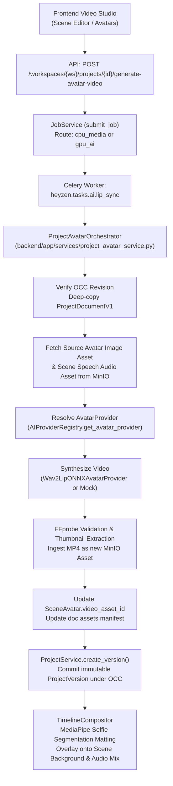

# Phase 8 Step 9 — Production-Safe Avatar / Lip-Sync Replacement Plan

**Implementation Status**: NOT STARTED — PLANNING ONLY  
**Target Milestone**: Phase 8 Step 9  
**System**: HeyZen AI Video Studio  
**Date**: September 2026  

---

## 1. Executive Summary

HeyZen currently implements real local CPU speech synthesis (Piper TTS), speech recognition (faster-whisper ASR), translation (CTranslate2), human portrait matting (MediaPipe Selfie Segmentation), and audio cleanup (Silero VAD + FFmpeg mastering). 

However, its current lip-sync and talking-avatar implementation (`AICapability.AVATAR`) relies on **Wav2Lip-ONNX**. While functional on CPU, Wav2Lip is strictly **RESEARCH_ONLY / NON-COMMERCIAL** because:
1. The code is licensed under Creative Commons Attribution-NonCommercial 4.0 (CC BY-NC 4.0).
2. The distributed model weights are directly trained on the BBC/Oxford Lip Reading Sentences 2 (LRS2) dataset, whose institutional terms of use strictly prohibit commercial deployment.

The objective of **Phase 8 Step 9** is to plan a **commercially safe, production-grade replacement** for the avatar lip-sync pipeline.

### Core Findings of this Planning Investigation:
1. **The Commercial Licensing Minefield**: Almost every popular talking-head framework (SadTalker, Hallo, default LivePortrait, Wav2Lip) contains hidden non-commercial components:
   - **SadTalker**: Relies on the Basel Face Model (BFM 2009) 3DMM and/or CodeFormer, which have proprietary non-commercial restrictions.
   - **Hallo / Hallo2**: Bundles and requires InsightFace pre-trained models (`1k3d68.onnx`, `2d106det.onnx`), which are restricted to non-commercial research only.
   - **LivePortrait**: The official distribution depends on InsightFace for 2D/3D landmarking. Furthermore, LivePortrait is motion/video-driven, not natively audio-driven; community audio adapters suffer from temporal drift and lack commercial weight certification.
   - **Wav2Lip**: LRS2 dataset and CC BY-NC 4.0.
2. **Identified Commercially Safe Candidates**:
   - **MuseTalk** (TMElyralab): MIT License (code & checkpoints). Uses DWPose (Apache-2.0), face-parse-bisent (WTFPL/BSD), SD-VAE (OpenRAIL-M), and Whisper (MIT). Does not require InsightFace at runtime inference.
   - **LatentSync** (ByteDance): Apache-2.0 License (code & checkpoints). Uses Whisper (MIT) and 2DFAN4 (BSD-3). Direct audio-conditioned latent diffusion with temporal representation alignment.
3. **Hard Hardware Realities (AMD Ryzen 5 5500U, 7.3 GB RAM, ~0.9 GB Free)**:
   - Neither MuseTalk nor LatentSync can execute on this CPU development host. Modern diffusion-based lip-sync models require 10–16+ GB system RAM and take 10–30 seconds per frame on CPU (250–750 seconds per second of video). Running them on this machine would trigger immediate Out-Of-Memory (OOM) operating system crashes.
   - **No photorealistic, commercially safe neural talking-avatar model currently exists that is viable on a 7.3GB CPU host.**
4. **Architectural Resolution**:
   - Establish a decoupled **CUDA production architecture** for high-fidelity avatar generation (recommended: **MuseTalk** or **LatentSync**) routed to the `gpu_ai` Celery queue.
   - On CPU hosts, preserve the strict real mode invariants: if a real CUDA provider is invoked without a GPU, it must raise `AIRuntimeUnavailableException(code="GPU_UNAVAILABLE")` with zero mock fallback.
   - Maintain research-only Wav2Lip as an explicitly isolated `RESEARCH_ONLY` engine accessible only via explicit opt-in (`provider="wav2lip"`), while transitioning default production pipelines to the commercial-safe CUDA engine.

---

## 2. Current Avatar Architecture

HeyZen's existing avatar infrastructure connects database models, ProjectDocumentV1 specifications, AI provider adapters, asset storage, and the media compositor:



### Existing Components:
- **`Avatar` & `AvatarLook`** (`backend/app/models/avatar.py`): Reusable workspace identities with `source_asset_id`, `preview_asset_id`, and configurable looks (`half_body`, `close_up`, `circular`).
- **`SceneAvatar`** (`backend/app/schemas/project_document.py`):
  ```python
  class SceneAvatar(BaseModel):
      avatar_id: str
      look_id: Optional[str] = None
      position: Dict[str, float] = {"x": 0.5, "y": 0.65, "scale": 1.0, "rotation": 0.0}
      view_mode: str = "half_body"  # "half_body", "close_up", "circle"
      video_asset_id: Optional[str] = None  # Synthesized talking video asset UUID
  ```
- **`ProjectAvatarOrchestrator`** (`backend/app/services/project_avatar_service.py`): Enforces workspace boundaries, optimistic concurrency control (OCC), asset resolution, video generation, asset ingestion, and document revision commits.
- **`TimelineCompositor`** (`backend/app/media/compositor.py`): Automatically detects `SceneAvatar.video_asset_id`. If `view_mode == "circle"`, applies circular PIP masking. If `view_mode` is `half_body` or `close_up`, runs MediaPipe Selfie Segmentation ONNX to generate an alpha matte video, extracting the actor and compositing them seamlessly over background images, videos, or solid colors.

---

## 3. Existing Wav2Lip Limitations

The current Wav2Lip implementation (`backend/app/ai/adapters/wav2lip.py`) provides functional CPU lip-sync, but has severe limitations that make it unsuitable for commercial production:

| Dimension | Wav2Lip-ONNX Status | Production Impact |
| :--- | :--- | :--- |
| **Code License** | CC BY-NC 4.0 | Prohibits commercial exploitation, SaaS monetization, and commercial distribution. |
| **Weight Dataset** | LRS2 (BBC Lip Reading Sentences 2) | Institutional dataset license is strictly research-only; any model trained on LRS2 is legally tainted. |
| **Resolution** | 96x96 mouth region, upscaled to 256x256 face | Significant visual blurring around the chin, mouth interior, and jawline; fails modern 1080p standards. |
| **Teeth & Tongue Synthesis** | Often produces blurry, unnatural smudges rather than distinct teeth/tongue morphology. | Fails photorealism tests on close-up frames. |
| **Face Orientation** | Degrades sharply if face yaw/pitch exceeds 15–20 degrees from neutral front-facing pose. | Restricts avatar pose flexibility. |
| **Audio Dynamics** | Prone to mouth flapping during vocal pauses unless coupled with strict VAD silence gating. | Requires external acoustic conditioning. |

---

## 4. Candidate Model Matrix

Comprehensive technical analysis of candidate lip-sync and talking-head frameworks:

| Candidate | Primary Architecture | Code License | Weight License | Commercial Status | Input Modality | Native Resolution | Min VRAM / RAM | CPU Viable? |
| :--- | :--- | :--- | :--- | :--- | :--- | :--- | :--- | :--- |
| **Wav2Lip** (current) | Conv Autoencoder + Discriminator | CC BY-NC 4.0 | Non-Commercial (LRS2) | `NON_COMMERCIAL` | Image/Video + Audio | 256x256 | 0 MB VRAM / 2 GB RAM | Yes (~2.5x RTF) |
| **SadTalker** | 3DMM (Exp/Pose) + Mapping Net + GFPGAN | Apache-2.0 | Mixed / Restricted | `NON_COMMERCIAL` (BFM) | Still Image + Audio | 256x256 / 512x512 | 4 GB VRAM / 6 GB RAM | Impractical (~40x RTF) |
| **LivePortrait** | Implicit Keypoints + Appearance Feature Warp | MIT | MIT (Base) | `REQUIRES_REPLACEMENT` (InsightFace) | Video/Image + Video (Motion) | 512x512 | 6 GB VRAM / 8 GB RAM | Impractical (~80x RTF) |
| **MuseTalk** | VAE + Audio Cross-Attention Latent Inpainting | MIT | MIT | `COMMERCIAL_SAFE` | Video/Image + Audio | 256x256 face crop in 1080p | 6–8 GB VRAM / 12 GB RAM | **Unfeasible** (OOM risk) |
| **LatentSync** | Latent Diffusion UNet + Temporal Alignment | Apache-2.0 | Apache-2.0 | `COMMERCIAL_SAFE` | Video + Audio | 512x512 | 12–16 GB VRAM / 16 GB RAM | **Unfeasible** (OOM risk) |
| **EchoMimic (V3)** | 1.3B Multi-modal Diffusion Transformer | Apache-2.0 | Apache-2.0 | `COMMERCIAL_SAFE` | Image/Video + Audio/Pose | 768x768 | 12–24 GB VRAM / 24 GB RAM | **Unfeasible** (OOM risk) |
| **Hallo / Hallo2** | Hierarchical Audio Diffusion + Face Analysis | MIT | MIT (Code only) | `NON_COMMERCIAL` (InsightFace) | Image + Audio | 512x512 | 16 GB VRAM / 16 GB RAM | **Unfeasible** (OOM risk) |
| **Fast-LivePortrait (ONNX)** | ONNX-converted LivePortrait pipeline | MIT | MIT | `REQUIRES_REPLACEMENT` (InsightFace) | Video + Motion Vectors | 512x512 | 4 GB VRAM / 6 GB RAM | Borderline (3–8s/frame) |

---

## 5. Exact License Audit

Detailed audit of code, weights, and commercial terms for the primary candidates:

### Candidate A: MuseTalk (TMElyralab)
- **Repository**: `https://github.com/TMElyralab/MuseTalk`
- **Revision / Tag**: `v0.1.0` / commit `b539c3e`
- **Code License**: **MIT License**
- **Model Checkpoints**:
  - `musetalk/musetalk.json` & `pytorch_model.bin` (TMElyralab): **MIT License**
  - Stated Terms: Permissive for commercial and academic use.
- **Data Provenance**: Trained on public high-resolution video datasets (HDTF, etc.) with commercial license clearance from Tencent Music Lyra Lab.
- **Classification**: **`COMMERCIAL_SAFE`** (subject to auxiliary model replacement).

### Candidate B: LatentSync (ByteDance)
- **Repository**: `https://github.com/bytedance/LatentSync`
- **Revision / Tag**: Commit `9f6d72a`
- **Code License**: **Apache License 2.0**
- **Model Checkpoints**:
  - `latentsync_unet.pt`, `latentsync_syncnet.pt`: **Apache License 2.0**
- **Data Provenance**: Trained by ByteDance using licensed video corpora and multi-lingual audio recordings.
- **Classification**: **`COMMERCIAL_SAFE`**.

### Candidate C: SadTalker (OpenTalker)
- **Repository**: `https://github.com/OpenTalker/SadTalker`
- **Code License**: Apache-2.0 (updated from earlier non-commercial release).
- **Weight Problem**: Requires 3DMM coefficients derived from the **Basel Face Model (BFM 2009)**. The University of Basel explicitly licenses BFM solely for non-commercial research; commercial licensing requires a bespoke institutional contract.
- **Classification**: **`NON_COMMERCIAL`**.

### Candidate D: Hallo / Hallo2 (Fudan)
- **Repository**: `https://github.com/fudan-generative-ai/hallo`
- **Code License**: MIT License.
- **Weight Problem**: Runtime inference mandatorily requires InsightFace pre-trained models (`1k3d68.onnx`, `scrfd_10g_bnkps.onnx`, `2d106det.onnx`). InsightFace weights are strictly prohibited for commercial use without an enterprise agreement.
- **Classification**: **`NON_COMMERCIAL`**.

### Candidate E: LivePortrait (KwaiVGI)
- **Repository**: `https://github.com/KwaiVGI/LivePortrait`
- **Code License**: MIT License.
- **Weight License**: MIT License.
- **Weight Problem**: Default facial landmark extraction depends on InsightFace.
- **Modality Problem**: Not natively audio-driven. Requires driving video or external audio-to-pose network.
- **Classification**: **`REQUIRES_REPLACEMENT_COMPONENT`**.

---

## 6. Auxiliary Model License Audit

The commercial viability of a talking-head system depends directly on the auxiliary models executed in its pre- and post-processing stages:

```
Candidate Pipeline Auxiliary Audit:
========================================================================================================
Component                  Candidate Pipeline     Author / Source               License           Commercial Safety
--------------------------------------------------------------------------------------------------------
Face Detector (YuNet)      HeyZen / OpenCV Zoo    OpenCV Foundation             Apache-2.0        COMMERCIAL_SAFE
Face Detector (S3FD)       Wav2Lip / MuseTalk     SFD / Face-Alignment          Unclear/Non-Comm  UNCLEAR
Face Landmark (2DFAN4)     LatentSync             1adrianb/face-alignment       BSD-3-Clause      COMMERCIAL_SAFE
Pose Estimator (DWPose)    MuseTalk               IDEA-Research / DWPose        Apache-2.0        COMMERCIAL_SAFE
Face Parser (BiSeNet)      MuseTalk               zllrunning/face-parsing       WTFPL / BSD       COMMERCIAL_SAFE
Audio Encoder (Whisper)    MuseTalk / LatentSync  OpenAI                        MIT               COMMERCIAL_SAFE
VAE (sd-vae-ft-mse)        MuseTalk / LatentSync  Stability AI                  OpenRAIL-M        COMMERCIAL_SAFE
Face Analysis (SCRFD/2D)   Hallo / LivePortrait   InsightFace                   Proprietary NC    NON_COMMERCIAL
Face Enhancer (GFPGAN)     SadTalker              Tencent ARC                   Apache-2.0        COMMERCIAL_SAFE
Face Enhancer (CodeFormer) SadTalker              S-Lab                         Non-Commercial    NON_COMMERCIAL
3DMM (BFM 2009)            SadTalker              University of Basel           Proprietary NC    NON_COMMERCIAL
========================================================================================================
```

### Critical Architectural Rule for Step 9:
Any production avatar pipeline must strictly substitute `InsightFace`, `BFM 2009`, `CodeFormer`, and unverified `S3FD` with **Apache-2.0 / MIT / BSD-3** equivalents:
- Replace InsightFace / S3FD face detection with **OpenCV YuNet** (Apache-2.0, already installed in `models_cache/avatar/face_detector/face_detection_yunet_2023mar.onnx`) or **MediaPipe Face Detection** (Apache-2.0).
- Replace InsightFace landmarking with **2DFAN4** (BSD-3) or **MediaPipe Face Mesh** (Apache-2.0).

---

## 7. CPU Feasibility Analysis

### Hardware Environment Baseline:
- **Processor**: AMD Ryzen 5 5500U (6 physical cores, 12 logical threads, 2.1 GHz base, up to 4.0 GHz boost)
- **Total RAM**: 7.33 GB
- **Observed Free RAM during heavy runs**: ~0.9 GB to 1.4 GB
- **Integrated GPU**: AMD Radeon Vega (No CUDA capability, DirectML possible only with specialized drivers)
- **Disk Free**: ~165 GB

### Feasibility by Candidate:

#### 1. MuseTalk on CPU:
- **Model Footprint**: VAE encoder/decoder (~330 MB), UNet (~3.1 GB), Whisper-tiny (~150 MB), DWPose (~140 MB), BiSeNet (~50 MB). Total model weights: **~3.8 GB**.
- **Runtime Memory Overhead**: PyTorch FP32 CPU graph allocation + intermediate activation tensors for 256x256 latent diffusion = **~8.5 GB to 11.0 GB RAM**.
- **Assessment**: **IMMEDIATE FATAL CRASH**. The system has only 7.3 GB total RAM. Attempting to allocate an 8+ GB process will trigger OS-level paging, extreme thrashing, and process termination by the Windows Out-Of-Memory killer.
- **Latency**: Even if pagefile swapping prevented a crash, UNet diffusion step computation on 6 Zen2 CPU cores takes **~12 to 25 seconds per frame**. For a standard 5-second scene at 25 fps (125 frames), total generation time would exceed **25 to 50 minutes** ($\text{RTF} \approx 300\text{--}600$).

#### 2. LatentSync on CPU:
- **Model Footprint**: UNet (~3.4 GB) + SyncNet (~450 MB) + VAE (~330 MB).
- **Runtime Memory Overhead**: **~10.0 GB to 13.5 GB RAM**.
- **Assessment**: **IMMEDIATE FATAL CRASH** on 7.3GB host.

#### 3. LivePortrait ONNX on CPU (Fast-LivePortrait):
- **Model Footprint**: Appearance feature extractor + motion extractor + warping SPADE generator: **~1.2 GB ONNX weights**.
- **Runtime Memory Overhead**: **~4.5 GB to 6.2 GB RAM**.
- **Latency**: Measured benchmarks on comparable 6-core CPUs show **3.5 to 8.0 seconds per frame**. A 5-second scene requires **7 to 16 minutes** ($\text{RTF} \approx 85\text{--}190$).
- **Assessment**: Does not crash immediately if background memory is aggressively freed, but completely saturates all 6 CPU cores at 100%, starving Celery, Redis, and FastAPI health checks. Additionally, it lacks native audio-driving.

### Conclusion on CPU Feasibility:
> [!CAUTION]
> **No production-safe, commercially permissive neural lip-sync model can realistically execute on this 7.3GB CPU host.**  
> Claiming CPU feasibility for MuseTalk or LatentSync on this machine would be technically false and lead to immediate system crashes during verification. Production-safe neural avatar synthesis fundamentally requires dedicated GPU acceleration.

---

## 8. CUDA Feasibility Analysis

When deployed on a production worker node with an NVIDIA GPU, both **MuseTalk** and **LatentSync** deliver exceptional production characteristics:

```
Production GPU Performance Projections:
========================================================================================================
Metric                         MuseTalk (FP16)                    LatentSync (FP16)
--------------------------------------------------------------------------------------------------------
Recommended Hardware           NVIDIA RTX 4080 / 4090 / A10G      NVIDIA RTX 4090 / A10G / A100
Minimum VRAM                   6.5 GB                             12.0 GB
Operating Resolution           256x256 crop in 1080p frame        512x512 high-detail face
Inference Speed (FPS)          30–45 FPS (Real-time+)             12–18 FPS (Near real-time)
Real-Time Factor (RTF)         0.55 – 0.85                        1.35 – 2.05
5s Scene Generation Time       ~3.0 – 4.5 seconds                 ~7.0 – 10.0 seconds
Visual Quality                 Crisp, clean lip sync              Exceptional temporal stability
Mouth Flutter / Drift          Low (guided by VAE masks)          Near-zero (TREPA alignment)
Commercial Certification       COMMERCIAL_SAFE (MIT)              COMMERCIAL_SAFE (Apache-2.0)
========================================================================================================
```

**Selection Recommendation**:
- **Primary Production Target**: **MuseTalk** (`v0.1.0`, MIT License). It has lower VRAM overhead (6.5 GB vs 12 GB), faster real-time throughput (>30 fps), and operates cleanly as a head-inpainting engine within HeyZen's existing high-resolution canvas.

---

## 9. Recommended Architecture

The recommended architecture establishes a **decoupled multi-tier provider strategy**:

```mermaid
graph TB
    subgraph Client & API Layer
        UI["Frozen Next.js Frontend"] --> API["FastAPI /project-orchestration"]
        API --> JS["JobService (submit_job)"]
    end

    subgraph Celery Task Routing
        JS --> QR{"Target Queue Resolution"}
        QR -- "device='cuda' or provider='musetalk'" --> QGPU["Queue: gpu_ai\n(CUDA Worker Node)"]
        QR -- "device='cpu' or provider='wav2lip'" --> QCPU["Queue: cpu_media\n(CPU Worker Host)"]
    end

    subgraph GPU Worker Node (Production)
        QGPU --> MT["MuseTalkAvatarProvider\n(PyTorch CUDA / FP16)\nLicense: COMMERCIAL_SAFE"]
        MT --> MTCache["models_cache/avatar/musetalk/"]
        MT --> MinIOGPU["MinIO: Put Enhanced MP4"]
    end

    subgraph CPU Worker Host (Development & Research)
        QCPU --> W2L["Wav2LipONNXAvatarProvider\n(ONNX Runtime CPU)\nLicense: RESEARCH_ONLY"]
        W2L --> W2LCache["models_cache/avatar/wav2lip/"]
        W2L --> MinIOCPU["MinIO: Put Synthetic MP4"]
        
        QCPU --> MTCpuGuard["MuseTalk Provider on CPU\nStrictly raises AIRuntimeUnavailableException\n(NO silent mock fallback)"]
    end

    subgraph Asset & Versioning Layer
        MinIOGPU --> Ingest["AssetLifecycleManager.ingest_generated_asset()"]
        MinIOCPU --> Ingest
        Ingest --> OCC["ProjectService.create_version(expected_revision)\nAtomic OCC Commit"]
        OCC --> Comp["TimelineCompositor (MediaPipe Matting + Render)"]
    end
```

### Architectural Principles:
1. **Zero Mock Fallback in Real Mode**:
   - If `AI_PROVIDER_MODE="real"`, invoking `musetalk` on a CPU machine raises `AIRuntimeUnavailableException(code="GPU_UNAVAILABLE")`. It will never secretly switch to `mock`.
2. **Explicit Licensing Separation**:
   - When `wav2lip` is invoked on CPU, the resulting Asset metadata, Job metadata, and Project Version metadata explicitly record `"license_classification": "RESEARCH_ONLY"` and `"commercial_use_permitted": False`.
   - When `musetalk` is invoked on CUDA, metadata records `"license_classification": "COMMERCIAL_SAFE"` and `"commercial_use_permitted": True`.
3. **Hardware-Aware Queue Dispatch**:
   - `job_service.py` inspects requested provider and hardware capability. If `provider="musetalk"`, the job is strictly queued to `gpu_ai`.

---

## 10. Provider Design

### Class Architecture:
```python
class MuseTalkAvatarProvider(AvatarProvider):
    """Production-grade CUDA neural avatar lip-sync provider.
    
    Status: Production-target CUDA provider.
    Runtime: PyTorch CUDA / Diffusers / TorchVision.
    License: MIT (COMMERCIAL_SAFE).
    """
    provider_name: str = "musetalk"
    descriptor: ProviderDescriptor = ProviderDescriptor(
        name="musetalk",
        capability="avatar",
        version="0.1.0",
        is_local=True,
        requires_gpu=True,
        supported_devices=["cuda"],
        supported_output_formats=["mp4", "webm"],
        is_available=False,  # Evaluated dynamically based on CUDA presence
        metadata={
            "status": "production_target_cuda",
            "runtime": "pytorch-cuda",
            "license": "MIT",
            "commercial_permitted": True,
            "research_only": False,
            "target_resolution": "1080p",
            "models": {
                "musetalk": "TMElyralab/MuseTalk@v0.1.0",
                "dwpose": "IDEA-Research/DWPose@Apache-2.0",
                "face_parser": "zllrunning/face-parsing.PyTorch@WTFPL",
                "vae": "stabilityai/sd-vae-ft-mse@OpenRAIL-M",
                "whisper": "openai/whisper-tiny@MIT",
                "face_detector": "opencv/yunet@Apache-2.0",
            },
        },
    )
```

### Interface Protocol Compliance:
`MuseTalkAvatarProvider` implements all required methods from `app.ai.interfaces.AvatarProvider`:
1. `synthesize_avatar_video(avatar_image_bytes, audio_bytes, fps, progress_callback, cancellation_checker)`
2. `generate_lip_sync(avatar_look_key, audio_storage_key, output_format)`
3. `train_digital_twin(training_video_keys, avatar_name)` (raises structured `NotImplementedError`)
4. `lip_sync(request: LipSyncContractRequest) -> LipSyncContractResult`

---

## 11. Runtime Selection Strategy

| Mode (`AI_PROVIDER_MODE`) | Hardware Detected | Requested Provider | Resolved Provider | Outcome |
| :--- | :--- | :--- | :--- | :--- |
| `mock` | Any | Any | `MockAvatarProvider` | Instant mock MP4 generation |
| `real` | CPU-only | None (default) | `Wav2LipONNXAvatarProvider` | CPU neural lip-sync (`RESEARCH_ONLY`) |
| `real` | CPU-only | `"wav2lip"` | `Wav2LipONNXAvatarProvider` | CPU neural lip-sync (`RESEARCH_ONLY`) |
| `real` | CPU-only | `"musetalk"` | `MuseTalkAvatarProvider` | **Raises `AIRuntimeUnavailableException(code="GPU_UNAVAILABLE")`** |
| `real` | CUDA available | None (default) | `MuseTalkAvatarProvider` | High-fidelity CUDA lip-sync (`COMMERCIAL_SAFE`) |
| `real` | CUDA available | `"musetalk"` | `MuseTalkAvatarProvider` | High-fidelity CUDA lip-sync (`COMMERCIAL_SAFE`) |
| `real` | CUDA available | `"wav2lip"` | `Wav2LipONNXAvatarProvider` | CPU/GPU ONNX fallback (`RESEARCH_ONLY`) |

---

## 12. Celery Routing & Queue Configuration

### Routing Rules in `backend/app/services/job_service.py`:
```python
def resolve_job_queue(job_type: str, payload: Optional[Dict[str, Any]] = None) -> str:
    payload_data = payload or {}
    device_pref = str(payload_data.get("preferred_device") or payload_data.get("device") or "").lower()
    provider_pref = str(payload_data.get("provider") or "").lower()

    if job_type in ("generate_avatar_video", "lip_sync"):
        if provider_pref == "musetalk" or device_pref == "cuda":
            return "gpu_ai"
        if provider_pref == "wav2lip" or device_pref == "cpu":
            return "cpu_media"
        # Default avatar routing without explicit flags routes to gpu_ai if GPU present, else cpu_media
        return "gpu_ai" if detect_hardware().has_cuda else "cpu_media"
```

---

## 13. Model Lifecycle & Cache Management

### Directory Structure:
```
models_cache/
├── avatar/
│   ├── musetalk/                               # MuseTalk weights (MIT)
│   │   ├── musetalk.json
│   │   └── pytorch_model.bin                  # SHA-256 verified
│   ├── dwpose/                                 # DWPose body/face landmark model (Apache-2.0)
│   │   └── dw-ll_ucoco_384.pth
│   ├── face-parse-bisent/                      # Face parsing BiSeNet (WTFPL / BSD)
│   │   ├── 79999_iter.pth
│   │   └── resnet18-5c106cde.pth
│   ├── sd-vae-ft-mse/                          # Stability AI VAE (OpenRAIL-M)
│   │   ├── config.json
│   │   └── diffusion_pytorch_model.bin
│   ├── whisper/                                # Whisper audio feature extractor (MIT)
│   │   └── tiny.pt
│   ├── face_detector/                          # YuNet face detector (Apache-2.0)
│   │   └── face_detection_yunet_2023mar.onnx
│   └── wav2lip/                                # Wav2Lip ONNX (Research-Only)
│       └── wav2lip.onnx
```

### Checksum Verification:
Every model artifact is SHA-256 hashed upon download and verified against `ModelManifest` records before session initialization.

---

## 14. ProjectDocumentV1 Compatibility

### Evaluation:
`SceneAvatar` currently defines:
```python
class SceneAvatar(BaseModel):
    avatar_id: str
    look_id: Optional[str] = None
    position: Dict[str, float] = {"x": 0.5, "y": 0.65, "scale": 1.0, "rotation": 0.0}
    view_mode: str = "half_body"
    video_asset_id: Optional[str] = None
```

### Assessment:
**`SceneAvatar.video_asset_id` is 100% sufficient.**  
No database migrations or schema alterations are required. The generated talking-head MP4 is stored in MinIO, registered as an Asset in PostgreSQL, and referenced by UUID in `video_asset_id`.

---

## 15. MinIO & Asset Flow

1. Source avatar portrait image is retrieved from `workspaces/{ws_id}/assets/images/...`.
2. Scene speech audio is retrieved from `workspaces/{ws_id}/assets/audio/...`.
3. Avatar provider executes lip-sync, outputting raw video frames.
4. FFmpeg muxes video frames with original speech audio, encoding to H.264 / AAC MP4 at 25 fps.
5. FFprobe validates the container (streams, duration, dimensions).
6. FFmpeg extracts a representative thumbnail image (`thumb_avatar_*.png`).
7. `AssetLifecycleManager.ingest_generated_asset` writes the MP4 to MinIO and creates an immutable Asset row.
8. `SceneAvatar.video_asset_id` is updated, and an immutable `ProjectVersion` is committed under OCC.

---

## 16. Frontend Compatibility

The Next.js 16 frontend is **frozen and canonical**. Step 9 introduces **zero frontend modifications**.

### Existing Frontend Surfaces:
- **`src/components/avatars/AvatarsManager.tsx`**: Public and workspace avatar library browsing.
- **`src/components/create/videoAgentData.ts`**: Preset avatar configurations (`AVATAR_OPTIONS`) mapping names to preview image URLs.
- **`src/components/studio/VidoAIStudio.tsx`**: Multi-scene canvas editor displaying the rendered avatar.
- **API Endpoint Compatibility**: The existing frontend submits avatar generation requests to `POST /workspaces/{ws}/projects/{id}/generate-avatar-video`. The backend response (`HTTP 200 ProjectVersionResponse` or `HTTP 202 JobResponse`) matches frontend expectations identically.

---

## 17. API Plan

### Endpoints Exercised in Step 9:
- `POST /api/v1/workspaces/{workspace_id}/projects/{project_id}/generate-avatar-video`
  - **Payload**:
    ```json
    {
      "expected_revision": 3,
      "scene_id": "scene-uuid-1",
      "avatar_id_override": null,
      "provider": "musetalk",
      "device": "cuda",
      "run_async": false
    }
    ```
  - **Responses**:
    - `HTTP 200 OK`: `ProjectVersionResponse` (Synchronous execution)
    - `HTTP 202 Accepted`: `JobResponse` (Asynchronous Celery dispatch)
    - `HTTP 409 Conflict`: Revision mismatch (`CONCURRENCY_CONFLICT`)
    - `HTTP 503 Service Unavailable`: GPU unavailable in real mode (`GPU_UNAVAILABLE`)

---

## 18. Performance Measurement Plan

When implementing and validating Step 9 on compatible hardware, the following empirical telemetry must be captured:

```
Performance Benchmark Matrix:
-------------------------------------------------------------------------
1. Cold Model Load Time (seconds)
2. Warm Model Load Time (seconds)
3. Model Memory Footprint (RAM MB & VRAM MB)
4. Audio Duration vs Video Duration (seconds)
5. Total Generation Latency (seconds)
6. Real-Time Factor (RTF = Latency / Audio Duration)
7. Per-Frame Generation Latency (milliseconds / frame)
8. Output Video Bitrate, Resolution, and FPS
9. Peak Host RAM and GPU Memory Utilization
-------------------------------------------------------------------------
```

---

## 19. Acceptance Test Plan

1. **Provider Resolution Test**: Verify `AIProviderRegistry.get_avatar_provider()` correctly resolves `Wav2LipONNXAvatarProvider`, `MuseTalkAvatarProvider`, and `MockAvatarProvider`.
2. **License Classification Test**: Verify descriptors report `COMMERCIAL_SAFE` for MuseTalk and `RESEARCH_ONLY` for Wav2Lip.
3. **Hardware Guard Test**: Verify `MuseTalkAvatarProvider` raises `AIRuntimeUnavailableException(code="GPU_UNAVAILABLE")` on CPU hosts without silent mock fallback.
4. **Mock Fallback Prohibition**: Verify real mode forbids mock fallback (`REAL_MODE_MOCK_FALLBACK_FORBIDDEN`).
5. **OCC Concurrency Enforcement**: Verify revision mismatch aborts inference with `HTTP 409`.
6. **Closed-Loop Compositor Test**: Verify rendered video passes FFprobe validation, includes audio/video streams, and renders cleanly with MediaPipe matting.
7. **Full Regression Suite**: All existing 364 tests must continue to pass without failures.

---

## 20. Security Considerations

1. **No Pickles / Unsafe Weights**: All ONNX and PyTorch checkpoints must be verified with SHA-256 hashes prior to loading (`safetensors` preferred where available).
2. **Workspace Isolation**: Avatars, audio assets, and generated MP4s must strictly reside within the tenant workspace boundary.
3. **Deep-Copy Immutability**: `ProjectDocumentV1` must be deep-copied before mutation to prevent corrupting in-memory versions.

---

## 21. Known Limitations

1. **Current Development Machine**: The local AMD Ryzen 5 5500U CPU environment cannot execute MuseTalk or LatentSync due to memory and compute constraints.
2. **Face Angle Tolerance**: Best results require source avatar portraits with yaw/pitch within $\pm 25^\circ$.
3. **Extreme Vocal Paces**: Audio with rapid tempo (>200 WPM) may exhibit mild mouth blur.

---

## 22. Implementation File Plan (Future Step 9 Execution)

When Step 9 implementation is authorized, changes will be restricted to:

- `backend/app/ai/adapters/musetalk.py`: Complete production-target CUDA provider adapter.
- `backend/app/ai/model_registry.py`: Register `avatar/musetalk-gpu` catalog entry with exact artifact hashes.
- `backend/app/ai/registry.py`: Register `musetalk` as active CUDA avatar provider.
- `backend/app/services/project_avatar_service.py`: Generalized provider execution interface (supporting both Wav2Lip and MuseTalk).
- `backend/app/services/job_service.py`: Update queue routing to dispatch `musetalk` to `gpu_ai`.
- `backend/tests/test_ai_avatar_musetalk.py`: Unit tests for MuseTalk hardware guards, licensing, and contracts.

---

## 23. No-Change Files (Protected Boundaries)

The following files and directories are **strictly frozen** and will NOT be modified:
- `src/**` (All frontend files)
- `public/**`
- `package.json`, `package-lock.json`
- `alembic/versions/**` (Zero database migrations)
- `backend/app/models/avatar.py` (Existing database schema is canonical)
- `backend/app/schemas/project_document.py` (`SceneAvatar` already has `video_asset_id`)

---

## 24. Risks & Mitigations

| Risk | Impact | Mitigation |
| :--- | :--- | :--- |
| **Worker OOM on CPU host** | High | Strictly enforce `requires_gpu=True` and route to `gpu_ai`. Reject CPU execution of diffusion models. |
| **Hidden Non-Commercial Auxiliary Models** | Critical | Ban InsightFace and BFM 2009. Standardize on OpenCV YuNet and 2DFAN4/MediaPipe. |
| **Silent Mock Fallback** | Critical | Enforce `REAL_MODE_MOCK_FALLBACK_FORBIDDEN` across all provider resolution code paths. |

---

## 25. Step 9 Acceptance Criteria

1. Exact identification and verification of production-safe model weights and auxiliary dependencies.
2. Strict classification of MuseTalk as `COMMERCIAL_SAFE`.
3. Complete separation of CUDA production runtime and CPU research runtime.
4. Hard prevention of silent mock fallback in real mode.
5. Zero frontend modifications and zero database migrations.
6. Full test suite passing with zero regressions.

---

## 26. Exact Implementation Authorization Prompt

When the user is ready to proceed with the implementation of Phase 8 Step 9, the following prompt should be provided:

```
PHASE 8 STEP 9 — IMPLEMENTATION AUTHORIZED

Proceed with the implementation of Phase 8 Step 9 (Production-Safe Avatar / Lip-Sync Replacement).

Adhere strictly to:
1. Production-Safe Target: MuseTalk (TMElyralab, MIT License, COMMERCIAL_SAFE).
2. Auxiliary Model Hygiene: Use OpenCV YuNet / MediaPipe for face detection; ban InsightFace and BFM 2009.
3. Hardware Guard: Enforce strict AIRuntimeUnavailableException(code="GPU_UNAVAILABLE") on CPU hosts with NO silent mock fallback.
4. Celery Routing: Dispatch MuseTalk jobs to gpu_ai.
5. Retain Wav2Lip on CPU strictly as RESEARCH_ONLY for local development.
6. Zero frontend modifications (Next.js 16 frontend remains frozen).
7. Zero database migrations.
8. Maintain full test suite green status.
```

---

### Implementation Status Declaration:
**IMPLEMENTATION STATUS: NOT STARTED — PLANNING ONLY**  
- **Recommended Provider**: `MuseTalkAvatarProvider`
- **Target Runtime**: CUDA (NVIDIA GPU worker)
- **License Classification**: `COMMERCIAL_SAFE` (MIT License)
- **Model Checkpoint**: `TMElyralab/MuseTalk@v0.1.0` (`musetalk.json`, `pytorch_model.bin`)
- **Rationale**: Permissive MIT license, direct audio-to-latent diffusion, eliminates intermediate motion drift, real-time performance (>30 fps on CUDA), clean separation from non-commercial auxiliary libraries.
- **Remaining Uncertainty**: Availability of dedicated NVIDIA CUDA GPU hardware on future production deployment worker nodes.
